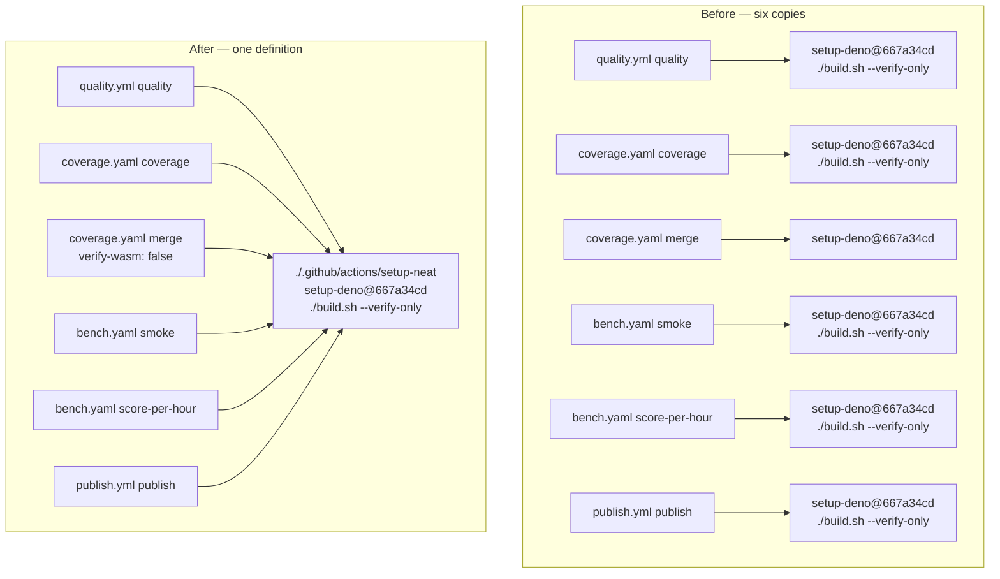
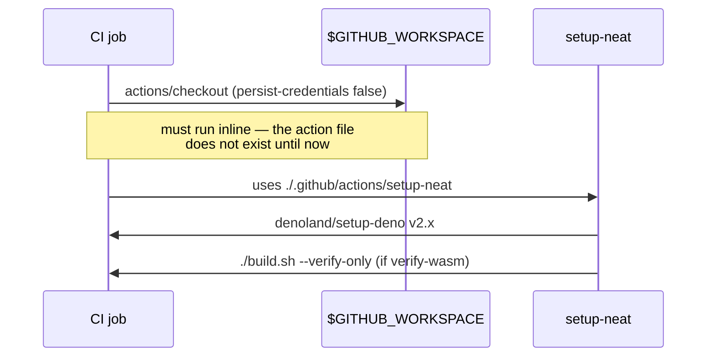

# Extract the shared CI preamble into a composite action

## Summary

The SHA-pinned `denoland/setup-deno` step and the `./build.sh --verify-only`
(WASM package sync) step were copy-pasted across six jobs in four workflows, so
every pin bump or policy change needed six coordinated edits. Both now live in
one local composite action, `.github/actions/setup-neat`, referenced as
`uses: ./.github/actions/setup-neat`. Closes #3608.

**`actions/checkout` deliberately stays inline in each job.** The issue's
suggested action.yml put checkout inside the composite, but that cannot work: a
local `uses: ./…` action is loaded from `$GITHUB_WORKSPACE`, so the calling job
must already have checked the repository out before the composite action file
can be read
([GitHub docs](https://docs.github.com/actions/creating-actions/creating-a-composite-action)).
A checkout step inside the composite could never run. The constraint is
documented in the action file and pinned by a test so nobody "helpfully" moves
checkout in and breaks every workflow.

Consolidated call sites:

| Workflow        | Job                         | WASM sync          |
| --------------- | --------------------------- | ------------------ |
| `quality.yml`   | `quality`                   | yes                |
| `coverage.yaml` | `coverage`                  | yes                |
| `coverage.yaml` | `merge`                     | no (`verify-wasm`) |
| `bench.yaml`    | `smoke`                     | yes                |
| `bench.yaml`    | `score-per-hour-regression` | yes                |
| `publish.yml`   | `publish`                   | yes                |

The `merge` job only aggregates shard artefacts and never loads the bundle, so
it opts out with `verify-wasm: "false"`. The input defaults to `"true"`, so the
sync is opt-out — a new job cannot silently skip it.

Step ordering is unchanged in every job: the composite runs exactly where
`Setup Deno` used to, immediately followed by the WASM sync. In particular
`quality.yml` still executes no PR-controlled code before the credentialed
gitleaks step (Issue #3607), and the PAT-holding `push-fixes` job is untouched —
it uses no composite action.

## Evidence

Backend/CI change with no web interface, so there is no screenshot. Evidence is
the test suite plus a clean `actionlint` run over the workflows.



Each job still runs `actions/checkout` inline first, because the composite
action is read from the checked-out workspace:



Local run of the full quality gate:

```text
ok | 8060 passed (5 steps) | 0 failed | 4 ignored (7m0s)
```

`actionlint` (which validates local `uses: ./…` references resolve) exits 0 over
the whole `.github/workflows/` tree.

## Test Plan

Added `test/ci/SetupNeatCompositeAction.ts` — 29 "what" tests parsing the
committed YAML:

- the composite action exists, declares `runs.using: composite`, and carries a
  description;
- it installs Deno via `denoland/setup-deno` and runs `./build.sh --verify-only`
  with `shell: bash`;
- it never invokes a bare `./build.sh` (Issue #2439 — CI must not auto-advance
  `neatCore.rev`);
- the WASM sync is gated on a `verify-wasm` input defaulting to `"true"`;
- **it contains no `actions/checkout` step** — the regression guard for the
  local-action loading constraint;
- per call site (six jobs): the job references the composite exactly once,
  checks out _before_ it, no longer inlines `denoland/setup-deno` or
  `./build.sh`, and requests the expected `verify-wasm` value.

Modified existing tests (documented, no test removed or disabled):

- `test/ci/WorkflowActionPinning.ts` — now scans `.github/actions/*/action.yml`
  alongside `.github/workflows/*.y*ml`, so moving a `uses:` into a composite
  action does not move it out of the SHA-pinning gate. Local `./…` references
  are exempt by construction: they carry no `@ref`, so `extractUses` never
  returns them.
- `test/scripts/PublishWorkflow.ts` — the `./build.sh --verify-only` invariant
  moved out of `publish.yml` into the composite action, so the two tests now
  follow the workflow's local `uses: ./…` references instead of grepping the
  workflow text alone. The asserted invariant is unchanged: the publish job must
  reach a verify-only build, and no reachable step may run a bare `./build.sh`.

Unaffected and still green: `WorkflowPersistCredentialsFalse.ts` (checkout stays
inline everywhere), `QualityWorkflowPatIsolation.ts` (the PAT job uses no
composite action), `ProvenancePublishWorkflow.ts`,
`CodeownersWorkflowsCoverage.ts` (CODEOWNERS already covers
`/.github/actions/`).

## Documentation

`docs/CI_EXTERNAL_NEAT_AI_CORE.md` — the "what the workflows do today" table now
lists all six jobs and points at the composite action; the "required workflow
pattern" snippet shows the inline checkout plus
`uses: ./.github/actions/setup-neat`, and explains why checkout cannot move in.

## Pre-PR Security Self-Check

- **Input validation** — n/a; no new runtime code paths. The composite's one
  input is compared against the literal `'true'` in an `if:` expression.
- **Secrets** — no secrets added or staged; the composite carries none.
- **Injection surface** — the composite's single `run:` step is a fixed literal
  (`./build.sh --verify-only`) with no interpolation of any context value.
- **Output encoding** — n/a.
- **Authentication/authorisation** — unchanged. `persist-credentials: false`
  stays on every checkout; the `push-fixes` job that holds
  `secrets.ACTIONS_PUSH` uses no composite action, preserving the Issue #3607
  isolation.
- **Error handling** — `./build.sh --verify-only` still fails the job loudly on
  a drifted or tampered WASM bundle; the `verify-wasm` input defaults to `true`
  so a new job cannot skip the gate by omission.
- **Dependencies** — no new dependency. `denoland/setup-deno` keeps its existing
  40-char SHA pin (`667a34cd…`, v2.0.4), now guarded in one place by
  `WorkflowActionPinning.ts`.
