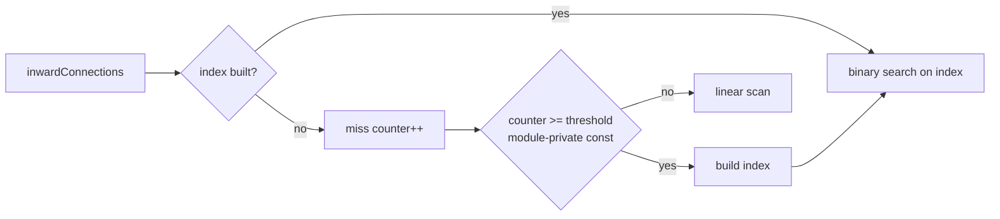

# Remove unused export `INWARD_INDEX_BUILD_THRESHOLD`

## Summary

`INWARD_INDEX_BUILD_THRESHOLD` in `src/creature/CreatureTopology.ts` was exported
but had no importer anywhere in the repository — it is read only from
`lookupInwardConnections` in its own module. Dropped the `export` keyword so the
constant stays module-private; the value and its internal use are unchanged, so
behaviour is identical. Closes #3610.

A repository-wide search (all file types, excluding `.git`/`target`) confirms the
name appears only in `src/creature/CreatureTopology.ts` — no re-export from
`mod.ts`, no dynamic or string-keyed lookup.

## Evidence

Backend/library change with no web interface, so no screenshot applies. Evidence
is the test run:

- `deno test --allow-all test/creature/CreatureTopology.ts` — 12 passed, 0 failed.
- `./quality.sh` passes (lint, format, type-check, full test suite).

The behavioural contract the constant governs — switching from linear scan to the
secondary index after enough cache misses — is covered by the new test below,
which asserts both code paths return identical results without referencing the
constant itself.

## Test Plan

- Added `test/creature/CreatureTopology.ts::"inwardConnections - index path
  matches linear-scan path"` — queries every neuron on a shared cache so the miss
  counter crosses the internal build threshold part-way through, asserting the
  linear-scan and index results both match a brute-force scan of
  `creature.synapses`.
- All existing `test/creature/CreatureTopology.ts` tests unchanged and passing.
