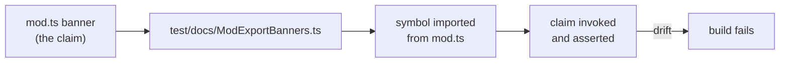

# Docs: state real contracts in `mod.ts` export banners (#3612)

## Summary

`mod.ts` is the sole `exports` entry point of `@stsoftware/neat-ai`, so its
export banners are the first documentation a JSR consumer meets. Ten of them
carried no contract a reader could not derive from the identifier — and three
actively misdescribed what they sat above. Each is now rewritten to state what
the signature cannot express, fact-checked against the implementation.

Closes #3612.

The three that were **wrong**, not merely thin:

| Banner          | Was                                                          | Now                                                                                |
| --------------- | ------------------------------------------------------------ | ---------------------------------------------------------------------------------- |
| `NeuronExport`  | "Neuron Class"                                               | Named as an interface; UUID-keyed wire format, runtime `id` omitted                |
| `SynapseExport` | "Synapse Class"                                              | Named as an interface; `fromUUID`/`toUUID` endpoints, `fromId`/`toId` runtime-only |
| `Upgrade`       | "upgrading and evolving AI entities … continued improvement" | Static repair helpers for creature exports; it evolves nothing                     |

The remaining seven (`CreatureExport`/`CreatureTrace`, `CreatureUtil`,
`NeatOptions`, `Selection`, `Mutation`, `randomConnectMissing`, `upgradeTwo`)
now name the actual surface — the strategies each registry exposes, where the
default is chosen, what "missing" means, and which calls throw.

No runtime code changed; this is a documentation-accuracy fix.

## Evidence

Backend/library change with no web interface to screenshot. Evidence is the new
fact-check test suite plus the full quality gate.

Every claim a banner now makes is exercised against the real symbol imported
from the public entry point, so the banners cannot silently drift from
behaviour:



Deliberately **not** a source-text grep over the comment prose — Issue #3142
removed that style from this repo because a reword broke the build without any
observable change. These are "what" tests, matching the precedent in
`test/docs/ApiReferenceExports.ts`.

Targeted run:

```
deno test --allow-all test/docs/ModExportBanners.ts
ok | 12 passed | 0 failed (65ms)
```

Full gate:

```
./quality.sh < /dev/null
ok | 8076 passed (5 steps) | 0 failed | 4 ignored (8m18s)
```

## Test Plan

New file `test/docs/ModExportBanners.ts` — one test per corrected banner:

- `CreatureTrace adds trace state only after activation` — an un-activated
  creature's `traceJSON()` carries no `trace`; after `activateAndTrace()` +
  `propagate()` neurons and synapses do.
- `makeUUID is structure-determined and reuses an existing UUID` — structurally
  identical creatures share a UUID.
- `shuffle mutates in place and leaves the tail untouched` — the `length` bound
  is honoured and the shuffled slice keeps its members.
- `createNeatConfig parses string numerics and freezes the result` — proves the
  `NeatOptionsInput` → `NeatOptions` distinction the banner now states.
- `createNeatConfig range-checks unvalidated input` — an out-of-range value
  fails loud.
- `Selection exposes exactly three strategies` — a pinned strategy is honoured;
  an omitted one is drawn from the three.
- `Mutation.FFW is the recurrent-free default operator set` — `FFW` omits every
  recurrent operator, `ALL` includes them, and `FFW` is the config default.
- `Upgrade.correct widens inputs and throws when shrinking`.
- `Upgrade.CRISPR migrates legacy DNA to the current shape` —
  `nodes`/`connections` renamed, `mode` defaulted to `append`, UUID endpoints
  resolved.
- `randomConnectMissing only touches unconnected inputs` — returns the creature
  unchanged when nothing is missing.
- `NeuronExport/SynapseExport are UUID-keyed wire shapes` — exports omit runtime
  integer ids; `normaliseCreatureExport` populates them.
- `upgradeTwo migrates 1.x and rejects 2.x or higher`.

No existing tests were modified, commented out, or removed.

## Security self-check

Documentation-only change plus a test file. No new input handling, dependencies,
endpoints, or injection surface; no secrets staged.
