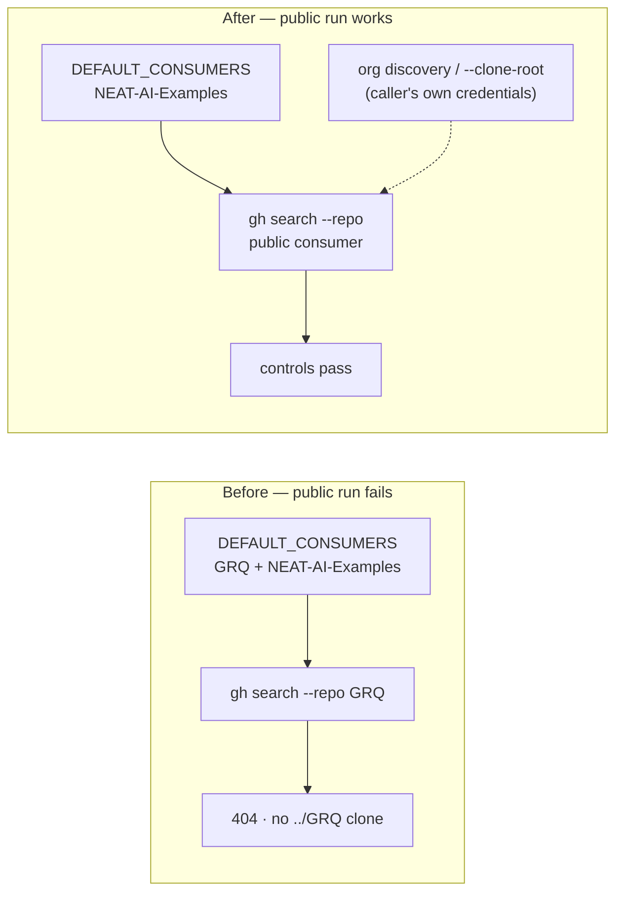

# Remove private consumer probing from the option-usage audit harness (#3613)

## Summary

The option-usage audit harness hard-coded the **private** `stSoftwareAU/GRQ`
repository as a default consumer, so no public user could run it: the
`gh search code --repo` probe 404s and the `--clone-root ..` sibling grep finds
no checkout. That split the repo's tooling into "works internally" and "fails
publicly". Closes #3613.

- `scripts/audit-option-usage.ts` — `DEFAULT_CONSUMERS` is now the public
  consumer only (`stSoftwareAU/NEAT-AI-Examples`). `DEFAULT_CONSUMERS`,
  `CONTROLS` and `resolveConsumers()` are exported so a guard can assert on the
  real values. Wider sweeps still work: org discovery and `--clone-root` widen
  the consumer set under the **caller's own** credentials, which is how a
  private downstream consumer joins a run.
- `scripts/lib/optionAuditRollup.ts` — the six verdict notes naming the private
  consumer are reworded to concept level ("the downstream production consumer").
- `test/scripts/AuditOptionUsage.ts` — fixtures no longer pin the private repo;
  they use the public consumer plus a generic `stSoftwareAU/downstream-consumer`
  placeholder where a second consumer is needed.
- Docs — `docs/OPTION_USAGE_AUDIT.md` gains a "Which consumers get probed"
  section; `docs/OPTION_AUDIT_CONSOLIDATED.md` rows are re-synced with the
  reworded notes.

Both built-in controls still hold against the public consumer alone, verified
against the live repo: `populationSize` is `IN USE` in
`stSoftwareAU/NEAT-AI-Examples` (positive control) and
`syntheticAlignmentThreshold` returns no hits (negative control).

## Evidence

Backend/CLI change — no web interface to screenshot. Evidence is the new guard
suite plus the full quality gate.

Quality gate: `./quality.sh < /dev/null` → **8080 passed, 0 failed, 4 ignored**.

## Test Plan

New guard `test/scripts/AuditOptionUsageNoPrivateConsumer.ts` — fails against
the unfixed harness (the private repo was in `DEFAULT_CONSUMERS` and in the
roll-up notes):

- `audit harness defaults name no private consumer (#3613)` — asserts
  `DEFAULT_CONSUMERS` contains no private `stSoftwareAU` repository, and is not
  empty.
- `audit harness controls probe only the public defaults (#3613)` — asserts
  `CONTROLS.repos` is a subset of `DEFAULT_CONSUMERS`.
- `resolveConsumers never greps a private sibling checkout (#3613)` —
  behavioural: builds a temp clone root holding **both** a `GRQ` and a
  `NEAT-AI-Examples` directory (the internal-machine layout), runs the real
  `resolveConsumers()`, and asserts no resolved consumer points at the private
  checkout while the public clone is still picked up.
- `roll-up verdict notes stay concept level (#3613)` — asserts no
  `OPTION_AUDIT_ROLLUP` note names a private repository.

Modified `test/scripts/AuditOptionUsage.ts` — fixture repo names only; every
existing assertion is preserved (no test removed or disabled). The
multi-consumer cases keep two distinct consumers via the
`stSoftwareAU/downstream-consumer` placeholder.
