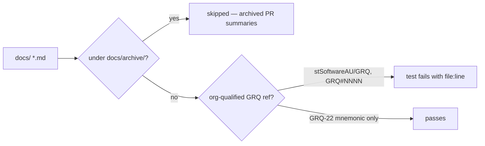

# PR summary — reword private `stSoftwareAU/GRQ` references in live option-audit docs

## Summary

The live (non-archive) option-audit documentation named the **private**
`stSoftwareAU/GRQ` repository and shipped runnable
`gh search code "<key>" --repo stSoftwareAU/GRQ` commands. A public repository
must be self-contained for the public: those commands 404 for every public
reader, so the documented audit method was unverifiable outside the
organisation. Closes #3615.

Two changes:

1. **Docs reworded to concept level.** Every org-qualified `stSoftwareAU/GRQ`
   reference in `docs/OPTION_AUDIT_SLICE_A–F.md` and
   `docs/dna-sharing-bake-off-results.md` now reads "the downstream production
   consumer" — the phrasing `docs/OPTION_AUDIT_CONSOLIDATED.md` already uses.
   Example commands use a `<consumer-repo>` placeholder, and the private
   issue-tracker pointer in slice F is replaced with concept-level wording.
   `docs/OPTION_USAGE_AUDIT.md` was already clean.
2. **Guard widened.** `test/docs/LiveDocsNoPrivateGrqReference.ts` previously
   walked only three hard-coded docs, which is why the newer option-audit pages
   reintroduced the references unchecked. It now also walks **all** of `docs/`
   outside `docs/archive/`.

### What the widened guard forbids

The new walk matches the **org-qualified** forms — the ones a reader can act on
and be 404'd by:

| Form                                          | Flagged | Rationale                          |
| --------------------------------------------- | :-----: | ---------------------------------- |
| `stSoftwareAU/GRQ` (incl. `-cluster`/`-logs`) |   ✅    | Actionable `--repo` / path pointer |
| A `github.com` link to that repo              |   ✅    | Link that 404s                     |
| `GRQ#NNNN` issue slug                         |   ✅    | Private issue-tracker slug         |
| `GRQ-22`, `grq-3397`                          |   ❌    | Bare mnemonic — names a concept    |

The bare-mnemonic carve-out is not new: it is the decision already recorded in
`test/_privateRepoRefs.ts` for #3454/#3604. The original three-doc,
any-`GRQ`-token check is unchanged and still enforced on those docs.



## Evidence

Documentation and test-only change — no web interface to screenshot.

The new guard was written first and reproduced the issue's file list exactly
before any doc was touched:

```
no live doc carries an org-qualified private GRQ reference (#3615) ... FAILED
  Live docs name the private stSoftwareAU/GRQ repository:
  OPTION_AUDIT_SLICE_A.md:30,43
  OPTION_AUDIT_SLICE_B.md:50,66
  OPTION_AUDIT_SLICE_C.md:62,74
  OPTION_AUDIT_SLICE_D.md:59,74,96
  OPTION_AUDIT_SLICE_E.md:63,79,126
  OPTION_AUDIT_SLICE_F.md:63,75,308
  dna-sharing-bake-off-results.md:194
FAILED | 11 passed | 1 failed
```

After the rewording, the same guard passes:

```
ok | 12 passed | 0 failed (102ms)
```

Full quality gate: `./quality.sh < /dev/null` →
`ok | 8084 passed (5 steps) | 0 failed | 4 ignored`.

## Test Plan

Added to `test/docs/LiveDocsNoPrivateGrqReference.ts`:

- `no live doc carries an org-qualified private GRQ reference (#3615)` — walks
  every `.md` under `docs/` except `docs/archive/`; the regression test for this
  issue (it failed against the unfixed docs and passes after the rewording).
- `findOrgQualifiedGrqReferences flags a repo slug and a gh search command` —
  happy path on both offending shapes.
- `findOrgQualifiedGrqReferences flags an issue slug and a repo link` — the
  `GRQ#NNNN` and `github.com/…` forms.
- `findOrgQualifiedGrqReferences ignores bare mnemonics and empty input` — edge
  cases; guards against false positives on `GRQ-22` / `grq-3397` and on empty
  input.

No existing test was removed or modified.

## Security self-check

- No new external input, injection surface, endpoint, or dependency — the change
  is Markdown prose plus a read-only test that reads files from the repo tree.
- No secrets or hidden files staged.
