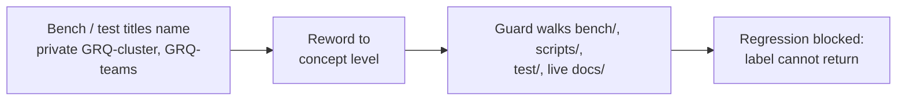

# Rename GRQ-cluster / GRQ-teams topology labels to concept level (#3616)

## Summary

Production-scale benchmark and test naming used the names of the **private**
`GRQ-cluster` and `GRQ-teams` repositories as topology labels. A public reader
running the bench suite saw test names asserting parity with a repository they
cannot open, so the claims were unverifiable and the labels were dead weight —
the fixtures themselves are generated synthetically in-tree and never needed the
private name.

Every affected label is reworded to concept level. No behaviour changes: only
comments, test titles and assertion messages. `Closes #3616`.

| File                                                     | Change                                                                                                                    |
| -------------------------------------------------------- | ------------------------------------------------------------------------------------------------------------------------- |
| `bench/ProductionScaleEvolveDirProfile.ts` (4)           | "at GRQ-cluster dimensions" → "at production-scale dimensions"                                                            |
| `bench/fixtures/generateProductionFixtures.ts` (3, 43)   | "matching GRQ-cluster dimensions" / "GRQ-cluster production dimensions" → "production-scale dimensions"                   |
| `test/bench/ProductionScaleEvolveDirProfile.ts`          | test title → "Production-scale creature has the expected dimensions"; assertion messages → "match production scale"       |
| `test/bench/fixtures/GenerateProductionFixtures.ts`      | four test titles → "Production-scale creature …"; "for GRQ-cluster scale" → "for production scale"                        |
| `test/predictiveCoding/ComplexCreatureIntegration.ts`    | test title → "PC training improves on production-representative large topology"                                           |
| `test/creature/EvolveRunStatistics_integration.ts` (7)   | "GRQ-cluster's `result.json`" → "the downstream run-result file"                                                          |
| `scripts/verifyBatchScorerUtilisation3238.ts` (19)       | "GRQ worker serialises into GRQ-cluster/result.json" → "production worker serialises into the downstream run-result file" |
| `test/breed/SyntheticLocationE2E.ts` (7)                 | "GRQ-teams Europa creature" → "a large production teams creature"                                                         |
| `test/breed/fixtures/synthetic-alignment/README.md` (16) | same rewording for the father fixture provenance note                                                                     |
| `docs/PREDICTIVE_CODING_BENCHMARKS.md` (311, 342)        | "GRQ-cluster pattern/topology" → "large-network pattern" / "production-scale topology"                                    |
| `docs/event-driven-evolution.md` (639)                   | "GRQ-cluster feeds this into …" → "The downstream production consumer feeds this into …"                                  |

The in-tree guard family is extended so the labels cannot come back.

## Evidence

Backend/library change with no web interface, so there is no screenshot to
capture. The evidence is the new guard test, which was written first and
reproduced the finding exactly — it failed listing the same eleven locations the
issue names, and passes after the rewording:

```text
# before the rename
bench/ProductionScaleEvolveDirProfile.ts:4
bench/fixtures/generateProductionFixtures.ts:3,43
docs/PREDICTIVE_CODING_BENCHMARKS.md:311,342
docs/event-driven-evolution.md:639
scripts/verifyBatchScorerUtilisation3238.ts:19
test/bench/ProductionScaleEvolveDirProfile.ts:5,21,27,38,39
test/bench/fixtures/GenerateProductionFixtures.ts:5,38,49,54,64,72,230
test/breed/SyntheticLocationE2E.ts:7
test/breed/fixtures/synthetic-alignment/README.md:16
test/creature/EvolveRunStatistics_integration.ts:7
test/predictiveCoding/ComplexCreatureIntegration.ts:551,554,555
FAILED | 4 passed | 1 failed

# after the rename
ok | 5 passed | 0 failed
```

Full gate: `./quality.sh` → `ok | 8089 passed (5 steps) | 0 failed | 4 ignored`.



### Case-sensitivity carve-out

The guard matches the upper-case repo tokens only, so the in-tree lower-case
`grq-cluster` scale-preset name in
`test/propagate/large/ProductionScaleCreature.ts` stays legal — it identifies a
synthetic fixture preset, not a private repository. This matches the `grq-3397`
carve-out already recorded in `test/_privateRepoRefs.ts` (#3454 / #3604), and
keeps the change naming-only with no API surface touched.

## Test Plan

New guard `test/docs/BenchAndTestNoPrivateGrqTopologyLabel.ts`:

- `bench, test, script and live doc trees carry no private GRQ topology label (#3616)`
  — walks `bench/`, `scripts/`, `test/` and live `docs/` (excluding
  `docs/archive/` and the private-repo guards that must name the tokens they
  detect) and fails on any `GRQ-cluster` / `GRQ-teams` label. This is the
  regression test for the finding.
- `findPrivateGrqTopologyLabels flags GRQ-cluster and GRQ-teams labels` — happy
  path, returns the offending 1-indexed line numbers.
- `findPrivateGrqTopologyLabels ignores the lower-case preset and bare mnemonics`
  — the `grq-cluster` / `grq-3397` presets and a bare `GRQ` mnemonic are not
  flagged.
- `findPrivateGrqTopologyLabels returns empty for concept-level prose` and
  `… for empty input` — edge cases.

Renamed (not removed) test titles — all still run and pass unchanged:

- `test/bench/ProductionScaleEvolveDirProfile.ts` — 1 title.
- `test/bench/fixtures/GenerateProductionFixtures.ts` — 4 titles.
- `test/predictiveCoding/ComplexCreatureIntegration.ts` — 1 title.

No assertions, thresholds, or fixture values were altered; only the label text.
