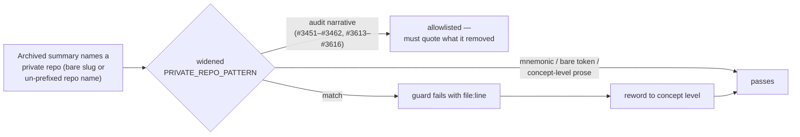

# Reword bare private-repo slugs in archived PR summaries and close the guard gap (#3617)

## Summary

Fourteen archived PR summaries still pointed public readers at the private
downstream production repositories, in two forms the archive guard did not
match: the bare org-qualified consumer slug, and an un-prefixed private repo
name used as a topology / run-result label. Both were reworded to concept level,
and the shared detector was widened so the archive cannot drift back. **Closes
#3617.**

Two changes:

1. **Detector widened** (`test/_privateRepoRefs.ts`). `PRIVATE_REPO_PATTERN` now
   also flags any org-qualified private slug —
   `stSoftwareAU\/(?:GRQ|VibeCoding)` followed by a word boundary, which
   subsumes the old `github.com/…` alternative — and un-prefixed repo names
   `GRQ-(?:cluster|logs|teams)` between word boundaries. The bare `GRQ` token,
   host/log/preset mnemonics (`GRQ-21`, `GRQ-3-rocket.log`, `GRQ-side`) and the
   lower-case `grq-3397` fixture stay clean, per the #3454 mnemonic decision;
   the bare token is policed separately by the live-doc and `src`/`test` guards.
2. **Fourteen archived summaries reworded** to the wording precedent set by
   #3455/#3616 — "the downstream production consumer", "the downstream
   run-result file/store", "the production-scale topology", "every production
   snapshot".

| File                                        | Reworded                                                                 |
| ------------------------------------------- | ------------------------------------------------------------------------ |
| `pr-summary-3519.md` (7)                    | consumer slug → "the downstream production consumer"                     |
| `pr-summary-3520.md` (7)                    | consumer slug → "the downstream production consumer"                     |
| `pr-summary-3521.md` (8)                    | consumer slug → "the downstream production consumer"                     |
| `pr-summary-3522.md` (8, 44, 86)            | consumer slug, `gh search code --repo` pointer, and the tool-output line |
| `pr-summary-3523.md` (10)                   | consumer slug → "the downstream production consumer"                     |
| `pr-summary-3524.md` (7)                    | consumer slug → "the downstream production consumer"                     |
| `pr-summary-3554.md` (12)                   | consumer slug → "the downstream production consumer"                     |
| `pr-summary-3558.md` (15)                   | consumer slug → "the downstream production consumer"                     |
| `pr-summary-worker-start-heartbeat.md` (13) | consumer slug → "A downstream production `team` run"                     |
| `pr-summary-3234.md` (10)                   | private `result.json` label → "the downstream run-result file"           |
| `pr-summary-3237.md` (11)                   | private `result.json` label → "the downstream run-result file"           |
| `pr-summary-3397.md` (10)                   | private topology label → "the production-scale topology"                 |
| `pr-summary-3422.md` (6)                    | private `result.json` label → "the downstream run-result file"           |
| `pr-summary-3427.md` (7, 19)                | "every production snapshot" / "the downstream run-result store"          |

The clean-up series that documents this class of removal (#3451–#3462,
#3613–#3616) must quote the patterns it removed, so those summaries joined the
guard's existing audit-narrative allowlist rather than being reworded. This
summary is deliberately **not** allowlisted — it describes the rewordings at
concept level and quotes only regex source, so the widened guard scans it like
any other archived doc.

## Evidence

Backend/test-only change; no web interface to screenshot. Regression evidence is
the widened detector run against the pre-fix files (`git show HEAD:<file>`),
which reproduces exactly the fourteen offenders the issue lists and is clean
after the reword:

```text
pr-summary-3234.md:10   pr-summary-3237.md:11   pr-summary-3397.md:10
pr-summary-3422.md:6    pr-summary-3427.md:7,19 pr-summary-3519.md:7
pr-summary-3520.md:7    pr-summary-3521.md:8    pr-summary-3522.md:8,44,86
pr-summary-3523.md:10   pr-summary-3524.md:7    pr-summary-3554.md:12
pr-summary-3558.md:15   pr-summary-worker-start-heartbeat.md:13
```



## Test Plan

- `findPrivateRepoRefs flags a bare org-qualified downstream consumer slug
  (#3617)`
  — new unit case; the two fixture lines previously asserted **clean** and now
  assert flagged. This is a deliberate contract change (documented in the file
  header), not a relaxed test.
- `findPrivateRepoRefs flags an un-prefixed private repo name (#3617)` — new
  unit case covering the `-cluster`, `-teams` and `-logs` forms plus a clean
  interleaved line.
- `findPrivateRepoRefs ignores the bare GRQ token on its own (#3604)` — new
  clean case pinning the carve-out the widened pattern must not swallow.
- `findPrivateRepoRefs ignores bare host/log/preset mnemonics (#3604)` —
  unchanged, still passes.
- `no private stSoftwareAU repo slugs or links in docs/archive (#3455)` — the
  existing tree-walking guard, now failing against the unfixed archive and
  passing after the reword.
- `bump-deps.sh` / `AGENTS.md` / `BumpDepsScript.ts`
  `has no private repo
  reference (#3458)` — the sibling consumers of the
  shared detector, unchanged and still clean under the widened pattern.
