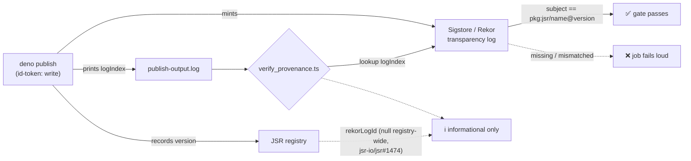

# Publish: verify provenance against Sigstore/Rekor, not JSR's dead rekorLogId (#3633)

## Summary

The post-publish provenance gate failed **every** release. It polled JSR's
`<version>_meta.json` for a non-null `rekorLogId`, but JSR stopped populating
that field for every package in the registry around 2026-07-02 — confirmed
against `@std/cli`, `@david/dax`, `@hono/hono` and our own back-catalogue, and
tracked upstream as [jsr-io/jsr#1474](https://github.com/jsr-io/jsr/issues/1474)
(with [#1481](https://github.com/jsr-io/jsr/issues/1481) reporting the same
symptom). Provenance itself was never broken: `deno publish` minted a genuine
Sigstore transparency-log entry on every run, including logIndex `2313255666`
for `6.2.0`. Only JSR's exposure of it is dead, so 12+ consecutive Publish runs
went red and the SBOM steps that sit after the gate never ran.

The gate now verifies the attestation against **Rekor**, the authoritative
transparency log:

1. `deno publish` output is captured to `publish-output.log` (with `pipefail`,
   so a failing publish is not masked by `tee`).
2. `scripts/verify_provenance.ts` reads the minted `logIndex` out of that
   transcript, looks the entry up in Rekor, and confirms its in-toto attestation
   names **this** package version (`pkg:jsr/<name>@<version>`) as its subject.
3. JSR's `rekorLogId` is still reported — informationally only, so the
   regression's eventual fix is visible without it ever blocking a release.

The gate stays fail-loud in every direction (Issue #3234): no transparency-log
line in the publish output, no entry in Rekor, a logIndex that does not match
the publish output, or an entry attesting a different artefact all exit
non-zero. No warn-only downgrade, no removal. There is no SBOM backfill for
6.1.1–6.2.0 — the next release's SBOM steps run normally once the gate is green.

Closes #3633.



### Removed: the duplicate JSR gate

`scripts/verify_jsr_provenance.sh` (Issue #3334) was a second, independent
implementation of the same dead check — it also failed every publish on the same
null field. Rather than keep two gates on a surface that no longer carries the
signal, it and the `Verify JSR provenance was recorded` step are removed,
leaving one gate. **Test change (documented per the TDD policy):**
`test/scripts/VerifyJsrProvenance.ts` tested that shell CLI exclusively and is
removed with it; `test/ci/PublishProvenanceGate.ts` keeps its two original
assertions (the gate runs; it is gated on `needs_publish`), retargeted at the
surviving gate, and gains a regression test that the `rekorLogId` gate is never
reinstated. In `test/ci/VerifyProvenance.ts` the `verifyProvenance` polling
tests are replaced by `verifySigstoreProvenance` (fail-loud) and `jsrRekorLogId`
(informational, never throws) tests — the same behaviour change, not a
weakening. `hasProvenance` and `metaUrl` keep their original coverage.

### Upstream report

An open upstream tracker already existed, so no duplicate was filed: the
registry-wide regression is reported and cross-linked at
[jsr-io/jsr#1474](https://github.com/jsr-io/jsr/issues/1474).

## Evidence

Backend/CI change — no web interface to screenshot. Verified by running the real
gate against the transcript of the run that this issue reports
([run 30709797553, attempt 1](https://github.com/stSoftwareAU/NEAT-AI/actions/runs/30709797553/job/91395137494)),
against live Rekor:

```console
$ deno run --allow-read=deno.json,publish-output.log \
    --allow-net=rekor.sigstore.dev,jsr.io \
    scripts/verify_provenance.ts publish-output.log
✅ @stsoftware/neat-ai@6.2.0 has Sigstore provenance: Rekor entry 108e9186e8c5677a…
   (logIndex 2313255666) attests pkg:jsr/@stsoftware/neat-ai@6.2.0.
ℹ️  JSR reports rekorLogId=null for @stsoftware/neat-ai@6.2.0. JSR has returned
   null for every package in the registry since ~2026-07-02 (upstream
   jsr-io/jsr#1474); this is informational and does not affect the gate, which
   verified the attestation against Rekor directly.
$ echo $?
0
```

The same run is the one the old gate failed with
`rekorLogId is null (no Sigstore attestation)` after 10 attempts.

Fail-loud paths, also against live Rekor:

```console
# transcript with no transparency-log line
❌ … contains no Sigstore transparency-log entry …            exit 1

# logIndex belonging to a different package (2148362238)
❌ Rekor entry 108e9186e8c5677a… (logIndex 2148362238) does not attest
   pkg:jsr/@stsoftware/neat-ai@6.2.0; its subjects are
   ["pkg:jsr/@evex/zeta@0.1.6"]. …                            exit 1
```

## Test Plan

`test/ci/VerifyProvenance.ts` — 24 unit tests calling the real functions with an
injected `fetch`/`sleep` (no network):

- `extractLogIndex`: parses the `deno publish` transcript; takes the last entry
  when several are printed; **throws** when no transparency-log line is present
  and when output is empty (the #3234 rule — absence is never success).
- `packageUrl` / `rekorEntryUrl` / `metaUrl`: URL construction, including a
  custom base URL without doubled slashes.
- `attestationSubjects`: decodes in-toto subject names; returns nothing for
  missing, empty, or undecodable attestation data.
- `verifySigstoreProvenance`: confirms a matching entry; **rejects** an entry
  attesting a different version, an entry with no attestation, a mismatched
  `logIndex`, and an empty Rekor response; retries while Rekor is still
  integrating; fails loud after exhausting retries.
- `jsrRekorLogId`: returns the id when JSR records one; returns `null` **without
  throwing** for a null value (citing jsr-io/jsr#1474) and for a transport
  failure.
- `hasProvenance`: unchanged coverage.

Workflow configuration tests:

- `test/ci/PublishProvenanceGate.ts` — the gate runs, is gated on
  `needs_publish`, is granted Rekor network access, reads the captured publish
  transcript, and the dead `rekorLogId` shell gate is not reinstated.
- `test/ci/ProvenancePublishWorkflow.ts` — publish still uses `deno publish`
  (never the `npx` shim, never `--no-provenance`), captures its transcript, sets
  `pipefail` so `tee` cannot mask a failed publish, and keeps least-privilege
  OIDC permissions.

Full `./quality.sh` (fmt, lint, type-check, all tests) passes.
