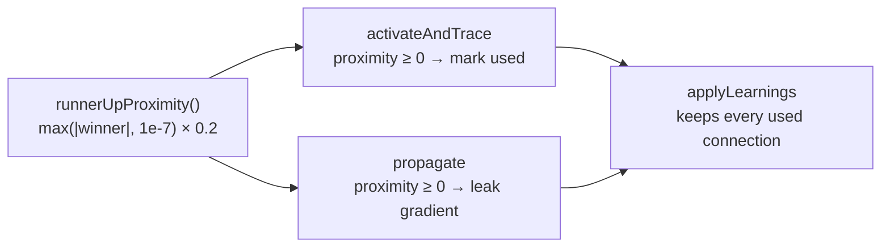

# Unify the runner-up proximity rule for MAXIMUM/MINIMUM

## Summary

The Issue #1874 "runner-up proximity" rule — a losing connection whose value
sits within 20% of the winning connection's magnitude still participates — was
copy-pasted into four method bodies across `MAXIMUM` and `MINIMUM`, and the
copies had diverged on the floor constant:

- `activateAndTrace` (usage marking) floored the winner's magnitude at `1e-12`;
- `propagate` (gradient leak) floored it at `config.plankConstant` (`1e-7` by
  default).

When the winner's magnitude fell between those two values the blocks computed
different windows, so a connection could receive leaked gradient in `propagate`
while never being marked `used` in `activateAndTrace` — and `applyLearnings`
then disconnected a connection that was still learning. That is exactly the
hazard the marking block exists to prevent.

The rule now lives in one place,
`src/methods/activations/aggregate/RunnerUpProximity.ts`, and all four sites
call it. Each site keeps only its local concern: the direction of `distance`
(below the winner for MAXIMUM, above it for MINIMUM) and its action (mark
`used`, or scale the leak).

**Chosen floor:** the fixed constant `RUNNER_UP_PROXIMITY_FLOOR = 1e-7`, which
matches the default `plankConstant` — the smallest magnitude propagation treats
as meaningful. It is deliberately *not* read from `config.plankConstant`,
because `activateAndTrace` has no `BackPropagationConfig`; sourcing the floor
from config is what let the two halves disagree in the first place. With the
default config the propagation window is unchanged; tracing now marks the same
(slightly wider) set of runner-ups that propagation leaks to.

Closes #3635.

## Evidence

Backend-only change — no web interface to screenshot. Verified by the tests
below plus the full `./quality.sh` gate.

The invariant the fix restores:



Because both halves read the same window, a connection can no longer be leaked
gradient by `propagate` yet dropped by `applyLearnings`.

**Regression proof:** with the trace-side floor temporarily restored to `1e-12`
(the pre-fix value), the two `survives applyLearnings` tests fail; with the
shared floor they pass.

```
MAXIMUM: a runner-up in the window survives applyLearnings => FAILED
MINIMUM: a runner-up in the window survives applyLearnings => FAILED
FAILED | 8 passed | 2 failed
```

## Test Plan

New file `test/methods/activations/RunnerUpProximity.ts`:

- `runnerUpProximity: winner itself scores 1` — happy path at zero distance.
- `runnerUpProximity: window edge scores 0, beyond scores -1` — boundary.
- `runnerUpProximity: decays linearly across the window` — the leak scale.
- `runnerUpProximity: distance on the winning side is not a runner-up` — error
  path (negative and `NaN` distance).
- `runnerUpProximity: floor bounds the window for tiny winners` — the floor
  matters, and it equals the default `plankConstant`.
- `runnerUpProximity: a zero window only admits an exact tie` — degenerate floor.
- `MAXIMUM/MINIMUM: a runner-up in the window survives applyLearnings` —
  regression for the diverged floor: a winner of magnitude `1e-9` with a
  runner-up `1e-8` away (inside the floored window, outside the old `1e-12` one)
  is kept, while a far connection is disconnected.
- `MAXIMUM/MINIMUM: the same runner-up receives leaked gradient` — the other
  half of the invariant: `propagate` accumulates on that same runner-up and not
  on the far connection.

Existing `test/propagate/MaximumGradientFlow.ts` and
`test/propagate/MinimumGradientFlow.ts` continue to pass unchanged.

## Notes

- The helper landed in `src/methods/activations/aggregate/RunnerUpProximity.ts`
  rather than `SquashUtils.ts` (the issue's suggestion): `SquashUtils` is
  squash-name *classification* and deliberately imports nothing, whereas this is
  extremum-aggregate numerics used only by the two files beside it.
- `MINIMUM.activateAndTrace` writing `state.activations[neuron.index]` where
  `MAXIMUM` does not, noted in the issue as a further sign of drift, is left
  alone — changing it alters activation behaviour and is outside this fix.

## Security self-check

- No new external input, secrets, injection surface, endpoints, or dependencies;
  the change is a pure-function extraction over existing in-memory numerics.
