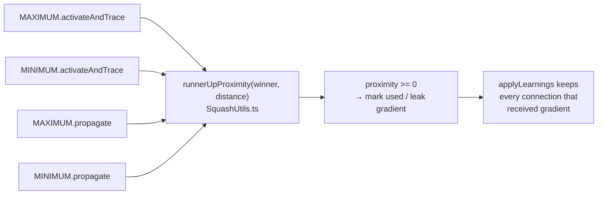

# Consolidate the runner-up proximity rule (Issue #3635)

## Summary

The Issue #1874 "runner-up proximity" rule — a losing connection whose value
sits within 20% of the winner's magnitude still participates — was copy-pasted
into four method bodies across the two extremum aggregates, and the copies had
already diverged on the magnitude floor:

| Site                       | Floor used             |
| -------------------------- | ---------------------- |
| `MAXIMUM.activateAndTrace` | `1e-12`                |
| `MINIMUM.activateAndTrace` | `1e-12`                |
| `MAXIMUM.propagate`        | `config.plankConstant` |
| `MINIMUM.propagate`        | `config.plankConstant` |

`plankConstant` defaults to `1e-7`, so for any winner magnitude between `1e-12`
and `1e-7` the propagation window was wider than the tracing window: a
connection could receive leaked gradient in `propagate` yet never be marked
`used` in `activateAndTrace`, leaving `applyLearnings` free to disconnect a
connection that was still learning.

The rule now lives once, in `runnerUpProximity()` in
`src/methods/activations/SquashUtils.ts`, and each of the four sites is a call
plus its local action (mark `used`, or scale the leak). The direction of the
distance stays at the call site, so no per-caller flags were needed.

**Which floor is correct:** the constant `1e-12`, not `config.plankConstant`.
Tracing has no `BackPropagationConfig` in scope, so a config-dependent floor
cannot give both sides the same window under any configuration. Fixing the floor
at `1e-12` makes the two windows identical regardless of the configured plank
constant. This narrows the propagation window only for winner magnitudes below
`1e-7`, where the leaked gradient was reaching connections that tracing never
marked.

The routine `@std/yaml` and `@std/testing` bumps produced by `bump-deps.sh` ride
in the same PR (#1613).

Closes #3635.

## Evidence

Backend-only change — no web interface to screenshot. Evidence is the test
suite: `./quality.sh` passes with **8113 tests, 0 failed**.

The invariant the four sites must jointly satisfy:



Before the fix, the two new consistency tests for the divergence window failed
with:

```
MAXIMUM: runner-up received gradient (count=1) but was not marked used (used=false)
MINIMUM: runner-up received gradient (count=1) but was not marked used (used=false)
```

## Follow-up found while working

`Creature.activateAndTrace()` always runs the WASM trace path, and
`applyWasmTraceData` marks only the **winning** connection for MAXIMUM/MINIMUM —
it never applies the proximity marking at all, while TypeScript propagation
still leaks gradient to runner-ups. That is a separate defect from this DRY
consolidation and is filed as **stSoftwareAU/NEAT-AI#3640**; this PR
deliberately does not change production tracing behaviour.

## Test Plan

New tests:

- `test/methods/activations/RunnerUpProximity.ts` — unit tests for the shared
  helper: winner scores 1, window edge scores 0, halfway scores 0.5, outside
  scores -1, negative distance and non-finite inputs are outside, zero winner
  falls back to the magnitude floor, and the regression case
  (`runnerUpProximity(1e-9, 1e-8) === -1`) that the old plank-constant floor
  admitted.
- `test/propagate/RunnerUpProximityConsistency.ts` — behavioural regression
  tests for both aggregates. Each traces then propagates one sample through a
  two-input extremum neuron and asserts the invariant "a connection that
  received leaked gradient must be marked `used`", plus the specific window
  outcome for a distant runner-up (neither) and a close one (both). The two
  distant-runner-up tests fail against the unfixed code.

Existing tests: no test was modified or removed; the full `./quality.sh` gate
(fmt, lint, type-check, 8113 tests) passes.
