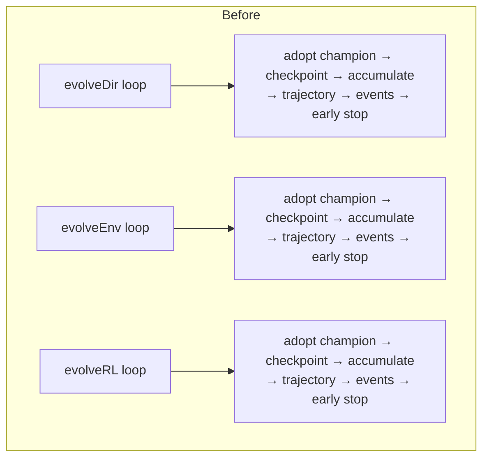
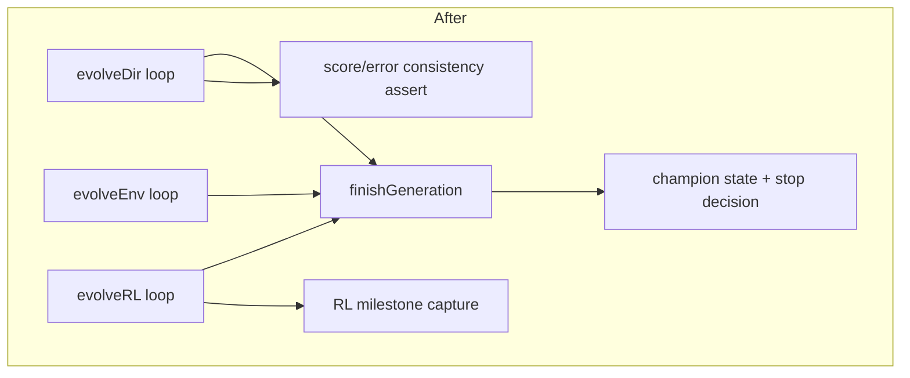

# Extract the shared generation-loop tail (Issue #3636)

## Summary

The end-of-generation bookkeeping — champion adoption, the optionally timed
checkpoint write, phase-timing and scorer-utilisation accumulation, the
score-trajectory snapshot, the `generation_complete` and `plateau_detected`
emissions, and the cost-aware early-stop decision — was copy-pasted into all
three training loops in `src/creature/CreatureTraining.ts` (`evolveDir`,
`evolveEnv`, `evolveRL`). Six separate changes (#3210, #3234, #3422, #3402,
#3263, #2947) each had to be applied three times, and the copies had already
drifted: `evolveEnv` and `evolveRL` parsed the error tag through an `"Infinity"`
ternary that `evolveDir` lacked.

This PR moves that rule into one place — `finishGeneration()` in the new
`src/creature/EvolveGenerationTail.ts` — with three call sites. Genuinely
variant-specific work stays in each loop: `evolveDir`'s score/error consistency
assert and `evolveRL`'s milestone capture. No mode flags are passed to the
helper.

Behaviour is unchanged. The drifted error-tag parse is unified on the explicit
`"Infinity"` form, which was already behaviourally inert
(`Number.parseFloat("Infinity") === Infinity`, and the following
`Number.isFinite` assert rejects it either way — a non-finite error tag still
fails loud in all three loops).

`CreatureTraining.ts` drops 275 net lines (1833 → 1558). No public API or event
payload changed, so `docs/api/EVOLUTION.md` needs no update.

Closes #3636.

## Evidence

Backend/library change — no web interface to screenshot. Verified by the unit
tests below plus the existing `evolveDir` / `evolveEnv` / `evolveRL` integration
suites (which assert on the emitted `generation_complete` payloads, the
run-level `phaseTimingTotals` / `scorerUtilisation` totals, the RL milestone
sequence, and the early-stop and hard-deadline behaviour).

Before — the same tail inlined three times:

After — one helper, three call sites, variant-specific work left in the loops:

Quality gate: `./quality.sh` run clean (fmt, lint, bash syntax, type-check,
discovery, WASM sync, full test suite).

## Test Plan

New unit tests in `test/creature/EvolveGenerationTail.ts` call the real
`finishGeneration()` with real configs, accumulators and creatures:

- `adopts an improved champion` — champion clone, best score/error, and the
  score-trajectory point (including the cumulative scored-count).
- `keeps the champion when no improvement` — champion, error, and trajectory
  untouched on a tie.
- `fails loud on a non-finite error tag` — `Infinity`, `NaN` and unparseable
  tags all reject rather than adopting an incomparable champion.
- `fails loud on a negative error tag`.
- `emits generation_complete` — asserts every field of the payload.
- `emits plateau_detected only on a plateau`.
- `accumulates timings and scorer counts` — two generations summed into the
  run-level accumulators.
- `times the checkpoint write` — `checkpointWriteMs` present and the population
  actually written to the store.
- `leaves phase timing untouched without a store`.
- Stop decision — early stop on `targetError`, the iteration limit, SIGTERM
  interruption, a passed `endTimeMS`, and staying un-completed mid-run.

No existing tests were modified or removed.
