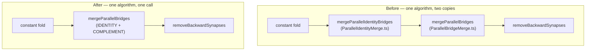

# Retire the duplicated IDENTITY-only parallel bridge merge

## Summary

The parallel-bridge merge algorithm — group bridge neurons by outbound target,
skip groups with duplicate inbound sources, fold biases into the kept neuron
(`bias_merged = Σ w_out_i · bias_i`), absorb the kept outbound weight into its
inbound weight, redirect removed neurons' inbound synapses with `w_out · w_in`
weights, merge tags (#1972), delete the removed synapses/neurons, re-validate —
existed verbatim in two files, and **both** passes ran back-to-back on every
creature in the same compaction sequence.

`mergeParallelBridges` already covers the IDENTITY case in full: `"IDENTITY"` is
in `PARALLEL_MERGEABLE_SQUASH_NAMES`, and its `convertToIdentity` step
short-circuits for IDENTITY neurons. The IDENTITY-only copy
(`src/compact/ParallelIdentityMerge.ts`) is therefore deleted and
`CompactCreature` keeps the single generalised call, preserving the intended
one-group-per-pass pacing. Closes #3637.

Net effect: 235 lines removed, 101 added; one merge algorithm, one call site.

## Evidence

Backend-only change — there is no web interface to screenshot. Verification is
the test suite.

Full quality gate: `./quality.sh` → **8139 passed | 0 failed | 4 ignored**
(4m37s). The 168 tests under `test/compact/` all pass.

An incidental improvement: the retired pass never called
`normaliseCreatureExport`, so callers had to populate integer ids themselves.
The surviving pass normalises internally, so a UUID-only export (the canonical
wire format) now merges without preparation — covered by a new test.

## Test Plan

Added `test/compact/ParallelIdentityBridgeUnification.ts`:

- `parallel merge: IDENTITY bridges merge from a UUID-only export` — asserts the
  merged bias (`2.0·0.1 + 1.5·0.2 = 0.5`) and both redirected weights
  (`2.0·0.5 = 1.0`, `1.5·0.3 = 0.45`) on an export carrying no integer ids.
- `parallel merge: compaction still collapses IDENTITY bridges without behaviour
  change`
  — runs a creature with parallel IDENTITY bridges through `compactCreature` and
  asserts the group collapses to one hidden neuron while activations are
  unchanged across three input samples (Float32 tolerance).

Modified tests (documented, no assertions removed or weakened): the six existing
cases in `test/compact/ParallelMergeCornerCases.ts` and
`test/compact/CompactTagPreservation.ts` that called
`mergeParallelIdentityBridges` now call `mergeParallelBridges`. Their fixtures
are IDENTITY-only, so every assertion — merged-tag preservation,
duplicate-source skipping, typed-synapse exclusion, dangling-reference integrity
— is unchanged and still passes. The two now-redundant `normaliseCreatureExport`
pre-calls (and their stale comments) were dropped since the surviving pass
normalises itself.
