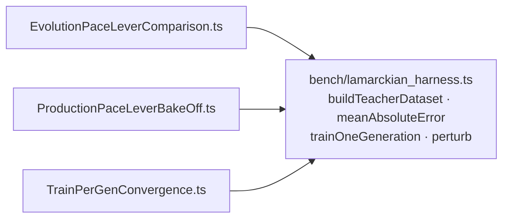

# Lamarckian bench harness extracted to a shared module (Issue #3638)

## Summary

The Lamarckian-evolution benchmark harness — the synthetic logistic-teacher
dataset generator, the mean-absolute-error scorer, the one-generation backprop
trainer (`plankConstant: 1e-7`, unit adjustment scales, `disableRandomSamples`,
`batchSize: 1`) and the weight/bias perturbation operator — was copy-pasted
across three benchmarks. A corrected backprop setting or a different teacher
non-linearity would have needed the same edit in all three, or their results
would silently stop being comparable across the experiment family.

That shared knowledge now lives once in `bench/lamarckian_harness.ts`, and the
three benches call it, each keeping its own constants and passing them in.
Closes #3638.

- New: `bench/lamarckian_harness.ts` — `buildTeacherDataset`,
  `meanAbsoluteError`, `trainOneGeneration`, `perturb`, and the `Sample` type.
- Updated call sites: `bench/EvolutionPaceLeverComparison.ts`,
  `bench/ProductionPaceLeverBakeOff.ts`, `bench/TrainPerGenConvergence.ts` (~200
  duplicated lines removed).
- Docs: the `buildDataset` reference in `docs/PERFORMANCE_RESEARCH.md` (the
  human-run GRQ adoption-gate recipe) now names `buildTeacherDataset`.

The two benches that drive the RNG through `RandomNumberGenerator` pass
`() => rng.random()`, so the random streams — and hence every reported figure —
are unchanged. `buildTeacherDataset` also validates its problem sizes and throws
a `RangeError` rather than quietly producing an empty dataset (fail loud).



## Evidence

Backend/CLI change — no web interface to screenshot.

**Behaviour is unchanged.** Each benchmark was run before and after the refactor
and the outputs diffed. Every non-timing figure is byte-identical; only
wall-clock milliseconds (inherently variable) differ.

| benchmark                         | before vs after                                  |
| --------------------------------- | ------------------------------------------------ |
| `TrainPerGenConvergence.ts`       | identical (best error, improvement %)            |
| `EvolutionPaceLeverComparison.ts` | identical except the wall-clock ms column        |
| `ProductionPaceLeverBakeOff.ts`   | fully identical (whole stdout, all three sweeps) |

Sample — `TrainPerGenConvergence.ts`, identical before and after:

```
trainPerGen= 1 -> best error 0.050095
trainPerGen= 4 -> best error 0.044458
trainPerGen=10 -> best error 0.034280
```

Quality gate: `./quality.sh < /dev/null` →
`ok | 8146 passed (5 steps) | 0 failed | 4 ignored`.

## Test Plan

New: `test/bench/LamarckianHarness.ts` — nine tests calling the real harness
functions and asserting on outcomes:

- `buildTeacherDataset` — sample/target shape with inputs in `[-1, 1)` and
  logistic targets strictly inside `(0, 1)`; determinism for a seeded RNG;
  `RangeError` on non-positive or non-integer problem sizes (error path).
- `meanAbsoluteError` — zero when the targets are the creature's own outputs;
  equals the mean absolute deviation over samples × outputs.
- `trainOneGeneration` — reduces error on a learnable dataset; leaves the
  creature untouched with zero inner iterations (edge case).
- `perturb` — jitters every weight and bias within `±scale` and leaves the
  source creature unmutated; a zero scale yields an unchanged copy.

Existing `test/bench/EvolutionPaceLeverComparison.ts` and
`test/bench/ProductionPaceLeverBakeOff.ts` (determinism and score-carry
contract) pass unchanged, confirming the extraction preserved behaviour.
