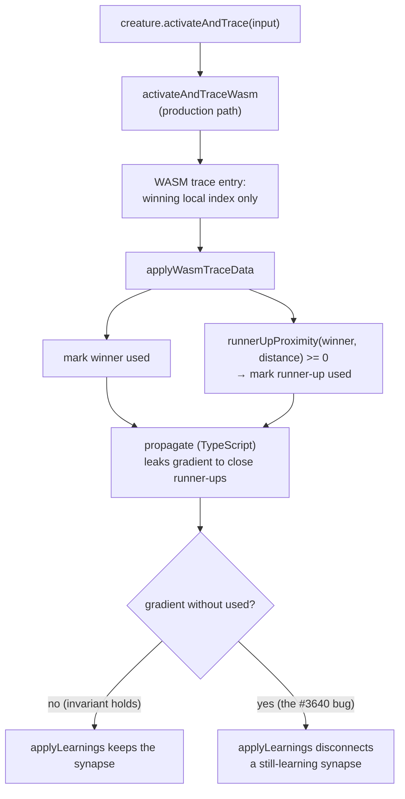

# WASM trace path applies the runner-up proximity rule (Issue #3640)

## Summary

`Creature.activateAndTrace()` always runs through WASM, so the TypeScript
`MAXIMUM.activateAndTrace` / `MINIMUM.activateAndTrace` bodies — which mark a
close runner-up connection as `used` — are unreachable in production.
Backpropagation is still TypeScript and does leak a fraction of the gradient to
those runner-ups, so a WASM trace that marked only the winner left a connection
with gradient but `used === false`, and `applyLearnings` was free to disconnect
a connection that was still learning.

The marking block itself landed in `applyWasmTraceData`
(`src/creature/CreatureActivation.ts`) with PR #3639 while consolidating the
rule for Issue #3635, but it shipped **without any regression cover for the
production path** — every existing test drove the TypeScript squash bodies
directly. This PR adds that cover and points the code comment at it. Closes
#3640.

Changes:

- `test/creature/WasmTraceRunnerUpProximity.ts` (new) — seven tests exercising
  `creature.activateAndTrace()` (the WASM path) and asserting on the resulting
  synapse state.
- `src/creature/CreatureActivation.ts` — comment only: records that this is the
  production trace path and names the regression test.

## Evidence

Backend/library change — no web interface to screenshot.

The marking block is load-bearing, proven by temporarily removing it and
re-running the new tests:

| `applyWasmTraceData` runner-up block | Result                           |
| ------------------------------------ | -------------------------------- |
| present (this branch)                | `ok \| 7 passed \| 0 failed`     |
| removed                              | `FAILED \| 2 passed \| 5 failed` |

Representative failure with the block removed — exactly the hazard from the
issue:

```text
error: AssertionError: MINIMUM: runner-up received gradient (count=1) but was not marked used (used=false)
```

Full quality gate: `./quality.sh` →
`ok | 8123 passed (5 steps) | 0 failed | 4 ignored`.



## Test Plan

New file `test/creature/WasmTraceRunnerUpProximity.ts`:

- `MAXIMUM/MINIMUM: WASM trace marks a close runner-up as used` — the issue's
  reproduction (`[1e-9, 9e-10]` and its MINIMUM mirror); the runner-up sits well
  inside the 20% window.
- `MAXIMUM/MINIMUM: WASM trace leaves a distant runner-up unused` — guards
  against the opposite failure of marking every inbound connection.
- `WASM trace agrees with the TypeScript trace on close runner-ups` — parity
  across all four cases, the exact divergence the issue reported.
- `MAXIMUM/MINIMUM: no gradient reaches an unused synapse after a WASM trace` —
  traces then propagates and asserts the invariant
  `count === 0 || used === true`.

All tests assert on observable synapse state, so they survive any rewrite of how
trace data returns from WASM (for example the alternative in the issue, where
the WASM trace returns the runner-up set directly).
