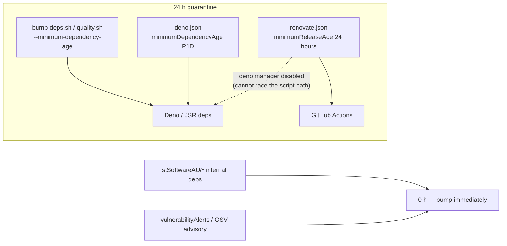

# Renovate 24 h supply-chain quarantine (Issue #3667)

## Summary

Renovate ran on a six-line `config:recommended` config with no
`minimumReleaseAge`, so it could raise — and a maintainer could merge — an
update PR the moment a version was published. That left GitHub Actions (15
workflows, never touched by `bump-deps.sh`) with **no** quarantine at all, and
let Renovate's `deno` manager land a JSR bump that the script-gated path would
have embargoed. Closes #3667.

Changes:

- `renovate.json` — added `minimumReleaseAge: "24 hours"`, a `packageRules`
  entry disabling the `deno` manager (Deno/JSR is governed by
  `bump-deps.sh --minimum-dependency-age`, so the two windows cannot race), and
  a rule exempting internal `stSoftwareAU/*` deps at `0` (Issue #1613
  classification). `vulnerabilityAlerts` / `osvVulnerabilityAlerts` are
  unchanged — Renovate exempts security fixes from `minimumReleaseAge`, so an
  actively-exploited CVE still moves immediately.
- `deno.json` — added the native
  `minimumDependencyAge: { "age": "P1D", "exclude": ["jsr:@stsoftware/*", "npm:@stsoftware/*"] }`
  window so a bare `deno outdated --update` outside `bump-deps.sh` inherits the
  same 24 h embargo.
- `SECURITY.md` and `docs/CORE_DEPENDENCY_POLICY.md` — documented that the
  quarantine now covers every update path.

## Evidence

Backend/CI configuration change — no web interface to screenshot. Verified by
the new test file, which parses the committed config rather than grepping it.

Before the fix (4 of 5 new tests failing):

```text
FAILED | 1 passed | 4 failed (7ms)
  renovate.json sets a top-level quarantine of at least 24 hours (Issue #3667)
  renovate.json disables the deno manager so it cannot race the gated path (Issue #3667)
  renovate.json exempts internal stSoftwareAU deps from the quarantine (Issue #3667)
  deno.json declares the native minimumDependencyAge window (Issue #3667)
```

After: `ok | 15 passed | 0 failed` across `RenovateQuarantine.ts`,
`RenovateConfig.ts` and `RenovateSecurityUpdates.ts` (the two pre-existing Issue
#3007 suites still pass unchanged), and the full gate `./quality.sh < /dev/null`
→ `ok | 8125 passed | 0 failed | 4 ignored (8m9s)`, exit 0.

Quarantine coverage after the change:



## Test Plan

Added `test/ci/RenovateQuarantine.ts` (5 tests, parse-and-assert on the
committed configs):

- `renovate.json` declares `minimumReleaseAge` (or the legacy `stabilityDays`)
  resolving to ≥ 24 h.
- `renovate.json` carries a `packageRules` entry with `matchManagers: ["deno"]`
  and `enabled: false`.
- `renovate.json` carries a `stSoftwareAU/*` rule whose `minimumReleaseAge`
  resolves to 0 h.
- `renovate.json` keeps `vulnerabilityAlerts.enabled: true` (regression guard —
  the quarantine must not slow security fixes).
- `deno.json` declares `minimumDependencyAge` with `age: "P1D"` and excludes
  both `jsr:@stsoftware/*` and `npm:@stsoftware/*`.

No existing tests were modified or removed.
