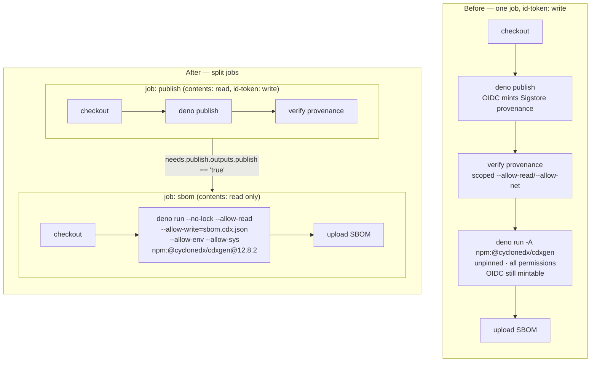

# Harden the CycloneDX SBOM step against package hijack (Issue #3668)

## Summary

`.github/workflows/publish.yml` ran an **unpinned** third-party npm package with
Deno's **all-permissions** flag inside the job that holds the JSR OIDC
publishing credential:

```yaml
- name: Generate CycloneDX SBOM
  if: steps.needs_publish.outputs.publish == 'true'
  run: deno run -A npm:@cyclonedx/cdxgen -t deno -o sbom.cdx.json .
```

Four properties combined into a package-hijack path. The bare specifier resolved
`latest` from the npm registry on every run (no `deno.lock` entry, and
`bump-deps.sh`'s quarantine only covers declared `deno.json` `imports`); `-A`
granted filesystem, network, environment, subprocess and FFI access; and
`permissions:` is **job-scoped**, so `ACTIONS_ID_TOKEN_REQUEST_URL` /
`ACTIONS_ID_TOKEN_REQUEST_TOKEN` were still live in that step's environment. A
compromised upstream release — no repository access required — could have minted
a fresh `jsr.io`-audience token and tokenlessly published a trojanised
`@stsoftware/neat-ai` carrying **valid** Sigstore provenance, because the
legitimate pipeline minted it.

Two of the issue's three suggested fixes are applied; each breaks the chain on
its own.

1. **SBOM generation moved to its own `sbom` job** (`needs: publish`,
   `permissions: contents: read`, no `id-token` grant), mirroring the split
   already used in `pages.yml`. The `publish` job now exposes the release gate
   as a job output so the new job reuses the same signal
   (`needs.publish.outputs.publish == 'true'`).
2. **The generator is pinned and sandboxed**:
   `deno run --no-lock --allow-read --allow-write=sbom.cdx.json --allow-env --allow-sys npm:@cyclonedx/cdxgen@12.8.2`.
   No `--allow-net`, no `--allow-run`, no `--allow-ffi` — a hijacked release has
   no route off the runner and cannot rewrite source files that later CI steps
   execute. A missing permission fails loud with Deno's `NotCapable` error
   rather than degrading the SBOM silently (Issue #3234).

Scoping the write permission surfaced a **latent correctness bug in the SBOM
itself**. Deno's module loader writes its resolution of the generator into
`deno.lock`, and that write bypasses `--allow-write`; cdxgen then reads
`deno.lock` as its input. Every SBOM published so far therefore described the
generator's own dependency tree as well as the package's — measured locally,
**308 components with the polluted lockfile versus 120 with a clean one**
(`@appthreat/atom-common` and friends were in the artefact; they are not
dependencies of `@stsoftware/neat-ai`). `--no-lock` fixes it at the same call
site.

The issue's third suggestion — `step-security/harden-runner` egress filtering —
is **not** adopted here. With SBOM generation moved out of the credential-
bearing job and network access removed from the generator, the remaining benefit
is marginal, while adding an always-on third-party network agent to the
OIDC-bearing publish job introduces exactly the class of dependency this change
removes. Repo-wide egress filtering is a separate policy decision, not a
property of this call site.

`renovate.json` is deliberately untouched: the sibling quarantine finding is
tracked as stSoftwareAU/NEAT-AI#3675. Renovate does not parse specifiers inside
a `run:` block, so the cdxgen pin is bumped by hand — which is the point, since
the bump is now a reviewable diff.

Closes #3668.

## Evidence

Backend/CI-only change — no web interface to screenshot.

Blast radius before and after (the OIDC credential is the shaded surface):



The permission set was derived empirically, not guessed: the narrowed command
was run locally against this repository until it completed, with no network or
subprocess access granted. It emits a valid CycloneDX 1.7 document — and, with
`--no-lock`, one that finally describes only the published tree.

```text
$ deno run --no-prompt --no-lock --allow-read --allow-write=…/clean.cdx.json \
    --allow-env --allow-sys npm:@cyclonedx/cdxgen@12.8.2 -t deno -o …/clean.cdx.json .
components: 120   (cspell*, stsoftware__tags, std__*, …)
generator's own deps present: []      # git status: deno.lock unchanged

# without --no-lock, for comparison:
components: 308   (includes @appthreat/atom-common and the rest of cdxgen's tree)
```

Intermediate runs confirmed the flags are genuinely required (each omission
fails loud rather than silently producing a thinner SBOM):

- without `--allow-read` on `DENO_DIR`: `NotCapable … lic-mapping.json`
- without `--allow-sys`: `NotCapable: Requires sys access to "homedir"` /
  `"uid"`
- without `--allow-env`:
  `NotCapable: Requires env access to "YARGS_MIN_NODE_VERSION"`

`--allow-env` stays unscoped because cdxgen and its dependency tree read dozens
of variables and the list changes between releases; the new job carries no
secrets, so there is nothing in that environment worth reading, and without
`--allow-net`/`--allow-run` there is nowhere to send it.

`actionlint .github/workflows/publish.yml` passes with no findings.

## Test Plan

New — `test/ci/SbomStepLeastPrivilege.ts` (every one of them failed against the
unfixed workflow; all pass now):

- `the SBOM generator runs outside the JSR OIDC job` — the job containing the
  cdxgen step must not grant `id-token`.
- `the SBOM job requests only contents: read` — explicit least-privilege
  `permissions:` block, nothing beyond `contents`.
- `the cdxgen specifier is version-pinned` — rejects a bare
  `npm:@cyclonedx/cdxgen` that resolves `latest`.
- `the cdxgen invocation does not use --allow-all`.
- `the cdxgen invocation grants no network, subprocess or FFI access`.
- `the cdxgen invocation does not rewrite the committed lockfile` — requires
  `--no-lock`, the fix for the SBOM pollution described above.
- `the cdxgen invocation scopes its write access to the SBOM file`.

Modified (documented, nothing removed):

- `test/ci/SbomPublishWorkflow.ts` — the release-gate test previously required
  the gate on each step's `if:`. Moving the steps into a dedicated job hoists
  that gate to the job, so the test now evaluates the **effective** condition
  (job `if:` combined with step `if:`) and accepts either
  `steps.needs_publish.outputs.publish` or `needs.publish.outputs.publish`. The
  requirement it encodes — the SBOM is emitted only for a new release version —
  is unchanged, and the other three tests in the file are untouched.
- `test/ci/SetupNeatCompositeAction.ts` — added the new `sbom` job to
  `CALL_SITES` with `verifyWasm: false`, so the job is held to the same shared
  preamble rules as every other job (checkout before the composite action, no
  inlined `setup-deno`/`build.sh`).

Existing gates re-run green over the new job: `WorkflowJobTimeoutMinutes`
(`timeout-minutes: 15`), `WorkflowPersistCredentialsFalse`
(`persist-credentials: false`), `WorkflowActionPinning` (40-char SHA pins),
`ProvenancePublishWorkflow` and `PublishProvenanceGate` (the `publish` job keeps
`contents: read` + `id-token: write` and its provenance gate).
