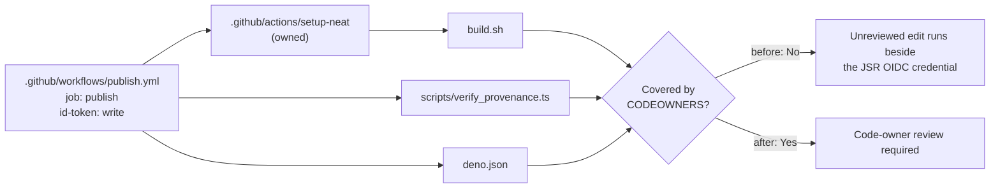

# Extend CODEOWNERS to the code the JSR OIDC job executes (Issue #3669)

## Summary

`.github/CODEOWNERS` owned the workflow _files_ but not the repository _code
those workflows execute_, so the review gate stopped one line short of the
privileged credential. `publish.yml`'s `publish` job holds
`permissions: id-token: write` — the JSR OIDC credential backing tokenless
publishing of `@stsoftware/neat-ai` — and `permissions:` is job-scoped, so every
step in that job can mint the token. Three repository paths ran inside it
unowned:

- `build.sh` — reached through the _owned_ composite action
  `.github/actions/setup-neat`, whose only instruction is
  `run: ./build.sh --verify-only`. Editing `build.sh` achieved what editing the
  owned `action.yml` would, without triggering the rule.
- `scripts/verify_provenance.ts` — the provenance gate itself, so an unreviewed
  edit could silently disable the control that turns a bad publish red.
- `deno.json` — carries the `version` that gates publishing, the
  `neatCore.assetSha256` integrity pin, and the `tasks` bodies CI executes.

The fix adds `/build.sh`, `/scripts/` and `/deno.json` to `.github/CODEOWNERS`,
and adds a test that derives the requirement from the workflows rather than from
a hand-written list, so a new script added to a privileged job fails CI until
the gate is extended to cover it.

Closes #3669.

**Still requires a human/admin action:** CODEOWNERS only _requests_ review. The
**"Require review from Code Owners"** branch-protection rule must be enabled on
`Develop` or GitHub enforces nothing — see
[`docs/REPO_GOVERNANCE.md`](../../REPO_GOVERNANCE.md#required-branch-protection-settings)
for the `gh api` invocation. This is a server-side setting invisible to a static
checkout, so no test can assert it.

The issue's "defence in depth" suggestion — moving the SBOM step out of the
`id-token: write` job — was already delivered by Issue #3668 (`publish.yml`'s
`sbom` job, `contents: read` only), so nothing was changed there.

## Evidence

Backend/CI governance change — no web interface to screenshot. Evidence is the
test run below: the new tests fail against the unfixed `CODEOWNERS` and pass
after it.

Before (`CODEOWNERS` unchanged), the discovery names the exact gap from the
issue:

```text
every file executed by an `id-token: write` job has a code owner (Issue #3669) ... FAILED
error: AssertionError: these files run inside a job holding the JSR OIDC `id-token`,
but no CODEOWNERS rule covers them, so they can be changed without the code-owner
review the gate exists to force:
  - build.sh — via .github/workflows/publish.yml (job: publish) → .github/actions/setup-neat/action.yml
  - deno.json — via .github/workflows/publish.yml (job: publish)
  - scripts/verify_provenance.ts — via .github/workflows/publish.yml (job: publish)
the publish gate's own verifier is owned (Issue #3669) ... FAILED
FAILED | 6 passed | 2 failed
```

After:

```text
running 3 tests from ./test/ci/CodeownersPrivilegedJobCoverage.ts
a job holding the JSR OIDC credential exists and executes repository code (Issue #3669) ... ok
every file executed by an `id-token: write` job has a code owner (Issue #3669) ... ok
the publish gate's own verifier is owned (Issue #3669) ... ok
running 5 tests from ./test/ci/CodeownersWorkflowsCoverage.ts
... ok | 8 passed | 0 failed
```



## Test Plan

Added `test/ci/CodeownersPrivilegedJobCoverage.ts` — it parses every workflow
job granting `id-token: write`, follows local `uses: ./…` composite actions into
their own `run:` blocks, collects each repository file the job executes (a token
counts only when it resolves to a file in the checkout), and asserts:

- `every file executed by an id-token: write job has a code owner` — the general
  case; it caught all three unowned paths without any of them being named in the
  test.
- `the publish gate's own verifier is owned` — pins
  `scripts/verify_provenance.ts` independently of discovery, so the gate cannot
  be edited in the same unreviewed PR that trojanises the pipeline.
- `a job holding the JSR OIDC credential exists and executes repository code` —
  fails loud if a restructure makes the discovery blind, rather than passing
  vacuously on an empty set (Issue #3234).

Supporting changes:

- `test/ci/_codeowners.ts` (new) — the CODEOWNERS reader/parser/`ownersFor`
  helpers, moved verbatim out of `test/ci/CodeownersWorkflowsCoverage.ts` so
  both test files share them without one test file importing another (which
  would register the same five tests twice).
- `test/ci/CodeownersWorkflowsCoverage.ts` — imports those helpers instead of
  defining them. **No test was removed, modified or disabled**; all five Issue
  #3187 tests still run and pass.
- `docs/REPO_GOVERNANCE.md` — new section documenting why ownership must reach
  the executed code, with the path table and a Mermaid diagram.
