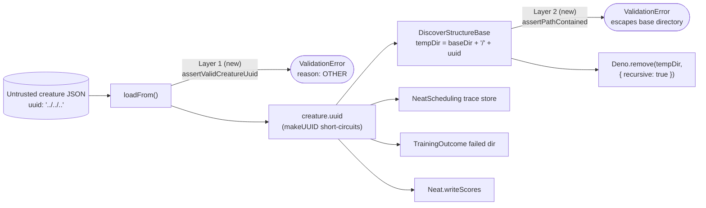

# Validate creature `uuid` at the deserialisation boundary (Issue #3670)

## Summary

`loadFrom` — the deserialiser behind the publicly exported `Creature.fromJSON` —
copied `uuid` straight out of untrusted model JSON with a bare
`as CreatureInternal` assertion, which is erased at runtime and checks nothing.
`CreatureUtil.makeUUID` short-circuits on any truthy existing value, so the
imported string survived untouched all the way to filesystem sinks:
`DiscoverStructureBase` built `` `${baseDir}/${creature.uuid}` `` and later
removed that tree with `Deno.remove(..., { recursive: true })`. A shared
checkpoint carrying `"uuid": "../../../some/victim/dir"` was a path-traversal
primitive (CWE-22) with a destructive sink.

The fix adds one guard at the boundary, plus a containment check as defence in
depth:

- **`src/creature/CreatureUuidValidation.ts`** (new) —
  `assertValidCreatureUuid(uuid, source)`. An absent `uuid` stays legal
  (`exportJSON()` deliberately omits it and `makeUUID` fills it in later); any
  present value must match the canonical 8-4-4-4-12 hexadecimal UUID layout, or
  it throws `ValidationError` with `reason: "OTHER"`.
- **`src/creature/CreatureSerialization.ts`** — `loadFrom` routes `json.uuid`
  through that guard, passing its existing `sourceTag` so production logs
  identify the upstream pipeline.
- **`src/utils/PathContainment.ts`** (new) —
  `assertPathContained(base,
  candidate, context)` resolves both paths and
  rejects anything that is not the base itself or a descendant of it.
- **`DiscoverStructureBase`** — asserts `tempDir` stays under `baseDir` right
  where it is built, so no future caller-supplied component reaches a recursive
  delete unchecked.

One guard at the boundary closes every sink at once — the discovery temp
directory, `NeatScheduling`'s trace store, `TrainingOutcome`'s failed-creature
dump, and `Neat.writeScores` — which is why it belongs there rather than at each
call site. Failing closed is right: a creature whose `uuid` is not a UUID is
malformed regardless of intent.

Closes #3670.

### Why the layout check rather than `@std/uuid`'s `validate`

`@std/uuid`'s `validate` additionally pins the version nibble to `1-8` and the
variant nibble to `8/9/a/b`. Creature uuids persisted by earlier releases are
not all version/variant conformant (this repo's own fixtures include
`01234567-89ab-cdef-0123-456789abcdef`), so using it would break loading
existing model files for no security gain. The layout check alone already
excludes every `/`, `\`, `.`, and NUL, so no accepted value can act as a path
component that escapes its directory. Uuids the library itself generates
(`crypto.randomUUID()` and the v5 generator behind `makeUUID`) pass both.

## Evidence

Backend/library change — no web interface to screenshot. Evidence is the test
suite and the full quality gate.

Source → sink before the fix, and where each layer now cuts it:



Full quality gate, clean on the branch:

```text
$ ./quality.sh < /dev/null
ok | 8149 passed (5 steps) | 0 failed | 4 ignored (6m48s)
```

The 8,149 passing tests also bound the blast radius: no existing path loads a
creature whose JSON carries a non-UUID `uuid`. `CreatureExport` omits the field
entirely, so internal `exportJSON()` → `fromJSON()` round-trips are unaffected,
as is test code that assigns a label directly to `creature.uuid` without going
through `loadFrom`.

## Test Plan

New file `test/creature/CreatureUuidValidation.ts` (10 tests). Every test calls
the real `Creature.fromJSON` / `DiscoverStructure` constructor and asserts on
the outcome — no source-text inspection.

Regression tests reproducing the issue (each fails against the unfixed code):

- `fromJSON rejects a uuid that escapes its directory` — the exact
  `"../../../some/victim/dir"` payload from the issue; asserts `ValidationError`
  with `reason === "OTHER"`.
- `fromJSON rejects uuids containing a path separator` — `".."`, `"a/b"`,
  `"/absolute/path"`, `"..\\windows"`, and a valid uuid with `/../..` appended.
- `DiscoverStructure refuses a temp dir outside its base directory` — sets
  `creature.uuid` directly to bypass layer 1, proving layer 2 holds on its own.

Error-path and edge cases:

- `fromJSON rejects a non-UUID uuid` — `""`, `"base"`, `"not-a-uuid"`,
  `"0123456789abcdef"`.
- `assertPathContained allows the base itself and descendants` — includes the
  sibling-prefix case (`/tmp/base` must not contain `/tmp/base-evil`) and a `..`
  escape.

Happy path and backward compatibility:

- `fromJSON accepts a canonical uuid and preserves it`.
- `fromJSON accepts an upper-case uuid and a generated uuid` (including
  `crypto.randomUUID()`).
- `fromJSON still loads JSON with no uuid` — absent `uuid` stays `undefined`.
- `exportJSON round-trip survives uuid validation`.
- `DiscoverStructure accepts a contained temp dir` — constructs successfully and
  cleans up its directory in a `finally`.

## Documentation

- `docs/api/CREATURE.md` — note on the static-methods table recording that
  `Creature.fromJSON` now throws `ValidationError` for a malformed `uuid`, and
  that an absent `uuid` remains legal.
- `CHANGELOG.md` — new `### Security` entry under `[Unreleased]`.
