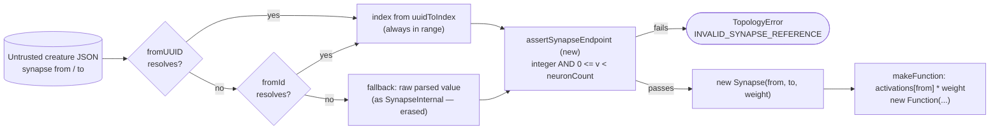

# Validate synapse `from`/`to` on the untrusted JSON-load path (Issue #3671)

## Summary

`loadFrom` resolved a synapse's `from` / `to` endpoint by UUID, then by numeric
id, and finally fell through to the raw parsed value with a bare
`as SynapseInternal` assertion — erased at runtime, so no type check and no
bounds check. Those two values are template-interpolated into `new Function()`
bodies by the activation compilers (`activations[${from}] * ${weight}` in
`src/neuron/NeuronActivation.ts`), making them the third and fourth interpolated
values in the loader and the only two without a guard. `bias` (Issue #2704) and
`weight` were already hardened; this completes that pass. Classified CWE-20,
improper input validation. Closes #3671.

Each resolved endpoint must now be an integer in `[0, neuronCount)`, or the load
throws `TopologyError` with the new reason `INVALID_SYNAPSE_REFERENCE`.
`Number.isInteger` rejects strings, `NaN`, `Infinity` and fractions in one test,
and the range check simultaneously closes a missing bounds check — an
out-of-range index previously reached `creatureValidate` as a bare `TypeError`
rather than a typed error.

**Not exploitable as shipped.** Every production activation entry point routes
through WASM (`requireWasmOrThrow`), so the compiled function is parsed and
discarded, never invoked. The value of the fix is that the sink is one refactor
away from being live and the hardening was silently incomplete.

### Changes

| File                                     | Change                                                                |
| ---------------------------------------- | --------------------------------------------------------------------- |
| `src/creature/CreatureSerialization.ts`  | New `assertSynapseEndpoint` guard, applied to both resolved endpoints |
| `src/errors/TopologyError.ts`            | New `INVALID_SYNAPSE_REFERENCE` reason                                |
| `test/security/CreatureJsonInjection.ts` | Seven new cases mirroring the existing `bias` / `weight` coverage     |
| `test/utils/ForEachSideEffects.ts`       | Corrected a malformed fixture (see below)                             |
| `CHANGELOG.md`                           | Security entry under Unreleased                                       |

The bounds check uses the **loaded** neuron count (`input` count plus every
non-input neuron appended after it), not `json.neurons.length` — the export wire
format omits input neurons, so the two differ.

## Evidence

Backend/library change with no web interface, so there is no screenshot; the
evidence is the test suite and the full quality gate.

Where the guard sits on the load path:



Targeted run — all six new rejection cases failed before the fix and pass after,
alongside the pre-existing `bias` / `weight` cases:

```text
ok | 16 passed | 0 failed (141ms)   test/security/CreatureJsonInjection.ts
```

Full quality gate, clean on the branch:

```text
ok | 8156 passed (5 steps) | 0 failed | 4 ignored (10m26s)
```

### Existing test modified — documented

`test/utils/ForEachSideEffects.ts` declared a 1-input / 1-output creature (valid
neuron indices 0 and 1) whose synapse read `from: 0, to: 2`, with a matching
bogus `index: 2` on the output neuron. That dangling endpoint loaded silently
before this change and is now correctly rejected. The fixture was corrected to
`to: 1` / `index: 1` so it describes the topology it always meant to — no
assertion was weakened, removed, or commented out, and the test still exercises
the same de-duplication behaviour.

### Unrelated pre-existing failure fixed

`test/docs/JekyllLiquidSafety.ts` was already red on `milestone/scan-20260807`:
`docs/archive/pr-summaries/pr-summary-3670.md` (commit `e6a4ac90`) used the
Mermaid hexagon shape, whose doubled-brace syntax is parsed as an unescaped
Liquid output tag and breaks the GitHub Pages build. Those two nodes were
switched to the stadium shape, which renders identically without the Liquid
sequence. Fixed here because it blocked the gate for this PR.

## Test Plan

Added to `test/security/CreatureJsonInjection.ts` (all six rejection cases fail
against the unfixed loader):

- `accepts well-formed integer synapse indices` — happy-path guard proving the
  new validation does not reject legitimate internal round-trips that carry raw
  integer endpoints.
- `rejects non-number synapse 'from' (string injection payload)` — the
  `"0]; maliciousJsCode(); //"` payload that closes `activations[${from}]`.
- `rejects non-number synapse 'to' (string injection payload)` — same shape on
  the `to` endpoint.
- `rejects fractional synapse 'from'` — `0.5` is not a valid index.
- `rejects NaN synapse 'to'`.
- `rejects negative synapse 'from'` — lower-bound case.
- `rejects out-of-range synapse 'to'` — upper-bound case (`99` on a 4-neuron
  creature).

Unchanged and still passing: the nine existing `bias` / `weight` cases in the
same file, and `test/errors/TopologyError.ts`.

## Security self-check

- **Input validation** — this change _is_ the input validation: both untrusted
  endpoints are type- and range-checked at the deserialisation boundary.
- **Secrets** — none staged.
- **Injection surface** — narrows one; adds none.
- **Error handling** — the thrown message reports the offending index and the
  rejected value (`JSON.stringify`-quoted when it is a string) with no stack
  trace, path, or internal state leaked.
- **Dependencies** — no new dependencies.
