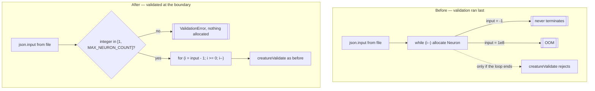

# Validate `input` / `output` before the load-side allocation loop (Issue #3672)

## Summary

`loadFrom` pre-filled input neurons straight from `json.input` — one `Neuron`
plus two Map entries per iteration — before anything validated that count. The
check that would have rejected a bad value (`creatureValidate`) ran only at the
**end** of the load, so on the public `Creature.fromJSON` path an
attacker-authored model file produced two denial-of-service outcomes:

- **Negative → non-terminating loop.** `while (i--)` tests `i` before
  decrementing, so `-1` is truthy, the body runs, and `i` walks away from zero.
  The loop never reaches the falsy `0` and never returns control to the caller,
  so even a timeout wrapper could not reclaim the thread.
- **Large → memory exhaustion.** `"input": 100000000` requested a hundred
  million neurons before any check fired.

The fix hoists the existing predicate to the boundary. A new
`src/creature/CreatureShapeValidation.ts` exports `MAX_NEURON_COUNT` and
`assertValidCreatureShape(input, output, source)`; both counts must be an
integer in `[1, MAX_NEURON_COUNT]` or the load throws `ValidationError`
(`reason: "OTHER"`). It is called at the top of `loadFrom` — before any
allocation, covering callers that reach `loadFrom` directly — and in `fromJSON`
before the lazily-initialised constructor stores the unchecked value. The loop
itself is now an explicit `for (let i = json.input - 1; i >= 0; i--)`, removing
the decrement-away-from-zero trap for future callers.

`MAX_NEURON_COUNT` is 1,000,000: an input neuron's id **is** its array index and
hidden/constant ids are allocated from 1,000,000 upwards
(`src/architecture/NeuronId.ts`), so a larger count would collide with the
hidden id space regardless of memory. `Number.isInteger` alone still admits
`1e8`, so the ceiling carries as much weight as the sign check.

Closes #3672.

## Evidence

Backend library change — no web interface to screenshot.

**Pre-fix reproduction.**
`Creature.fromJSON({ input: -1, output: 1, neurons: [],
synapses: [] })` printed
the "loading" line and never returned; the probe had to be killed by `gtimeout`
after 20s. Post-fix the same payload throws immediately:

```text
ValidationError: Invalid creature 'input' count (source=fromJSON): expected an
integer in [1, 1000000], got -1
```

Load-path ordering, before and after:



Test run for the new suite:

```text
ok | 24 passed | 0 failed (58ms)
```

Full `./quality.sh` passes (format, lint, type-check, discovery, WASM sync, and
the complete test suite).

## Test Plan

New `test/creature/CreatureLoadShapeValidation.ts` — 24 cases, all calling the
real load path:

- `fromJSON` rejects each hostile `input` **and** `output` value with a
  `ValidationError` naming the offending field: negative, large negative, zero,
  fractional, numeric string, `NaN`, `Infinity`, `undefined`,
  `MAX_NEURON_COUNT + 1`, and `100_000_000`. The negative cases are the
  regression test — without the fix they do not fail, they hang.
- `loadFrom` rejects a hostile shape on the direct load path.
- `fromPersistedJSON` rejects a hostile shape.
- `MAX_NEURON_COUNT` stays at or below the hidden neuron id floor.
- A valid creature still round-trips through `exportJSON` → `fromJSON` with
  `input`, `output`, neuron count and synapse count preserved.
