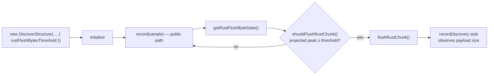

# PR Summary — Issue #3676

## Summary

`test/ErrorGuidedStructuralEvolution/RustFlushPeakCopy.ts` arranged all three
cases by casting `DiscoverStructure` to an ad-hoc shape and hand-writing five
protected fields (`usingRustDualWrite`, `rustFlushBytesThreshold`,
`rustAccumulatedEstimatedBytes`, `rustAccumulatedData`, `rustFlushRecords`)
before asserting `shouldFlushRustChunk()`. That verified the predicate against
state the implementation might never produce: a rename of the internal
bookkeeping broke the tests with no behaviour change, and a drift in the real
accumulation path would leave them green while the Issue #3402 peak-copy guard
silently regressed.

The tests are rewritten to drive the predicate the way production does
(suggested fix (a) — the file is **not** deleted, so the #3402 behaviour keeps a
direct behavioural net):

- The byte threshold now comes from
  `DiscoverStructureOptions.rustFlushBytesThreshold` and the record ceiling from
  the constructor argument.
- The byte accounting is produced by recording **real** samples through the
  public `record()` path.
- `usingRustDualWrite` is no longer poked — `initialize()` already sets it.
- The flush itself is observed at the already-injected `recordDiscovery`
  boundary stub.

To let a test observe the flush decision without reaching into protected state,
`DiscoverStructureRecording` gains a small public accessor,
`getRustFlushByteState()`, returning the accumulated sample count, the
accumulated estimate, the projected flush-time peak, and the configured
threshold. `shouldFlushRustChunk()` now reads its projected peak from that same
accessor, so there is one source of truth for the decision inputs.

Closes #3676.

## Evidence

Backend-only change — no web interface to screenshot. Evidence is the test run
plus a deliberate regression check.

All four cases pass against the current implementation:

```
byte flush fires while the accumulator alone is still under the threshold ... ok
byte flush holds off while the projected peak is under the threshold ... ok
record-count ceiling still forces a flush regardless of bytes ... ok
flush driven by the byte predicate hands the accumulated samples to the FFI boundary ... ok
ok | 4 passed | 0 failed
```

Regression check — temporarily reverting `shouldFlushRustChunk()` to the
pre-#3402 estimate-only comparison
(`rustAccumulatedEstimatedBytes >= threshold`) fails the guard test, proving the
new behaviour-based arrange still nets the peak-copy fix:

```
byte flush fires while the accumulator alone is still under the threshold ... FAILED
error: AssertionError: accumulator 10300 should still be under 10000 when the flush fires
FAILED | 3 passed | 1 failed
```

The implementation was restored immediately afterwards; the diff contains no
such change.



## Test Plan

Rewritten in `test/ErrorGuidedStructuralEvolution/RustFlushPeakCopy.ts` (no test
was dropped — each original case has a behaviour-based successor):

- **byte flush fires while the accumulator alone is still under the threshold**
  — records real samples one at a time until the predicate fires, then asserts
  the projected peak has reached the configured threshold while the single-copy
  accumulator is still below it. This is the #3402 guard: an estimate-only
  predicate would still be accumulating at that point.
- **byte flush holds off while the projected peak is under the threshold** —
  records three samples under a large threshold and asserts no flush.
- **record-count ceiling still forces a flush regardless of bytes** — configures
  the ceiling via the constructor argument with an effectively infinite byte
  threshold; false at two samples, true at three.
- **flush driven by the byte predicate hands the accumulated samples to the FFI
  boundary** (new end-to-end case) — mirrors the `DataRecorderRecording` call
  site: the stub receives exactly the accumulated samples, the accumulator
  resets to zero bytes, and the next chunk flushes at the same size.

Full `./quality.sh` run passes.
