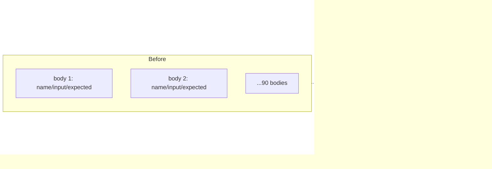

# Table-driven the four copy-paste test families (Issue #3677)

## Summary

Four test files each carried a family of near-identical bodies differing only in
one input literal and its expected output. Each family is now one shared body
driven by a reviewable case table, so adding an activation or tightening a
validation message is a table row rather than a hand-copied body. Closes #3677.

| File                                             | Family                                                 | Before    | After             |
| ------------------------------------------------ | ------------------------------------------------------ | --------- | ----------------- |
| `test/methods/activations/EdgeCases.ts`          | `squash(0)`, `squash(large)`, `squash(large_negative)` | 42 bodies | 3 tables + 1 body |
| `test/wasm/WasmDerivative.ts`                    | WASM-vs-JS derivative comparison                       | 32 bodies | 1 table + 1 body  |
| `test/config/MCMCConfig.ts`                      | `createNeatConfig` rejection of invalid `mcmc` values  | 16 bodies | 1 table + 1 body  |
| `test/methods/activations/SafeZoneAdjustment.ts` | `safeZoneAdjustment` boundary scenarios                | 35 bodies | 1 table + 1 body  |

Design decisions worth a reviewer's attention:

- **Registration idiom.** The issue suggested `t.step`, but `deno.json` opts
  into the `no-await-in-loop` lint rule and stepping over a table needs a
  sequential `await` per case. The repo's own established data-driven idiom —
  the generated `Deno.test` loop already present in `EdgeCases.ts` for
  non-finite inputs — gives the same per-case reporting with no lint
  suppression, so each table row registers its own named `Deno.test`.
- **No coverage lost.** Every case literal moved across unchanged. The case
  types keep the distinctions the original bodies carried: exact vs tolerant
  comparison (`tolerance` omitted means `assertEquals`), and strict vs inclusive
  range bounds (`gt`/`gte`/`lt`/`lte`) so the asymptotic `LOGISTIC`/`TANH`
  assertions stay exactly as strict as before.
- **Kept out of the tables.** `StdInverse: squash(0)` (asserts magnitude, not a
  value), the `SQRT` derivative `x <= 0` edge assertions (compare WASM against a
  fixed 0, not against the JS impl), the aggregate-derivative test, and the
  per-activation boundary tests are genuinely one-off, so they stay as
  standalone bodies. Splitting the `SQRT` edge assertions out is why the runtime
  test count goes 150 → 151.
- **Guard lifted.** `SafeZoneAdjustment.ts`'s three-line
  `Activations.find(...)` + `hasSafeZone` preamble is now
  `findSafeZoneActivation(name)`, which fails loud when an activation has no
  safe-zone logic.



## Evidence

Backend/test-only change — no web interface to screenshot. Evidence is the test
run itself: the collapsed files register the same cases as before and the full
quality gate is green.

Per-file run (`deno test --allow-all` over the four files) — 151 tests, all
named per case:

```
ArcTan: squash(0) ≈ 0 … ok
LOGISTIC: squash(0) ≈ 0.5 … ok
LOGISTIC: squash(100) > 0.99 and <= 1 … ok
WASM Derivative: ReLU6 … ok
MCMCConfig - coolingRate must be < 1 … ok
SQUARE: recovery zone allows small value … ok

ok | 151 passed | 0 failed (403ms)
```

Full quality gate (`./quality.sh < /dev/null`) — lint, format, type-check, WASM
sync and the whole suite:

```
ok | 8186 passed (5 steps) | 0 failed | 4 ignored (4m40s)
```

Case-count parity, checked against `git show HEAD:<file>`:

| File                    | Cases before                      | Cases after                       |
| ----------------------- | --------------------------------- | --------------------------------- |
| `EdgeCases.ts`          | 42                                | 42                                |
| `WasmDerivative.ts`     | 32                                | 32                                |
| `MCMCConfig.ts`         | 16                                | 16                                |
| `SafeZoneAdjustment.ts` | 74 assertions across 35 scenarios | 74 assertions across 35 scenarios |

## Test Plan

No new behaviour, so no new assertions — the tests _are_ the change. What was
verified:

- `test/methods/activations/EdgeCases.ts` — `ZERO_CASES` (31 rows),
  `LARGE_POSITIVE_CASES` (6), `LARGE_NEGATIVE_CASES` (5) each register a named
  test; `StdInverse`, the non-finite loop and the five boundary tests unchanged.
- `test/wasm/WasmDerivative.ts` — `DERIVATIVE_CASES` (32 rows) registers one
  named test per activation, preserving each per-activation value set (`ReLU6`,
  `HardTanh`, `Mish`, `TAN`, `Step`, `Sqrt`, `Exponential`) and the `Mish` 1e-3
  tolerance override. WASM initialisation still registers first, so it runs
  before the comparisons.
- `test/config/MCMCConfig.ts` — `MCMC_REJECTION_CASES` (16 rows) covers every
  former `assertThrows`, including the Issue #2201 (`adjustmentRate`,
  `toleranceRate`) and Issue #2527 (`mcmcAdvantageMode`) cases.
- `test/methods/activations/SafeZoneAdjustment.ts` — `SAFE_ZONE_SCENARIOS` (35
  rows, 74 cases) registers one named test per scenario.
