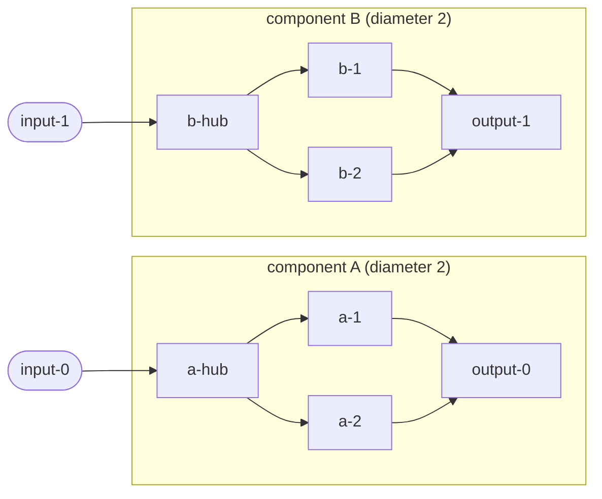

## Summary

`test/propagate/sparse/BFSOptimisation.ts` defined its own copy of the BFS
traversal (`getConnectedNeuronsOptimised` plus a local `buildSynapseMap`) and
asserted against that copy — its only import was `@std/assert`, so all seven
tests stayed green no matter what the project code did. The file has been
rewritten to drive the real `chooseNeurons()` entry point
(`src/propagate/sparse/ChooseNeurons.ts`), which is the only caller of the
non-exported `getConnectedNeurons` the file was supposed to cover. Closes #3678.

Each fixture creature is built so the cluster-expansion outcome is assertable
without depending on the shuffle: every component has a diameter of two and the
`sparseRatio` is chosen so the quota equals exactly one component's size. The
selection must therefore be exactly one whole component — a traversal that
under-reaches, loses the bidirectional edge, or leaks across components fills
the quota from a disconnected component and fails the assertion. The RNG is
seeded (`createSeededRng`, restored in a `finally`) and each test sweeps eight
seeds, so the different seed neurons are covered reproducibly.

## Evidence

Backend-only change — no web surface to screenshot. Evidence is the test run
plus mutation testing of the real implementation.

`deno test test/propagate/sparse/BFSOptimisation.ts` — 4 passed, 0 failed.

Mutation testing (temporary edits to `src/propagate/sparse/ChooseNeurons.ts`,
reverted afterwards) confirms the rewritten tests are coupled to the production
code, which the old file was not:

| Mutation to real code                                 | Old file | New file          |
| ----------------------------------------------------- | -------- | ----------------- |
| `getConnectedNeurons` returns an empty set            | 7 passed | **3 of 4 failed** |
| `buildSynapseMap` drops the reverse (undirected) edge | 7 passed | **3 of 4 failed** |

(The isolated-neuron test survives both mutations by design — it asserts the
selection still terminates and returns exactly the requested number of eligible
neurons when a seed has no eligible neighbour.)

Cluster containment being asserted:

With `sparseRatio: 0.5` over eight eligible neurons the quota is four, so
`chooseNeurons` must return exactly component A or exactly component B.

## Test Plan

`test/propagate/sparse/BFSOptimisation.ts` — rewritten; the seven
framework-guarantee tests against the in-file copy are replaced by four tests
against the real path:

- `chooseNeurons - cluster expansion stays inside one component` — twin diamond
  components (branching plus an undirected cycle); selection must equal one
  whole diamond. Replaces the old "branching graph", "cycle handling" and
  "disconnected neuron" tests.
- `chooseNeurons - two-step reach covers the far end of a path` — twin
  three-neuron paths whose ends are two steps apart; selection must equal one
  whole path. Replaces the old "linear chain depth 1/2" tests.
- `chooseNeurons - a neuron with no eligible neighbours still terminates` — an
  output driven straight from an input has no eligible neighbour; selection
  still terminates with exactly the requested number of eligible neurons, at
  least two of them from the connected path. Replaces the old "isolated neuron"
  test.
- `chooseNeurons - larger creature still selects a single cluster` — three
  disconnected six-neuron fans; selection must equal exactly one fan. Replaces
  the old "large graph consistency" test.

Full gate: `./quality.sh` — 8183 passed, 0 failed.
