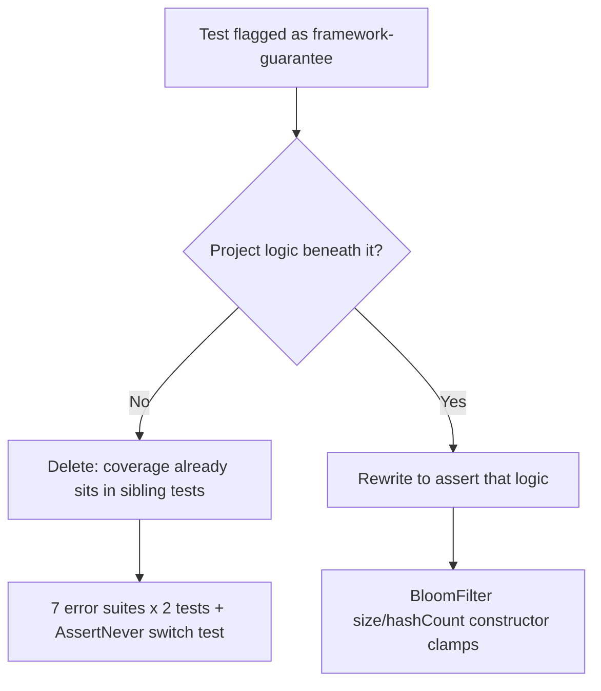

# Tests asserting language/library guarantees

## Summary

Removed the tests that assert guarantees owned by JavaScript or `@std/assert`
rather than by this project, and replaced the one case that turned out to have
real project logic underneath it. Closes #3679.

**Deleted — pure framework/language guarantees (15 tests):**

- `"<Error> - is instanceof Error"` and `"<Error> - can be caught selectively"`
  across all seven typed error suites (`WasmError`, `TopologyError`,
  `ValidationError`, `ConfigurationError`, `DatasetError`, `DiscoveryError`,
  `ActivationError`). `class X extends Error` producing an `instanceof`
  relationship is JavaScript semantics, and `assertThrows(fn, Ctor)` matching by
  constructor is `@std/assert`'s own contract — neither can fail for a reason
  this repo can fix.
- `"assertNever - exhaustive switch never reaches the guard"`. The switch is
  written inside the test, so the assertions only confirmed that a local
  function returns the string literals it was written to return. The
  exhaustiveness value of `assertNever` is compile-time and needs no runtime
  test.

**Rewritten — the BloomFilter case had project logic the old test hid:**

The issue described `src/utils/BloomFilter.ts:94` as a bare getter echoing its
constructor argument. It is not: the constructor clamps
(`this.bitSize = Math.max(8, size)`, `this.hashCount = Math.max(1, hashCount)`).
The old `"size getter returns configured size"` test passed `2048` — a value
above both floors — so it never touched the clamp and would have passed with the
clamps deleted. It is replaced by two tests that exercise the clamps directly.

**Coverage kept.** Every deleted test's project-side behaviour is still asserted
by siblings in the same file: each error suite asserts the overridden `name` and
the `reason`/`path`/`activation` payload via `assertIsError` (e.g.
`test/errors/WasmError.ts:4-31`), and `test/utils/AssertNever.ts` retains both
tests that drive the real runtime throw path and its message formatting. The
`"distinguishable from generic Error"` catch-block tests are untouched — the
issue did not list them and they assert the `reason` payload after narrowing.

## Evidence

Backend/test-only change — no web interface to screenshot.

**Mutation check.** The two new BloomFilter tests were verified to be sensitive
to the project code they cover. With the clamps temporarily stripped from
`src/utils/BloomFilter.ts` (`this.bitSize = size`,
`this.hashCount = hashCount`):

```text
BloomFilter - constructor clamps size to the one-byte floor ... FAILED (16ms)
BloomFilter - constructor clamps hash count to at least one ... FAILED (602µs)
FAILED | 13 passed | 2 failed (145ms)
```

The source was restored immediately afterwards (`git diff --stat` on
`src/utils/BloomFilter.ts` is empty — no production code changed in this PR).

**Full quality gate**, `./quality.sh < /dev/null`:

```text
ok | 8169 passed (5 steps) | 0 failed | 4 ignored (3m44s)
```

The decision applied to each finding:



## Test Plan

Removed (framework/language guarantees, no project code beneath them):

- `test/errors/WasmError.ts` — `is instanceof Error`,
  `can be caught selectively`
- `test/errors/TopologyError.ts` — same two
- `test/errors/ValidationError.ts` — same two
- `test/errors/ConfigurationError.ts` — same two
- `test/errors/DatasetError.ts` — same two
- `test/errors/DiscoveryError.ts` — same two
- `test/errors/ActivationError.ts` — same two
- `test/utils/AssertNever.ts` — `exhaustive switch never reaches the guard`
- `test/utils/BloomFilter.ts` — `size getter returns configured size`

Added (assert real constructor logic, mutation-verified above):

- `test/utils/BloomFilter.ts` —
  `BloomFilter - constructor clamps size to the one-byte floor`: sizes `0`, `3`
  and `-64` all report `size === 8`; `2048` is reported unchanged.
- `test/utils/BloomFilter.ts` —
  `BloomFilter - constructor clamps hash count to at least one`: with
  `hashCount = 0`, an added key is found **and** an unadded key is still
  rejected — the latter only holds if at least one bit is actually probed.

Unused `assert` / `assertThrows` imports were dropped from the seven error test
files as a consequence of the deletions.
