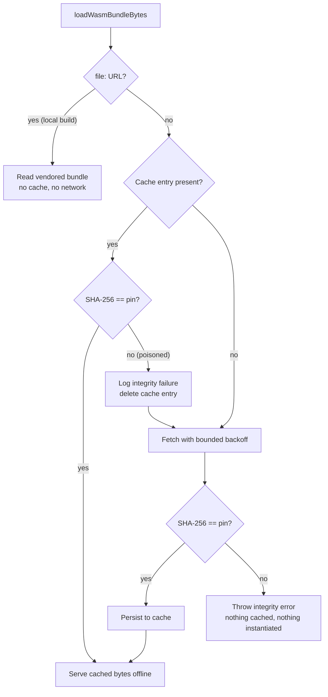

# PR Summary — Verify the WASM bundle digest at runtime (Issue #3680)

## Summary

`deno.json` `neatCore.assetSha256` pins the NEAT-AI-core **release tarball** and
is enforced by `build.sh` only, so at runtime the WASM activation bundle was
instantiated with no digest check. The disk cache is environment-controlled
(`NEAT_AI_WASM_CACHE_DIR`, then `XDG_CACHE_HOME`, then
`$HOME/.cache/neat-ai/wasm`) and keyed by `SHA-256(url)`, so anyone able to
write there could plant a `<key>.wasm` file that ran unchecked on the next
start. Closes #3680.

What changed:

- **`build.sh`** gained `write_runtime_bundle_pin`, which regenerates
  `src/wasm/WasmBundleSha256.ts` from
  `wasm_activation/pkg/wasm_activation_bg.wasm` whenever the vendored bundle is
  refreshed. Note this is the **bundle's own** digest — `neatCore.assetSha256`
  is the tarball hash and cannot be compared against the bundle bytes. The
  generated constant is part of the module graph, so it travels with the
  published package and is covered by Deno's JSR/lockfile integrity checks
  rather than by the mutable cache.
- **`src/wasm/WasmBundleCache.ts`** verifies `SHA-256(bytes)` against that pin
  on **both** untrusted paths. A cache hit that does not match is logged at
  `error`, deleted, and re-fetched; fetched bytes that do not match throw and
  are never cached or instantiated. An expected digest that is not 64 hex chars
  fails fast rather than silently disabling verification. The digest is
  injectable via the new `expectedSha256` option (tests only).
- The local (`file:`) build path is untouched — those bytes come from the
  checked-out tree, not a mutable cache.

## Evidence

Backend/CLI change with no web interface, so no screenshot applies. Evidence is
the test suite plus the quality gate.



Quality gate:

```text
$ ./quality.sh < /dev/null
ok | 8176 passed (5 steps) | 0 failed | 4 ignored (2m20s)
```

## Test Plan

Added `test/wasm/WasmBundleIntegrity.ts` (six cases, one per acceptance
criterion):

- `cache hit with matching digest is served offline` — seeded cache, fetch
  denied; bytes returned with zero network access.
- `poisoned cache entry is rejected, deleted, and re-fetched` — tampered
  `<key>.wasm` is not served, exactly one fetch happens, and the cache is
  repaired with the verified bytes. This is the regression test for the issue:
  against the unfixed loader the tampered bytes were returned verbatim.
- `poisoned cache entry is removed even when the re-fetch fails` — the rejected
  file does not survive to be served by the next start.
- `fetched bytes with the wrong digest hard-fail` — the load throws, the error
  names the expected digest, and nothing is written to the cache.
- `an unusable expected digest fails fast` — a malformed pin is a loud error,
  not silently-skipped verification.
- `the runtime pin matches the vendored bundle` — the staleness guard: the
  generated constant must equal both `SHA-256(wasm_activation_bg.wasm)` and the
  digest recorded in `wasm_activation/pkg/content-manifest.sha256`, so a core
  bump that forgets `./build.sh` fails here rather than as a permanent re-fetch
  loop in production.

Added to `test/scripts/BuildScriptContentHash.ts`:

- `write_runtime_bundle_pin regenerates the runtime digest constant` — sources
  the real bash function against a temp bundle and asserts the generated file
  carries that bundle's digest and the exported constant.

Modified (documented, no test removed or disabled): the existing
`test/wasm/WasmBundleCache.ts` and `test/wasm/WasmInitDiagnostics.ts` fixtures
seed arbitrary payloads, so each now passes `expectedSha256` computed from its
own payload. Their assertions are unchanged; the `file:`-URL cases needed no
change at all.
