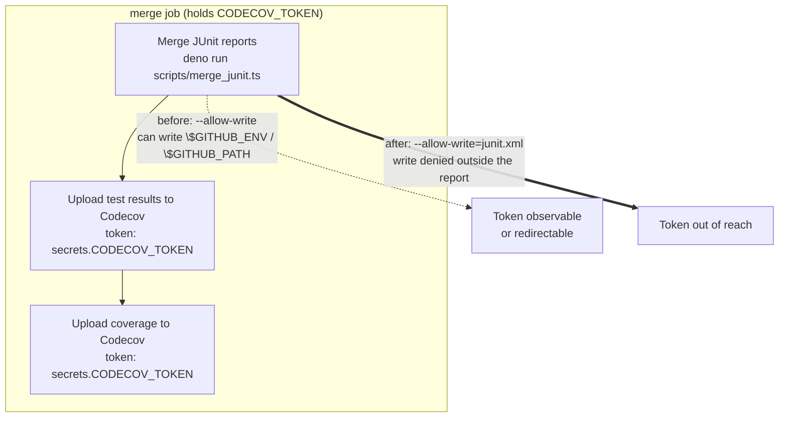

# PR Summary — Scope the JUnit merge step's write grant (Issue #3681)

## Summary

The `merge` job of `.github/workflows/coverage.yaml` ran the in-repo script
`scripts/merge_junit.ts` with an unrestricted `--allow-write`, ahead of two
steps in the same job that hold `secrets.CODECOV_TOKEN`. A same-repo pull
request controls what executes at that step, and an unrestricted write grant
reaches `$GITHUB_ENV` and `$GITHUB_PATH` — both honoured by later steps in the
same job — which is enough to shim a binary onto `PATH` or set an environment
variable the Codecov action reads, and thereby observe or redirect the token.

The grant is now scoped to exactly the file the script writes
(`--allow-write=junit.xml`), matching the already-narrow `--allow-read`
treatment of `coverage_merge_gate.ts` and the SBOM step's
`--allow-write=sbom.cdx.json` (Issue #3668). Fork PRs never receive the secret,
so the exposure was limited to branch PRs, but the ordering still put
PR-authored code with unrestricted write ahead of the token.

`Closes #3681`.

## Evidence

Backend/CI-only change — there is no web interface to screenshot. Verification
is the new test file, run below.



Test run (`deno test test/ci/CoverageMergeStepLeastPrivilege.ts`):

```text
the JUnit merge step scopes --allow-write to its output (Issue #3681) ... ok
no secret-bearing job grants unrestricted write to repo-authored code (Issue #3681) ... ok
the committed permission set still merges the shard reports (Issue #3681) ... ok
the committed permission set blocks writes outside the report (Issue #3681) ... ok
ok | 4 passed | 0 failed
```

All four fail (bar the first behavioural one) against the unfixed workflow —
they were written first and confirmed red before the workflow was changed.

## Test Plan

New file `test/ci/CoverageMergeStepLeastPrivilege.ts`:

- **`the JUnit merge step scopes --allow-write to its output`** — parses the
  committed workflow and asserts the merge step grants exactly one
  `--allow-write`, qualified with a path equal to the step's `--output` value.
- **`no secret-bearing job grants unrestricted write to repo-authored code`** —
  the regression guard the issue asks for: any job in `coverage.yaml` that
  references a secret must not run `deno run/test/bench/eval` with a bare
  `--allow-write`, `-A`, or `--allow-all`. This catches permission drift back to
  unrestricted, which never fails at runtime.
- **`the committed permission set still merges the shard reports`** — executes
  `scripts/merge_junit.ts` in a throwaway directory under the _exact_ flags
  parsed out of the committed workflow, over two fixture shard reports, and
  asserts the merged `junit.xml` aggregates both (`tests="5" failures="1"`).
  Narrowing the grant too far turns this red instead of failing CI later.
- **`the committed permission set blocks writes outside the report`** — same
  flags, but asks the script to write a different path; asserts a non-zero exit
  with a Deno permission error and that no file was created. This proves the
  narrowing is actually binding, not cosmetic.

Existing `test/scripts/MergeJunit.ts` (the script's own unit tests) is unchanged
and still passes; the script's behaviour is untouched.

## Files changed

- `.github/workflows/coverage.yaml` — `--allow-write` →
  `--allow-write=junit.xml` on the merge step, with a comment recording why.
- `scripts/merge_junit.ts` — CLI usage comment updated to the scoped invocation.
- `test/ci/CoverageMergeStepLeastPrivilege.ts` — new tests (above).
