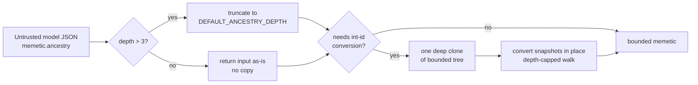

# Bound memetic `ancestry` depth on the load side (Issue #3682)

## Summary

`convertMemeticToIntIds` in `src/creature/CreatureSerialization.ts` recursed
through `memetic.ancestry` with no depth cap and re-cloned its whole remaining
subtree (`JSON.parse(JSON.stringify(...))`) at every level. A compact,
hand-written model JSON with a deep `ancestry` chain therefore cost O(d²) work
before it overflowed the stack — a cheap denial of service against any process
loading untrusted model files. The write side (`addToAncestry`) has always
bounded ancestry, so the invariant existed but was never enforced where
untrusted bytes arrive. Closes #3682.

Changes:

- **Shared cap.** `addToAncestry` now defaults `maxDepth` to the existing
  `DEFAULT_ANCESTRY_DEPTH` (3) from `@blackbox/MemeticInterface.ts` instead of a
  bare literal, and the load side enforces the same constant — one source of
  truth for both directions.
- **Truncate, don't reject.** `truncateAncestryDepth` bounds the incoming chain
  to `DEFAULT_ANCESTRY_DEPTH` nested levels, matching the writer's
  circular-buffer semantics so existing files still load. It shallow-copies only
  the retained levels and returns the original object untouched when the chain
  is already within the bound, so the common path allocates nothing and the
  caller's JSON is never mutated.
- **Clone once.** The deep clone was hoisted out of the recursion to the entry
  point, and conversion now runs in place over that single private clone
  (`convertSnapshotInPlace` / `convertSnapshotTree`). Depth no longer multiplies
  serialisation cost.
- **Depth parameter.** `convertSnapshotTree` carries an explicit `depth` and
  refuses to descend past the cap — a second line of defence if a future caller
  hands it an untruncated tree.

Per-snapshot conversion semantics are unchanged: a snapshot carrying no wire
identities is still left exactly as it arrived, and its own ancestry is still
not descended into.

## Evidence

Backend-only change — no web interface to screenshot. Evidence is the test
suite.

Before the fix, `test/creature/MemeticAncestryDepth.ts` killed the test process
outright (fatal V8 out-of-memory inside the repeated
`JSON.parse`/`JSON.stringify` of the nested subtree, stack frames alternating
`ParseJsonObject` / `ParseJsonArray`). After the fix the same 10 000-level input
loads in ~1 ms:

```text
running 4 tests from ./test/creature/MemeticAncestryDepth.ts
deeply nested memetic ancestry loads without a stack overflow ... ok (1ms)
deeply nested memetic ancestry still converts UUID keys to int ids ... ok (514µs)
memetic within the ancestry depth cap round-trips unchanged ... ok (798µs)
ancestry nesting at the depth cap is preserved ... ok (81µs)

ok | 4 passed | 0 failed (4ms)
```

Full gate: `./quality.sh` → `ok | 8184 passed (5 steps) | 0 failed | 4 ignored`.

Load path after the change:



## Test Plan

Added `test/creature/MemeticAncestryDepth.ts`:

- `deeply nested memetic ancestry loads without a stack overflow` — regression
  test: a model JSON with 10 000 nested `ancestry` levels loads and is truncated
  to `DEFAULT_ANCESTRY_DEPTH`. Fatally crashes the runner against the unfixed
  code.
- `deeply nested memetic ancestry still converts UUID keys to int ids` — the
  retained levels are still rewritten from wire UUIDs to runtime integer ids.
- `memetic within the ancestry depth cap round-trips unchanged` — a well-formed
  block with three ancestors survives `fromJSON` → `exportJSON` identical,
  guarding against over-aggressive truncation.
- `ancestry nesting at the depth cap is preserved` — nesting exactly at the cap
  is kept.

Existing coverage kept green: `test/creature/` and `test/blackbox/` (including
`MemeticExportSingleClone.ts`, `CreatureSerialization.ts`,
`test/architecture/ExportSchemaValidation.ts` against the updated
`docs/snapshot-schema.json`).
