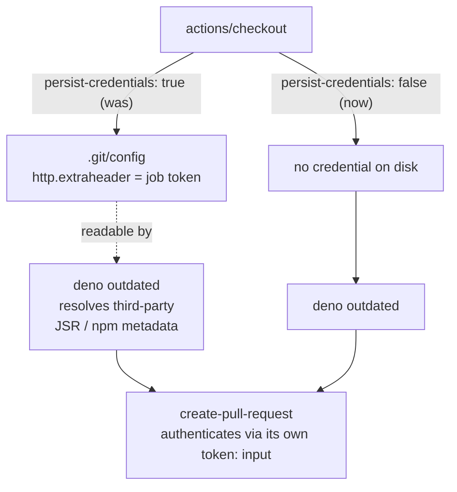

# PR Summary — Issue #3683

## Summary

`.github/workflows/deno-outdated.yml` held the last `actions/checkout` in the
repository that did not set `persist-credentials: false`. Without the flag,
`actions/checkout` writes the job token into `.git/config` as an
`http.extraheader`, where any later step in the job can read it. That is a poor
place to leave a credential here: the job grants `contents: write` **and**
`pull-requests: write`, the very next step runs
`deno outdated --update --latest --minimum-dependency-age=…` (which resolves
third-party JSR/npm metadata from registries this repo does not control), and
the job also holds `secrets.ACTIONS_PUSH`, an org-level PAT.

The change is a functional no-op: no step in the job pushes over the persisted
credential — `peter-evans/create-pull-request` authenticates with its own
`token:` input.

A repo-wide sweep test was added alongside the existing per-workflow assertions
so a newly added workflow cannot reintroduce credential persistence without a
matching test. Closes #3683.

## Evidence

Backend/CI-only change — no web interface to screenshot. Evidence is the test
sweep.

Before the fix, the new sweep test failed with exactly one offender:

```text
error: AssertionError: Values are not equal: every actions/checkout must set
persist-credentials: false … Offending checkouts:
  deno-outdated.yml job "outdated" step "Checkout"
```

After the fix, all 19 `actions/checkout` steps across the 15 workflows carry the
flag:

```text
deno test --allow-read test/ci/WorkflowPersistCredentialsFalse.ts
ok | 13 passed | 0 failed (9ms)
```

Note the issue text estimated 18 checkouts; the actual parsed count is 19 — the
sweep test asserts "no offenders" rather than a hard-coded total, so it does not
rot as workflows are added or removed.

Where the token used to land, and where it no longer does:



## Test Plan

- Added `test/ci/WorkflowPersistCredentialsFalse.ts` →
  `workflow-conventions: every actions/checkout sets persist-credentials: false (Issue #3683)`.
  It parses every `.github/workflows/*.y*ml` file, collects each
  `actions/checkout` step across all jobs, and fails with a named list of any
  step lacking `persist-credentials: false`. Written test-first: it failed on
  `deno-outdated.yml` before the workflow change and passes after.
- Existing per-workflow assertions in the same file (Issues #2727, #3349–#3358)
  are unchanged and still pass.
- `./quality.sh --skip-wasm --skip-discovery` — lint, format, type-check and the
  full suite pass (8184 tests). An earlier run of the same gate flaked on two
  unrelated tests (`test/upgrade/PopulateFixForwardOnly.ts`,
  `test/score/RustScorerIntegration.ts`); both pass in isolation and passed on
  the re-run, and neither is reachable from this change, which touches only a
  YAML workflow and a filesystem-reading CI test.
