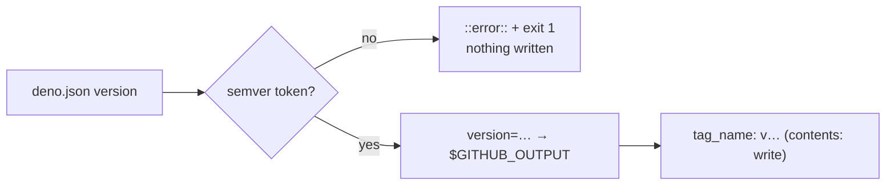

# Validate `deno.json`'s version before it reaches `$GITHUB_OUTPUT` (Issue #3684)

## Summary

`.github/workflows/github-release.yml` read `version` out of `deno.json` and
echoed it straight into `$GITHUB_OUTPUT`. That file is line-oriented
`key=value`, so a `version` containing a newline injects arbitrary extra step
outputs — in a job holding `contents: write`, whose next step consumes
`steps.version.outputs.version` as the release `tag_name` and `name`.
`deno.json` sits outside the CODEOWNERS gate (Issue #3669), so the edit that
carries the newline is not force-reviewed.

Both steps that echo a `deno.json`-derived version into `$GITHUB_OUTPUT` now
reject anything that is not a plain semver token before writing:

- `github-release.yml` → the `version` step (`version=`).
- `update-package-version.yml` → the `check_version` step (`base_version=`),
  which derives its value from the base branch's `deno.json` the same way.

The guard fails the step loudly with a `::error::` annotation and writes **no**
step output. It deliberately does not echo the rejected value back — a newline
in an annotation is a second injection point, into the workflow-command stream.

`publish.yml` was checked as the issue asks: it reads `.version` from
`deno.json`, but only ever writes the literals `publish=true` / `publish=false`
to `$GITHUB_OUTPUT`, so it does not carry this injection and is unchanged.

Closes #3684.

## Evidence

Backend/CI-only change — no web surface to screenshot. The evidence is the new
test suite, which executes the committed run blocks rather than inspecting them.



`test/ci/WorkflowVersionOutputInjection.ts` parses each workflow, pulls out the
real `run:` block by step id, and runs it under `bash` in a temp directory with
a crafted `deno.json` and a throwaway `$GITHUB_OUTPUT`, asserting on the exit
code and on the exact bytes the step wrote. `update-package-version.yml`'s step
shells out to `git` and `deno`, so both are stubbed on `PATH` to drive the base
and current version values.

Against the unfixed workflows, 8 of the 16 cases fail; with the guard in place
all 16 pass, alongside the 2 existing `WorkflowVersionCheckStrictMode.ts` cases
that pin `set -Eeuo pipefail` (Issue #3003) in the same block:

```text
ok | 254 passed | 0 failed (2s)   # deno test "test/ci/*.ts"
actionlint .github/workflows/github-release.yml .github/workflows/update-package-version.yml → clean
```

## Test Plan

New file `test/ci/WorkflowVersionOutputInjection.ts`:

- **Rejects (regression cases for #3684)** — `github-release.yml`: a
  newline-injected version (`1.2.3\nevil=pwned`), shell-significant characters
  (`1.2.3; touch pwned`), a command substitution (`$(touch pwned)`), an absent
  `version` field, an empty version, `latest`, and `1.2`. Each asserts a
  non-zero exit, an empty `$GITHUB_OUTPUT`, and — for the injection cases — that
  no `pwned` file was created.
- **Still works** — the repository's own current version, plus `1.2.3`, `0.0.0`,
  `10.20.30-rc.1` and `1.2.3+build.5`, each producing exactly
  `version=<value>\n`.
- **`update-package-version.yml`** — an unchanged semver emits
  `needs_update=true` + `base_version=1.2.3`; a newline-injected base version
  fails with no output written; an unknown base version and an already-bumped PR
  version both still emit `needs_update=false`.

Unchanged: `test/ci/WorkflowVersionCheckStrictMode.ts` still passes, so `-E` in
`set -Eeuo pipefail` remains pinned.
