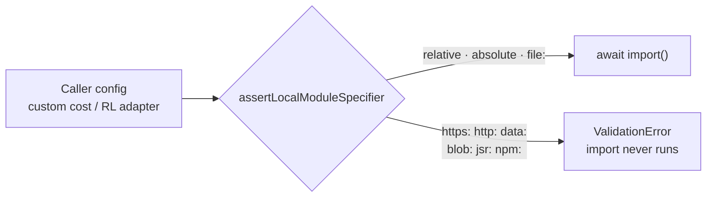

# Finish the bounded security sweep (Issue #3685)

## Summary

Completes the `security-scan` sweep that #3673 left bounded by context rather
than by a clean result. Closes #3685.

Three things landed:

1. **The `await import()` scheme question is resolved with a guard, not a trust
   argument.** `WorkerProcessor.ts:117` and `EpisodeWorkerProcessor.ts:127` each
   handed a caller-supplied module specifier straight to `await import()`. Both
   values are developer configuration today, but neither the type
   (`AdapterDescription.url: string`, `customCost.filePath: string`) nor the
   call graph prevents one arriving from a remote manifest — a downloaded
   experiment description or a shared job spec — at which point an `https:` or
   `data:` specifier executes attacker code inside the worker. Writing down
   "this can never come from an untrusted source" would have been a claim the
   code does not enforce, so the allowlist went in instead.

   New `assertLocalModuleSpecifier()` (`src/utils/ModuleSpecifierGuard.ts`) runs
   before both imports. Relative paths, absolute filesystem paths (including
   Windows drive letters), and `file:` URLs load; `https:`, `http:`, `data:`,
   `blob:`, `jsr:`, and `npm:` are rejected with a `ValidationError` naming the
   scheme.

2. **The three unswept directories plus the ONNX encoders were audited.**
   `src/predictiveCoding/` and `src/onnx/` came back clean; `src/transfer/` and
   `src/intelligentDesign/` each produced one confirmed finding, filed as
   individual issues with `file:line` evidence:

   - **#3714** — `importCheckpoint()` uses the raw `checkpoint.creature.input` /
     `.output` counts as loop bounds before `assertValidCreatureShape` runs, so
     a hostile checkpoint exhausts memory at `src/transfer/Checkpoint.ts:147`
     and `:324` rather than hitting the `MAX_NEURON_COUNT` cap. Same hazard
     #3672 fixed for `Creature.fromJSON`; this entry point was not covered.
     Reproduced — see Evidence.
   - **#3715** — `ImproveSquash.ts:461-470` and `:533-539` build a write path
     from an unvalidated creature neuron `uuid`, and `SafeWrite`'s
     `ensureDirSync` creates the escaping directories rather than rejecting
     them, so a `uuid` ending in `/../../a` writes outside `outputDir`.

3. **Coverage is recorded so the next sweep does not redo it.** New
   `docs/SECURITY_SWEEP_COVERAGE.md` names every directory explicitly with its
   disposition, carries the reasoning that cleared the clean ones, and lists
   what was considered and dismissed — including three low-severity items judged
   not worth their own issue. That is what makes the acceptance criterion
   checkable: the next `security-scan` run's coverage diff comes back empty.

## Evidence

Backend/library change — no web interface to screenshot.

**The two checkpoint findings were reproduced, not inferred.** Against the
current tree, with a scratch script deleted before commit:

| Loop                                                  | Payload              | Result                                    |
| ----------------------------------------------------- | -------------------- | ----------------------------------------- |
| `Checkpoint.ts:147` → `NormaliseCreatureExport.ts:65` | `input: 50_000_000`  | `Map maximum size exceeded` after 6332 ms |
| `Checkpoint.ts:324-332` (remap path)                  | `output: 20_000_000` | `Set maximum size exceeded` after 1794 ms |

In both cases the failure is memory exhaustion after seconds of burn, not the
intended `ValidationError` — confirming the shape cap runs too late. Full detail
is on #3714.

The guard's control flow:

The two call sites surface a rejection differently, deliberately:

- **Custom cost** — the guard sits _outside_ the existing try/catch so the typed
  `ValidationError` reaches the caller rather than being flattened into a
  generic load failure.
- **Episode adapter** — the guard runs first inside `handleInit`, ahead of WASM
  init, and the rejection travels back over the worker protocol as
  `initialize: { status: "ERROR" }`, that protocol's fail-loud channel.

**Quality gate:** `./quality.sh` passes clean —
`8214 passed | 0 failed |
4 ignored`.

## Test Plan

Added, all behavioural — each calls the real function and asserts on the
outcome:

- `test/utils/ModuleSpecifierGuard.ts` (9 tests) — the predicate itself: accepts
  relative, absolute, and `file:` specifiers (including a Windows drive letter,
  which must not be read as a `c:` scheme); rejects `https:`, `http:`, `data:`,
  `blob:`, `jsr:`, `npm:`, blank, non-string, and a scheme hidden behind
  surrounding whitespace; asserts the error names the rejected scheme and
  carries `reason === "OTHER"`.
- `test/multithreading/WorkerProcessor.ts` (2 tests added) — drives
  `WorkerProcessor.process()` with a remote `customCostData` filePath and
  asserts a `ValidationError` mentioning `custom cost function`. The paired test
  proves a _relative_ specifier still reaches `import()`: it fails with
  `Failed to load custom cost function`, not a `ValidationError`, so the guard
  is not simply rejecting everything.
- `test/creature/EpisodeWorkerProcessorSpecifierGuard_test.ts` (2 tests) — same
  shape for the episode adapter over the worker protocol: remote URLs return
  `status: "ERROR"` naming `episode adapter`; a `file:` URL fails with a module
  resolution error instead, proving local specifiers pass.

Existing coverage confirmed unaffected:
`test/creature/evolveRL_parallel_test.ts` and `test/costs/` (which use `file://`
and absolute paths) still pass.

No existing tests were removed, disabled, or modified.
