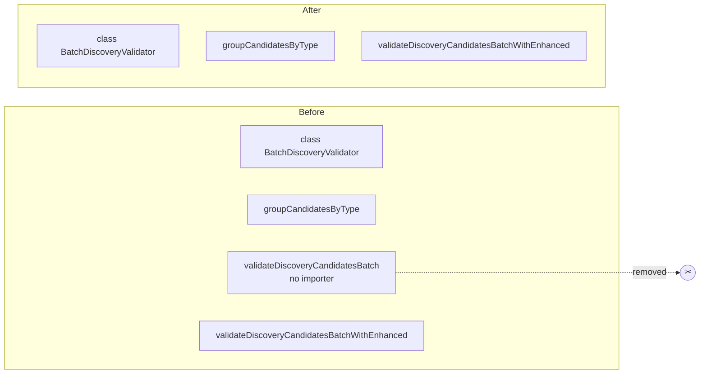

# PR Summary — Issue #3686

## Summary

Removed the unused export `validateDiscoveryCandidatesBatch` from
`src/discovery/BatchDiscoveryValidator.ts`. Closes #3686.

The function was a thin convenience wrapper that constructed a
`BatchDiscoveryValidator` and called `validateBatch`. A whole-repo sweep
confirmed the finding before removal:

- No module imports the name from `BatchDiscoveryValidator.ts` — the only hits
  anywhere in `src/`, `test/`, `bench/`, `scripts/` and `docs/` were the
  definition itself and an **independent, same-named** function at
  `src/discovery/DiscoveryPostValidate.ts:106` (a separate symbol, untouched).
- No in-file caller, and no string-keyed or reflective reference.
- `mod.ts` contains no `export *` wildcards, so the symbol was never reachable
  through the package's single documented entry point.

Live consumers already bypass the wrapper: `bench/BatchDiscoveryValidation.ts`
and `src/discovery/DiscoveryPostValidate.ts` construct `BatchDiscoveryValidator`
and call `validateBatch` themselves. The class and the sibling
`validateDiscoveryCandidatesBatchWithEnhanced` wrapper (which _is_ live, used by
`test/discovery/BatchDiscoveryValidator.ts`) are unchanged.

## Evidence

Backend-only change with no web interface — no screenshot applies. Evidence is
the test run and the full quality gate.

Targeted run of the affected suite after the removal:

```text
ok | 11 passed (3 steps) | 0 failed (11ms)
```

Full quality gate (`./quality.sh < /dev/null`):

```text
ok | 8215 passed (5 steps) | 0 failed | 4 ignored (2m30s)
```

The new test was confirmed to fail against the unfixed code before the removal:

```text
AssertionError: Values are not equal: The unused plain-batch wrapper must not be
exported; callers use BatchDiscoveryValidator.validateBatch directly
-   true
+   false
FAILED | 0 passed | 1 failed
```

Exported surface before and after:



## Test Plan

- Added `test/discovery/BatchDiscoveryValidator.ts` →
  `"BatchDiscoveryValidator module exports no dead plain-batch convenience function (Issue #3686)"`.
  It imports the module at runtime and asserts the module namespace no longer
  carries `validateDiscoveryCandidatesBatch`, while `BatchDiscoveryValidator`,
  `groupCandidatesByType` and `validateDiscoveryCandidatesBatchWithEnhanced`
  remain exported. This is a runtime check of the module's public surface, not a
  source-text grep.
- No existing tests were modified, commented out, or removed.
