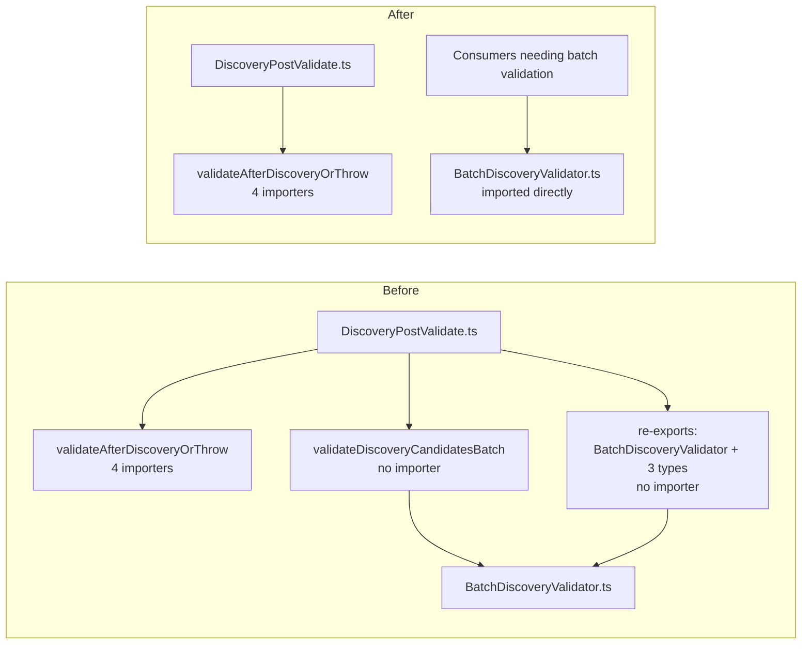

# Remove dead batch wrapper and convenience re-exports from DiscoveryPostValidate.ts

## Summary

Removed the unused export `validateDiscoveryCandidatesBatch` (the Issue #1291
batch wrapper) from `src/discovery/DiscoveryPostValidate.ts`, along with the
convenience re-export block (`BatchValidationResult`, `BatchValidationStats`,
`BatchValidatorOptions`, `BatchDiscoveryValidator`) and the now-unused imports
that only those symbols used. Closes #3687.

`validateAfterDiscoveryOrThrow` — the live symbol every importer of this module
actually uses — is untouched.

### Why it was safe

An import-graph sweep confirmed every importer of `DiscoveryPostValidate.ts`
imports only `validateAfterDiscoveryOrThrow`:

- `src/NEAT/ProcessCompletedResults.ts:16`
- `bench/BatchDiscoveryValidation.ts:20`
- `test/NEAT/DiscoveryReplayIntegration.ts:28`
- `test/discovery/DiscoveryPostValidate.ts:4`

Nothing imported `validateDiscoveryCandidatesBatch` or reached
`BatchDiscoveryValidator` / its types through this module — consumers that need
them import `@discovery/BatchDiscoveryValidator.ts` directly. There was no
in-file caller, no string-keyed or reflective reference, and the module is not
re-exported from the `mod.ts` barrel (the package's single public entry point),
so no downstream consumer could reach the removed symbols through the published
API.

The same-named plain wrapper previously at
`src/discovery/BatchDiscoveryValidator.ts:392` was a separate symbol, already
removed under Issue #3686 (commit `b7bedd62`); the two were independent.

## Evidence

Backend-only change with no web interface, so no screenshot applies. Evidence is
the test suite.

Before the removal, the new surface test failed on the first assertion
(`Object.hasOwn(surface, "validateDiscoveryCandidatesBatch")` returned `true`);
after it, all four tests in the file pass.

Full quality gate: `./quality.sh` — **8216 passed | 0 failed | 4 ignored**.

## Test Plan

- Added
  `test/discovery/DiscoveryPostValidate.ts::"DiscoveryPostValidate exports only the live post-validation helper (Issue #3687)"`
  — imports the module and asserts the runtime surface: neither
  `validateDiscoveryCandidatesBatch` nor the `BatchDiscoveryValidator`
  re-export is present, while `validateAfterDiscoveryOrThrow` remains a
  function. This fails against the unfixed code and passes after the removal.
- Existing `validateAfterDiscoveryOrThrow` tests in the same file are unchanged
  and still pass, confirming the live behaviour is unaffected.
- `./quality.sh` (lint, format, type-check, WASM sync, full test suite) passes
  cleanly.
