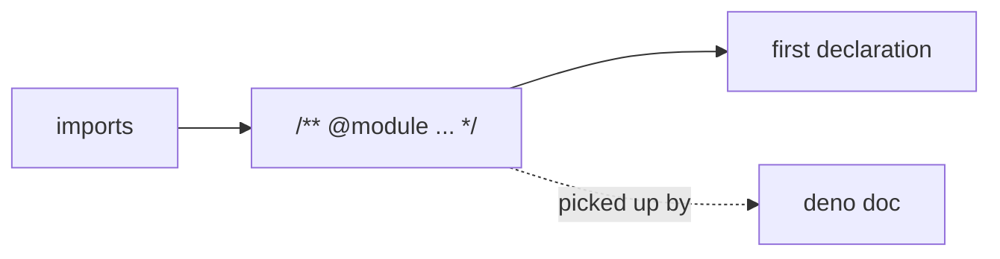

## Summary

Added a leading `/** @module … */` JSDoc block to the seventeen public modules
under `src/` that went straight from their imports to their first code
statement, leaving a new reader with nothing that says what the module provides,
why it exists, or when to reach for it.

Each block was written from the module's actual code, not its filename, and
states what the signature cannot — for example the wire-schema version contract
and the UUID-only boundary rule for `DiscoveryWireFormat.ts`, the discovery
pipeline's entry point and its fail-fast behaviour without the Rust library for
`DiscoveryRunner.ts`, and the subprocess boundary plus WASM-fallback semantics
for `RustScorerBridge.ts`. This follows the precedent set by the closed
`@module` issues #3119–#3123.

This is a documentation-only change — no code, types, or behaviour were
modified. Closes #3688.

Files documented:

- `src/NEAT/DiscoveryReplayQueue.ts`
- `src/NEAT/LogApproach.ts`
- `src/architecture/ErrorGuidedStructuralEvolution/ApplyCoordinatedStructuralCandidate.ts`
- `src/architecture/ErrorGuidedStructuralEvolution/DiscoveryWireIdentity.ts`
- `src/compact/CompactUnused.ts`
- `src/compact/DeadSubgraphPruning.ts`
- `src/compact/SynapsePruning.ts`
- `src/config/TrainOptions.ts`
- `src/discovery/DiscoveryRunner.ts`
- `src/discovery/DiscoveryWireFormat.ts`
- `src/discovery/NeuronErrorImpactEstimator.ts`
- `src/methods/activations/aggregate/MAXIMUM.ts`
- `src/methods/activations/aggregate/MINIMUM.ts`
- `src/multithreading/workers/WorkerHandler.ts`
- `src/multithreading/workers/WorkerProcessor.ts`
- `src/propagate/sparse/SparseConfig.ts`
- `src/score/RustScorerBridge.ts`

The sites the issue deliberately excluded under the trivial-surface guard
(`BIPOLAR`/`LeakyReLU`/`STEP`, `ErrorHelper.ts`, `SynapseState.ts`,
`UpgradeOne.ts`, and the zero-export `deno/worker.ts`) were left untouched.

## Evidence

Backend/library change only — no web interface to screenshot.

`deno doc` picks up each new block. For example,
`deno doc src/discovery/DiscoveryWireFormat.ts` now opens with:

```
@module
    The wire schema for Discovery payloads that cross a process, worker, cache,
    disk or Rust FFI boundary — and the translator that produces them.

    TypeScript owns the in-memory candidate shapes (`CandidateNeuron`,
    `CoordinatedStructuralCandidate`, …), which are addressed by ephemeral
    runtime integer ids. The `Wire*` types here are their boundary-safe
    counterparts, addressed by stable neuron UUIDs only; the Rust side and the
    on-disk caches consume this shape.
    ...
```



`git diff --stat` is additions only — 17 files, 293 insertions, 0 deletions —
confirming no existing line was altered.

Quality gate: `./quality.sh < /dev/null` passes cleanly —
`8216 passed | 0 failed | 4 ignored`, covering `deno fmt`, `deno lint`,
`deno check`, the WASM sync, and the full test suite.

## Test Plan

No unit tests apply. This is a pure documentation change adding JSDoc comments
with no new or modified runtime behaviour to assert on; per AGENTS.md a test
that inspected source text for doc comments would be a "how" test, which the
project explicitly forbids. Verification was:

- `./quality.sh < /dev/null` — full gate green (8216 tests passed, 0 failed).
- `deno fmt` / `deno lint` — clean across all 524 source files.
- `deno doc src/discovery/DiscoveryWireFormat.ts` — confirms the `@module` block
  is surfaced in generated documentation.
- `git diff --stat` — insertions only, so no existing behaviour was touched.
