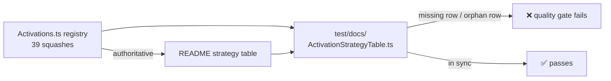

# PR Summary — Issue #3690

## Summary

The backpropagation-strategy table in `src/methods/activations/README.md`
documented 38 activations while `src/methods/activations/Activations.ts`
registers 39 — `SOFTMAX` appeared nowhere, despite being the output activation
the `CROSS_ENTROPY` coupling selects. Closes #3690.

Changes:

- Added the `SOFTMAX` row to the strategy table, plus a note explaining why it
  is the odd one out: true softmax is a vector operation, so `unSquash()`
  inverts the per-neuron logistic surrogate rather than the normalised vector
  (`softmaxNormalise()` does the vector form); `calculateError()` returns the
  softmax + cross-entropy gradient (`target − activation`) with no derivative
  scaling; and its `⬇ 0` priority means "chosen explicitly on an output layer",
  not "deprecated or unsuitable" like the other zero-priority rows.
- Extended the Invertible legend with `⚠️` (surrogate-only inversion) so the new
  row's marker is defined.
- Added an `[!IMPORTANT]` note naming `Activations.ts` as the authoritative list
  that the table documents.
- `CONTRIBUTING.md` step 4 now points at the guard test.

## Evidence

Documentation change with no web interface to screenshot. The evidence is the
new guard test, which fails against the unfixed README and passes after it.

Before the README fix:

```text
activations README documents every registered squash ... FAILED
  [Diff] Actual / Expected
  -   [ "SOFTMAX" ]
  +   []
activations README names the registry as authoritative ... FAILED
FAILED | 1 passed | 2 failed
```

After:

```text
activations README documents every registered squash ... ok
activations README has no rows for unregistered squashes ... ok
activations README names the registry as authoritative ... ok
ok | 3 passed | 0 failed
```

Full gate: `./quality.sh < /dev/null` →
`ok | 8222 passed (5 steps) | 0 failed |
4 ignored (1m11s)`.



## Test Plan

- Added `test/docs/ActivationStrategyTable.ts`:
  - `activations README documents every registered squash` — every canonical
    name from `Activations.list()` has a table row (regression test for the
    missing `SOFTMAX` entry).
  - `activations README has no rows for unregistered squashes` — the reverse
    direction, so a removed or renamed squash cannot leave a stale row.
  - `activations README names the registry as authoritative` — the README points
    readers at `Activations.ts`.
- No existing tests modified or removed.
