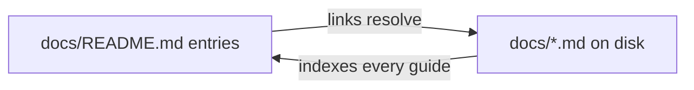

# PR Summary — docs index now covers every top-level guide (Issue #3691)

## Summary

`docs/README.md` claims "every long-form guide in the repository has a home
here", but `docs/PROFILING_REPORT_3397.md` appeared in neither the topic
sections nor the "Out of scope for this index" list, so the claim was false. The
report is indexed under **Performance**, beside its siblings from the same #3396
milestone (`SCORE_PER_HOUR_HARNESS.md`, `EVOLUTION_CONFIG_SWEEP_3400.md`).

A regression test now enforces the claim in general rather than for this one
file. Running it surfaced three further unindexed top-level docs — the
`*_PARITY_AUDIT.md` redirect stubs left behind when `PARITY_AUDITS.md`
consolidated them — so the existing `PARITY_AUDITS.md` bullet, which already
mentioned "three former stubs", now links them by name. No other doc content
changed. Closes #3691.

## Evidence

Documentation-only change — no web interface to screenshot. The behavioural
evidence is the new test, which fails against the unfixed index and passes after
it:

Before (index unchanged):

```text
docs/README.md indexes every top-level guide ... FAILED
error: AssertionError: docs/README.md omits top-level guide(s), breaking its
"every long-form guide has a home here" claim:
NEAT_AI_CORE_PARITY_AUDIT.md
PROFILING_REPORT_3397.md
RUST_SCORER_PARITY_AUDIT.md
WASM_ACTIVATION_PARITY_AUDIT.md
```

After:

```text
docs/README.md internal links resolve ... ok
docs/README.md indexes every top-level guide ... ok
ok | 2 passed | 0 failed
```

The two tests are complementary — one checks every index entry points at a real
file, the other checks every real file has an index entry:



## Test Plan

- Added `test/docs/DocsIndex.ts::docs/README.md indexes every top-level guide` —
  enumerates `docs/*.md`, skips `README.md` and the `pr-summary-*.md` files the
  index explicitly carves out, and asserts each remaining file is linked from
  the index. It reads the real directory and the real index, so it stays correct
  as docs are added.
- Refactored the shared markdown-link extraction in `test/docs/DocsIndex.ts`
  into a `linkTargets()` helper used by both tests; the existing "internal links
  resolve" test is otherwise unchanged and still passes.
- `deno test -A test/docs/*.ts` — 176 passed, 0 failed.
- `./quality.sh` — passes.
