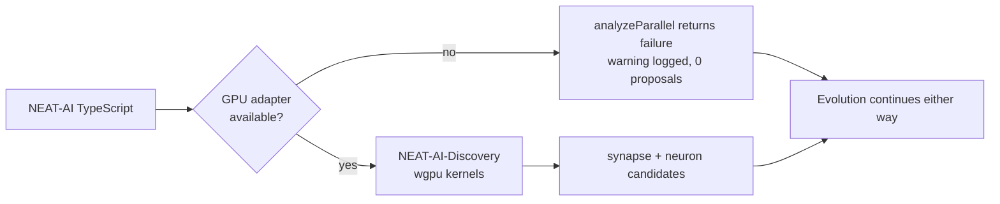

# PR Summary — GPU docs promised a CPU fallback that does not exist

## Summary

`docs/GPU_ACCELERATION.md` and nine sibling documents told operators that
discovery's synapse/neuron analysis "gracefully falls back to CPU" when no GPU
adapter is present. It does not. Corrected every surface to state the shipped
behaviour, removed the two unrunnable code samples and the dead environment
variable, and exported `getGpuBackendInfo()` from `mod.ts` so the probe sample a
reader copies actually resolves. Closes #3692.

**What the code actually does** — verified, not inferred:

- `RustDiscoveryOperations.ts:293` — `analyzeParallel()` returns
  `{ success: false, error: "Rust synapse/neuron analysis unavailable (GPU adapter not available)" }`
  whenever `requireGpu !== false` and no adapter is present.
- Nothing in `src/` ever sets `requireGpu`, so that branch is always taken on a
  GPU-less host. It is a field on the internal FFI payload
  `RustParallelAnalysisInput` (`RustDiscoveryTypes.ts:335`), not a `NeatOptions`
  key.
- Setting it to `false` buys no CPU path either: NEAT-AI-Discovery's own
  `ffi_internal/gpu.rs:22` states "The crate hard-requires a GPU for
  synapse/neuron analysis", and returns `errorKind: "GpuPermanent"` (the
  behaviour `AnalyzeParallelGpuGuard.ts` already asserts).
- `RustAnalysisCache.ts:207-216` — on that failure the pass logs a warning and
  returns no result, so discovery contributes no proposals. Evolution itself is
  unaffected.
- `NEAT_AI_DISCOVERY_GPU_DEBUG` is read nowhere in this repository **and**
  nowhere in NEAT-AI-Discovery (grepped both trees) — deleted rather than
  externally attributed.

### Docs corrected

`docs/GPU_ACCELERATION.md` (rewritten TL;DR, overview, backend matrix, pipeline
diagram, verification methods, configuration, troubleshooting, history),
`docs/troubleshooting/DISCOVERY.md`, `docs/DISCOVERY_DIR.md`, `AGENTS.md`, plus
six more carrying the same claim that the issue did not list:
`docs/TROUBLESHOOTING.md`, `docs/README.md`, `docs/DISCOVERY_ARCHITECTURE.md`,
`docs/TS_RUST_MIGRATION.md`, `docs/comparison/IMPLEMENTED.md`,
`docs/comparison/FUTURE_WORK.md`. Leaving those would have re-seeded the rot.

### Code changes

- `mod.ts` — exports `getGpuBackendInfo` and the `GpuBackendInfo` type. The doc
  previously told readers to
  `import { getGpuBackendInfo } from "./RustDiscovery.ts"`, a relative path that
  resolves only inside `src/architecture/ErrorGuidedStructuralEvolution/`. Per
  the Issue #3271 rule a sample must import from the sole published specifier,
  so the symbol is now exported rather than the sample deleted — a GPU probe is
  exactly what a consumer needs now that analysis is known to be GPU-gated.
- `RustDiscoveryLibrary.ts` — the GPU probe logged
  `ℹ️  No GPU detected — discovery will use CPU fallback` at `info`. That
  message is the root of the wrong mental model, so it (and its three siblings)
  now `warn` and name the real consequence. No behaviour change; assertions
  untouched.
- `DiscoveryRunner.ts` — one stale comment.
- Two existing test files: names and messages only ("CPU fallback supported" →
  "the GPU adapter is checked at analysis time"). **No test was removed,
  disabled, or had an assertion changed** — those tests assert that
  `isRustDiscoveryEnabled()` does not gate on GPU, which is still true; only
  their stated rationale was wrong.

## Evidence

Backend-only change — no web interface to screenshot. Evidence is the test run
below plus the source citations above.

`./quality.sh` — **8272 passed, 0 failed, 4 ignored (5m26s)**.

The new test file was written first and fails against the unfixed tree twice
over: on `mod.ts` with "Module ... has no exported member 'getGpuBackendInfo'",
and on the docs with "docs/GPU_ACCELERATION.md still contains analyzeSynapses".
Both pass after the change.

## Test Plan

New file `test/docs/GpuAccelerationDoc.ts` — five "what" tests, each exercising
real code rather than grepping source:

- `getGpuBackendInfo()` is reachable from `mod.ts` and returns a structured
  result — proves the doc's Method 2 sample is runnable (fails pre-fix with a
  type error).
- `ensureRustCombinedAnalysis` fed the real guard failure returns
  `{ result: undefined, cache: undefined }` and warns on both the synapse and
  neuron scopes — the documented "no proposals, no CPU results" outcome.
- `convertParallelAnalysisResult` puts `gpuUsed` on `converted.synapse` /
  `converted.neuron` with nothing at the top level — the corrected Method 3
  sample.
- `createNeatConfig({})` has no `requireGpu` property — it is not user
  configuration.
- A companion guard (the `RootImportSpecifiers.ts` pattern) asserting the four
  removed claims cannot creep back into `docs/GPU_ACCELERATION.md`,
  `docs/troubleshooting/DISCOVERY.md`, `docs/DISCOVERY_DIR.md` and `AGENTS.md`.

Existing coverage left intact and still green: `AnalyzeParallelGpuGuard.ts`,
`CpuOnlyDiscoveryIntegration.ts`, `CrossPlatformGpuSupport.ts`,
`GpuBackendDetection.ts`, `RustAnalysisCacheGpuGuard.ts`.

## Security Self-Check

No new external input, endpoints, dependencies, or injection surfaces. No
secrets staged. The one new public export is a read-only diagnostic that cannot
throw and reveals only a wgpu backend/adapter name already printed to the log.
