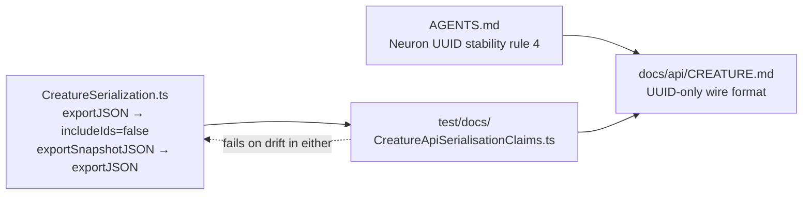

# PR Summary — docs/api/CREATURE.md serialisation claims (Issue #3693)

## Summary

`docs/api/CREATURE.md` inverted the repository's most safety-critical
serialisation contract. The method table described `exportJSON` as "Canonical
serialisation: wire UUIDs plus resolved runtime ids (`id` / `fromId` / `toId`)"
and `exportSnapshotJSON` as differing by omitting those numeric ids. Both claims
are false: `src/creature/CreatureSerialization.ts:195` implements `exportJSON`
as `buildCreatureExportJSON(creature, false)` — UUID-only — and
`exportSnapshotJSON` (`:210`) simply delegates to `exportJSON`, retained for
backward compatibility. `AGENTS.md` rule 4 of the Neuron UUID stability
invariant states the same, and rule 3 forbids numeric ids from crossing any
process, machine, disk, cache or FFI boundary (Issue #2090 showed hash-colliding
integer ids silently corrupting creatures). A reader acting on the old wording
would persist or match by numeric id — exactly the failure the invariant exists
to prevent.

The same document's `randomConnectMissing(creature)` bullet claimed it "connects
neurons that lack required inward or outward connections … Used during topology
repair after structural mutation". `src/reconstruct/ConnectMissing.ts:18-45`
only connects **input** neurons that have no outgoing synapse, returns the
creature unchanged when none is missing, and is exported from `mod.ts` for
consumers — nothing under `src/` calls it.

Both entries now match the source, with the export rows pointing at the
AGENTS.md invariant rather than restating it. Closes #3693.

## Evidence

Documentation-only change plus a new guard test — no web interface to
screenshot. Each corrected claim is anchored to the live API in
`test/docs/CreatureApiSerialisationClaims.ts`, following the existing
`test/docs/` fact-check convention: the behaviour half fails if an export ever
regains numeric ids, the doc half fails if the prose is reverted.

Before the doc fix (TDD — the guard reproduced all three stale claims):

```text
error: AssertionError: exportJSON must be documented as UUID-only, got:
  | `exportJSON` | `(): CreatureExport` | Canonical serialisation: wire UUIDs plus resolved runtime ids (`id` / `fromId` / `toId`). |
error: AssertionError: exportSnapshotJSON must be documented as equivalent, got:
  | `exportSnapshotJSON` | `(): CreatureExport` | Wire-only snapshot: same topology as `exportJSON` but omits numeric ids (sharing / schema checks). |
error: AssertionError: randomConnectMissing must be documented as input-side, got:
  - `randomConnectMissing(creature)` — connects neurons that lack required inward or outward connections … Used during topology repair after structural mutation.
FAILED | 0 passed | 3 failed
```

After the doc fix, the full gate is green:

```text
./quality.sh
ok | 8226 passed (5 steps) | 0 failed | 4 ignored (2m30s)
```

Where the documented claim now comes from:



## Test Plan

Added `test/docs/CreatureApiSerialisationClaims.ts` (three tests, each pairing a
behaviour assertion with the doc claim it underwrites):

- `CREATURE.md: exportJSON is documented as the UUID-only wire format` — asserts
  a live `exportJSON()` carries `uuid` / `fromUUID` / `toUUID` and no `id` /
  `fromId` / `toId`, then that the table row says UUID-only and never claims
  runtime ids.
- `CREATURE.md: exportSnapshotJSON is documented as equivalent to exportJSON` —
  asserts the two produce an identical payload, then that the row states
  equivalence rather than a difference.
- `CREATURE.md: randomConnectMissing is documented as input-side only` — asserts
  an already-connected creature is returned unchanged (same instance), then that
  the bullet describes input neurons and drops both the "inward or outward" and
  "topology repair after structural mutation" claims.

Existing coverage left untouched and still passing:
`test/architecture/ExportNoIntegerIds.ts` (the `exportJSON` /
`exportSnapshotJSON` no-integer-id contract), `test/docs/ModExportBanners.ts`
(`randomConnectMissing` touches unconnected inputs only), and
`test/docs/ApiReferenceSplit.ts` (the new `../../AGENTS.md` link resolves).
