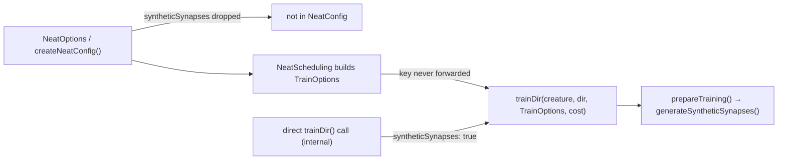

# Training docs: correct the `syntheticSynapses` surface and the backprop defaults

## Summary

`docs/api/TRAINING.md` and `docs/config/TRAINING.md` documented
`syntheticSynapses` as an evolution-level option and quoted three stale
`BackPropagationOptions` facts. Both docs now match the source. Closes #3694.

**`syntheticSynapses` is a `TrainOptions` key, not a `NeatOptions` key**

- It is declared only on `TrainArguments` (`src/config/TrainOptions.ts:116`) and
  read only by `prepareTraining()`
  (`src/architecture/training/TrainingSetup.ts:201`).
- It is not a `NeatOptions`/`NeatArguments` field, so `createNeatConfig()` never
  reads it, and the train options the evolution loop builds internally
  (`src/NEAT/NeatScheduling.ts:360-380`) do not forward it — `evolveDir()`
  cannot enable it.
- There is also no public `Creature.train()`: `trainDir()`
  (`src/architecture/Training.ts:41`) is internal and is not re-exported from
  `mod.ts`, so the flag is currently unreachable from the public API. Both docs
  now say so plainly rather than showing a sample that cannot work.

**Stale backprop facts corrected in `docs/api/TRAINING.md`**

| Doc claim (before)                        | Source (after)                                                   |
| ----------------------------------------- | ---------------------------------------------------------------- |
| `generations` default "random 1–100"      | random 1–10 — `MAX_RANDOM_GENERATIONS` (`BackPropagation.ts:13`) |
| `learningRate` default "random low value" | fixed `0.01` (`BackPropagation.ts:54`, Issue #1437)              |
| `learningRateStrategy` union of three     | adds `"warm_restart"` (`BackPropagation.ts:96`)                  |

**Exports list (Issue #3271 rule)** — `BackPropagationOptions` and
`TrainOptions` are not re-exported from `mod.ts`, so the "Exports referenced
here" section is now "Types referenced here" and states that consumers cannot
import them; `NeatOptions` is named as the public configuration surface. No new
re-exports were added, because no public function accepts either type.

## Evidence

Documentation-only change to a Deno library — no web interface to screenshot.
The evidence is the new fact-check test suite, which drives the real factories
and the real training entry point:

```
deno test --allow-all test/docs/TrainingDocsFacts.ts
running 6 tests from ./test/docs/TrainingDocsFacts.ts
docs/api/TRAINING.md: BackPropagationOptions defaults are as published ... ok
docs/api/TRAINING.md: generations defaults to a random 1–MAX_RANDOM_GENERATIONS ... ok
docs/api/TRAINING.md: learningRateStrategy accepts every documented value ... ok
docs/api/TRAINING.md: the random default strategy can select warm_restart ... ok
docs/config/TRAINING.md: syntheticSynapses is not a NeatOptions field ... ok
docs/api/TRAINING.md: syntheticSynapses is opt-in on the training options ... ok
ok | 6 passed | 0 failed
```

Where the flag can and cannot travel:



## Test Plan

Added `test/docs/TrainingDocsFacts.ts` (6 tests, all "what" tests — no source or
doc grepping):

- `BackPropagationOptions defaults are as published` — asserts every default the
  doc's code block quotes against `createBackPropagationConfig()`.
- `generations defaults to a random 1–MAX_RANDOM_GENERATIONS` — pins
  `MAX_RANDOM_GENERATIONS === 10` and the resolved range across stubbed RNG
  draws; an explicit value is honoured unchanged.
- `learningRateStrategy accepts every documented value` — round-trips all four
  union members, including `"warm_restart"`.
- `the random default strategy can select warm_restart` — a constant RNG at 0.6
  pins the documented `[0.55, 0.75)` branch.
- `syntheticSynapses is not a NeatOptions field` — the old doc sample's key is
  dropped by `createNeatConfig()`, so it can never reach training.
- `syntheticSynapses is opt-in on the training options` — trains through
  `trainDir()` with the flag set and asserts a finite error, verifying the
  surface the doc now points at.

Full `./quality.sh` run passes (fmt, lint, type-check, all tests).
