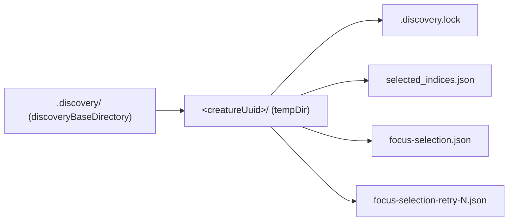

# Discovery docs: dead symbols, wrong paths, wrong signatures (#3695)

## Summary

The discovery reference documents cited symbols, file paths and signatures that
do not exist in the source. Each defect is a claim a reader acts on, so all four
are corrected against the code, and a new fact-check test anchors every claim to
the live API so neither half can drift again. Closes #3695.

| Document                         | Was                                                                       | Now                                                                                                 |
| -------------------------------- | ------------------------------------------------------------------------- | --------------------------------------------------------------------------------------------------- |
| `docs/DISCOVERY_DIR.md`          | `Creature.toJSON()`                                                       | `Creature.exportJSON()` (`src/creature/CreatureSerialization.ts`)                                   |
| `docs/DISCOVERY_DIR.md`          | `focus-analysis/<discoveryID>/<ISO8601-timestamp>-focus-selection*.json`  | `.discovery/<creatureUuid>/focus-selection[-retry-N].json` — no timestamp prefix, no such directory |
| `docs/DISCOVERY_ARCHITECTURE.md` | `getSuccessfulRemovalNeuronUUIDs()`                                       | `getSuccessfulRemovalNeuronIds()` (`src/discovery/SuccessCache.ts:325`)                             |
| `docs/api/DISCOVERY.md`          | four disk-space functions documented as taking `(dir, config)` / `(opts)` | the real scalar parameter lists from `src/discovery/DiskSpaceMonitor.ts`                            |
| `docs/DISCOVERY_GUIDE.md`        | `deno run \\` — doubled continuations that split the command              | single `\`, matching the working block in `DISCOVERY_DIR.md`                                        |

Two adjacent corrections in the same on-disk tree were required to keep the
relocated focus-selection trace consistent with the source: the per-creature
work area is `.discovery/<creatureUuid>/`, not `<runDir>/<creatureUuid>/`
(`DiscoverStructureBase.ts:191`, `DiscoveryCleanup.ts:5`), and
`selected_indices.json` is listed alongside the trace it sits next to
(`DiscoverStructureBase.ts:196`).

## Evidence

Documentation-only change with no web interface to screenshot. The evidence is
the new test, which does not merely grep the prose — it calls the real code and
asserts the documented behaviour, then asserts the docs match:

- writes two real traces via `writeFocusSelectionAnalysis()` into a temp dir and
  asserts the filenames are exactly `focus-selection.json` and
  `focus-selection-retry-2.json`;
- calls `getSuccessfulRemovalNeuronIds()` on a missing cache directory;
- calls all four disk-space functions through their real parameter lists
  (`estimateRequiredDiskSpaceMB(1 MiB, 10) === 20`, the third argument being the
  safety multiplier; `logDiscoveryDiskUsage(dirPath, milestone)` taking a label,
  not a logger);
- asserts `Creature` exposes `exportJSON` and has no `toJSON`.

Where the documented trace files are written:

Full gate: `./quality.sh` → `ok | 8284 passed (5 steps) | 0 failed | 4 ignored`.

## Test Plan

- Added `test/docs/DiscoveryReferenceSymbols.ts` (6 tests), each of which fails
  against the unfixed docs:
  - `DISCOVERY_DIR.md: creature samples cite the real export API`
  - `DISCOVERY_DIR.md: focus-selection traces are documented where they are written`
  - `DISCOVERY_ARCHITECTURE.md: success-cache query method exists under the documented name`
  - `DISCOVERY_ARCHITECTURE.md: success-cache query is documented by its real name`
  - `api/DISCOVERY.md: disk-space signatures match the real exports`
  - `DISCOVERY_GUIDE.md: shell samples use single-backslash line continuations`
- Re-ran the existing `test/docs/*` family (196 tests) to confirm the edited
  documents still satisfy the discovery-guide, index and link checks.
