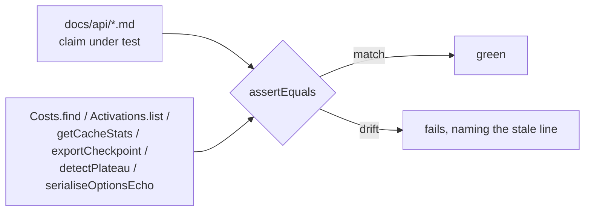

# Docs: correct the drifted `docs/api/` reference claims (Issue #3696)

## Summary

The verification sweep found twelve claims across the remaining `docs/api/`
reference pages that contradicted the source — wrong option keys, wrong
signatures, a stale priority scale and samples that could not type-check. Each
cited line is now corrected to the source value, and a new fact-check guard pins
every corrected claim to the shipped code so it cannot drift again silently.
Closes #3696.

### `docs/api/COSTS_AND_ACTIVATIONS.md`

- Added the missing `"RMSE"` row to the built-in cost table and changed "six" to
  **seven** names in both places (`src/Costs.ts:23-34`).
- `BUILT_IN_COST_NAMES` is no longer presented as a package symbol — the doc now
  says it is the internal tuple in `src/Costs.ts` and that `costName` takes a
  string literal (Issue #3271 rule: `mod.ts` does not re-export it).
- Replaced the invented "Priority" column with a **Weight** column carrying each
  activation's actual `mutationProbability`, re-sorted descending. Swish (35)
  now correctly ranks above GELU (34), and the six functions wrongly listed as
  priority `0` (COMPLEMENT, STEP, IF, BIPOLAR, MAXIMUM, MINIMUM) carry their
  real non-zero weights. The tip and the trailing note were rewritten off the
  new scale; only SOFTMAX and the three deprecated squashes are weight `0`.

### `docs/api/COMPUTE.md`

- `getCacheStats()` returns `CacheStats[]`, one entry per instrumented cache
  (`src/cache/getCacheStats.ts:31`) — the sample now annotates the array type
  and iterates it, and the surrounding prose says so.
- The worker sample (and the numbered step above it) now calls
  `await initialiseWasmActivationFromPayload(payload, true)`, matching the real
  two-parameter `Promise<void>` signature (`src/workers/WasmWorkerInit.ts:31`).

### `docs/api/INTEROP.md`

- `frozenNeuronUUIDs: string[]` → `frozenNeuronIds: number[]` in both the sample
  and the parameter table (`src/transfer/Checkpoint.ts:36`).

### `docs/api/EVOLUTION.md`

- The `requestedOptions` summary now says non-serialisable values are **dropped
  entirely, no marker**, matching both the implementation
  (`src/creature/EvolveOptionsEcho.ts:15-16,54`) and the doc's own detail
  section, which it previously contradicted.
- `detectPlateau(history, windowSize, minImprovementRate)` with its real
  `{ onPlateau, improvementRate }` return, plus a worked sample.
- The plateau-detection link now points at the anchor that exists,
  `CONFIGURATION.md#plateaudetection--plateaudetectionconfig`.

### `docs/api/CONFIGURATION.md` (and `DISCOVERY.md`)

- `### outputRange` → `### outputRanges`, the real `NeatOptions` key
  (`src/config/NeatOptions.ts:202`).
- `calculateOutputRangePenalty(creature, ranges)` → `(outputs, ranges)`, with a
  note that `outputs` is one record's output values
  (`src/architecture/OutputRangePenalty.ts:25-28`).
- `### diskSpace` → `### discoveryDiskSpace` (`src/config/NeatOptions.ts:154`);
  `DISCOVERY.md`'s cross-reference to the same non-existent key follows the
  rename.

## Evidence

This is a documentation change with no web interface to screenshot. The evidence
is the new guard test, which fails against the pre-fix docs and passes after.

Running `test/docs/ApiReferenceSourceFacts.ts` against the **unfixed** docs:

```
FAILED | 3 passed | 13 failed (368ms)
```

After the corrections:

```
ok | 16 passed | 0 failed (108ms)
```

Full gate:

```
./quality.sh < /dev/null
ok | 8300 passed (5 steps) | 0 failed | 4 ignored (7m4s)
```

The guard reads each doc only to extract the claim under test, then compares it
against a value the shipped code produces:



## Test Plan

New file `test/docs/ApiReferenceSourceFacts.ts` — 16 tests, each invoking the
real function rather than grepping source:

- `built-in cost table lists every BUILT_IN_COST_NAMES entry` — table names are
  set-compared with the tuple and each resolves via `Costs.find()`.
- `the built-in cost count in prose matches the tuple` — the number word in
  prose is derived from `BUILT_IN_COST_NAMES.length`.
- `RMSE is a working built-in cost` — `Costs.find("RMSE").calculate()`.
- `activation table weights match mutationProbability` — every row's weight is
  compared with `Activations.list()`, and every registered squash must have a
  row.
- `no activation is described with the stale priority scale`.
- `getCacheStats returns an array of per-cache stats` + the sample declares
  `CacheStats[]`.
- `the worker sample passes every required argument and awaits` — argument count
  is taken from `initialiseWasmActivationFromPayload.length`.
- `exportCheckpoint freezes neurons named by frozenNeuronIds` — real export
  call; plus the doc must name `frozenNeuronIds` / `number[]` and must not name
  `frozenNeuronUUIDs`.
- `requestedOptions drops non-serialisable values with no marker` — real
  `serialiseOptionsEcho()` call; plus summary/detail agreement.
- `detectPlateau is documented with its real parameter list` — parameter count
  taken from `detectPlateau.length`.
- `every in-repo CONFIGURATION.md anchor resolves to a heading` — GitHub-style
  slugs computed from the actual headings.
- `outputRanges` / `discoveryDiskSpace` headings, plus a real
  `calculateOutputRangePenalty()` call proving it takes output values.

No existing tests were modified or removed.
