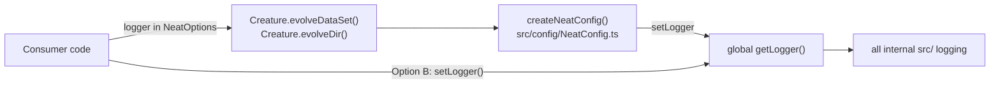

## Summary

The AGENTS.md Logging Policy sample (rule 3) could not run: it imported `Neat`,
which is internal and not re-exported from `mod.ts`, and called a
`new Neat(input, output, fitness, options)` constructor that never existed (the
real one is `(input, output, options, workers, fastWorkers?)`). Both breaches
sat directly above the note forbidding them and above `docs/DOC_STYLE.md`
rule 4.

Option A is now written around the public `Creature.evolveDataSet()` /
`evolveDir()` entry points, which take `NeatOptions` — where `logger` really
lives (`src/config/NeatOptions.ts:203`, consumed at
`src/config/NeatConfig.ts:753-762`). Option B (`setLogger`) is unchanged; both
now share one `myLogger: Logger` object so the sample is copy-pasteable. Only
the vehicle changed — no source or API change was needed. Closes #3697.

## Evidence

Documentation-only change; no web surface to screenshot. Verified by tests:

- `test/docs/AgentsLoggingExample.ts` "AGENTS.md imports only symbols mod.ts
  actually re-exports" fails against the old doc (`Neat`) and passes after the
  rewrite.
- Full gate: `./quality.sh` →
  `ok | 8303 passed (5 steps) | 0 failed | 4 ignored`.

## Test Plan

New `test/docs/AgentsLoggingExample.ts`:

- `collectRootImportedSymbols extracts named symbols and skips type-only ones` —
  unit test for the helper (happy path, type-only clause, other-package import).
- `AGENTS.md imports only symbols mod.ts actually re-exports` — regression test
  for this issue; walks every `@stsoftware/neat-ai` import in AGENTS.md and
  checks each value symbol against the real `mod.ts` namespace (general check,
  not a grep for `Neat`), so any future non-exported symbol is caught too.
- `NeatOptions.logger routes NEAT-AI log output to the injected logger` — runs
  the corrected Option A through `Creature.evolveDataSet()` and asserts the
  injected logger becomes the active logger and receives log output.
