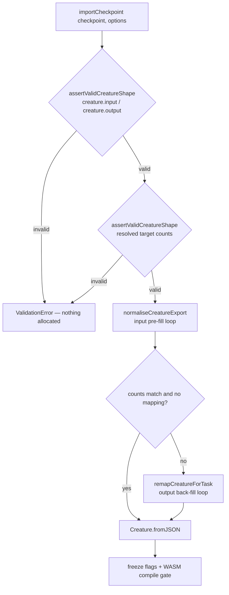

# Validate creature shape at the `importCheckpoint()` boundary (#3714)

## Summary

`importCheckpoint()` is a public deserialisation boundary — the checkpoint it is
handed is read off disk or the network. It used the raw
`checkpoint.creature.input` / `.output` counts as loop bounds before
`Creature.fromJSON` could apply `assertValidCreatureShape`, so a hostile count
burnt seconds of CPU and then died with `RangeError: Map maximum size exceeded`
instead of failing fast with a `ValidationError`. Two loops were reachable:
`normaliseCreatureExport`'s `json.input` pre-fill, and the output back-fill in
`remapCreatureForTask` driven by `targetOutputCount`.

The fix hoists `assertValidCreatureShape` to the first statement of
`importCheckpoint`, and validates the resolved target counts (so an explicitly
supplied `targetInputCount` / `targetOutputCount` is checked too) before
`normaliseCreatureExport` runs. This places the guard at the deserialisation
boundary, matching what Issue #3672 did for `Creature.fromJSON`.

Also fixed alongside (noted in the issue, availability only, same file):
`remapCreatureForTask` dereferenced `metadata.sourceInputIds` /
`sourceOutputIds` with no presence check, so a checkpoint omitting those fields
threw a raw `TypeError` out of a public API. Missing arrays now mean "nothing to
map by position", and the positional-overlap loops are additionally capped by
the actual array length so a mismatched `sourceInputCount` cannot insert
`undefined` map keys.

Closes #3714.

## Evidence

Backend/library change — no web interface to screenshot. Verified by the test
suite.

Order of operations after the change:



Before the fix (issue reproduction, both hostile cases):

```text
importCheckpoint - rejects fifty million input before allocating
error: AssertionError: Expected error to be instance of "ValidationError", but was "RangeError".
importCheckpoint - rejects fifty million output on the remap path
error: AssertionError: Expected error to be instance of "ValidationError", but was "RangeError".
importCheckpoint - metadata without id arrays does not throw TypeError
error: TypeError: Cannot read properties of undefined (reading '0')
      inputMap.set(metadata.sourceInputIds[i], i);

FAILED | 29 passed | 9 failed (45s)
```

After the fix — the same suite plus the pre-existing checkpoint tests, and the
45 seconds of allocation burn is gone:

```text
deno test test/transfer/CheckpointImportShapeValidation.ts test/transfer/Checkpoint.ts
ok | 55 passed | 0 failed (497ms)
```

Full gate:

```text
./quality.sh < /dev/null
ok | 8262 passed (5 steps) | 0 failed | 4 ignored (8m3s)
```

## Test Plan

New regression suite `test/transfer/CheckpointImportShapeValidation.ts`:

- `importCheckpoint - rejects <count> input before allocating` — hostile
  `creature.input` (negative, zero, fractional, numeric string, `NaN`,
  `Infinity`, `MAX_NEURON_COUNT + 1`, 50 million) throws `ValidationError`
  naming `input`. The 50-million case is the issue's own reproduction and
  previously threw `RangeError` after ~6 s.
- `importCheckpoint - rejects <count> output on the remap path` — same counts on
  `creature.output` with an `outputIdMapping` supplied, which is the remap path
  that pushes one neuron per `targetOutputCount`.
- `importCheckpoint - rejects <count> targetInputCount` /
  `targetOutputCount` — explicitly supplied target counts are validated too.
- `importCheckpoint - rejects a missing input/output count` — `undefined` on the
  checkpoint is hostile; `undefined` in the options legitimately means "not
  supplied" and falls back to the source count.
- `importCheckpoint - metadata without id arrays does not throw TypeError` —
  a checkpoint with `sourceInputIds` / `sourceOutputIds` removed imports
  cleanly.
- `importCheckpoint - a valid checkpoint still round-trips` — the happy path is
  unchanged.

Existing `test/transfer/Checkpoint.ts` (19 tests) passes unmodified.
