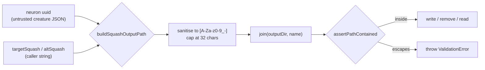

# Contain Intelligent Design squash output paths

## Summary

`scanForSquashImprovements()` built its output path by interpolating an
**unvalidated creature neuron uuid** and the free-form caller string
`targetSquash` straight into `${outputDir}/${targetSquash}_${shortId}.json`. A
neuron uuid ending in `/../../x` produced `outputDir/GELU_/../../x.json` — a
write into the grandparent of `outputDir` — and `SafeWrite`'s `ensureDirSync()`
**created** the intermediate `..` components rather than rejecting them. The
same escaped path was stored on `BestNeuronSquash.path` and later reused for a
`Deno.remove` and a `Deno.readTextFile`, so both inherited the escape. The
alternative-squash follow-up (`altPath`, written via `writeTextFileSync`) had
the identical defect. Closes #3715.

The fix adds `src/intelligentDesign/SquashOutputPath.ts`:
`buildSquashOutputPath(outputDir, squash, uuid)` reduces both components to
`[A-Za-z0-9_-]` (any other character becomes `_`), caps each at 32 characters,
joins them, and then asserts containment with the existing
`assertPathContained()` primitive (added for #3670) as defence in depth. Both
write sites in `ImproveSquash.ts` now build their path through it, so the
derived `path` / `altPath` values used for the later remove and read are
contained by construction.

Well-formed identifiers are unchanged: `targetSquash: "GELU"` with uuid
`…456789abcdef` still yields `GELU_89abcdef.json`.

## Evidence

Backend/library change — no web interface to screenshot. Evidence is the test
suite.

The regression tests fail against the unfixed code and pass after the fix:

```text
# with src/intelligentDesign/ImproveSquash.ts stashed (pre-fix)
FAILED | 0 passed | 2 failed | 3 filtered out
  scanForSquashImprovements keeps writes inside outputDir when a neuron uuid contains traversal (Issue #3715)
  scanForSquashImprovements keeps writes inside outputDir when targetSquash contains traversal (Issue #3715)

# after the fix
ok | 5 passed | 0 failed (13ms)
```

Full quality gate:

```text
./quality.sh < /dev/null
ok | 8267 passed (5 steps) | 0 failed | 4 ignored (3m30s)
exit=0
```

Path construction before and after:



## Test Plan

New file `test/intelligentDesign/ImproveSquashPathContainment.ts`:

- `scanForSquashImprovements keeps writes inside outputDir when a neuron uuid
  contains traversal (Issue #3715)`
  — drives the public scan with a hidden neuron whose uuid ends in `/../../x`
  and asserts every written, removed, and recorded path resolves inside
  `outputDir` (regression test for the reported vector).
- `scanForSquashImprovements keeps writes inside outputDir when targetSquash
  contains traversal (Issue #3715)`
  — same for the latent `targetSquash = "../../../home/user/.ssh/x"`
  API-contract vector.
- `buildSquashOutputPath keeps the familiar name for well-formed identifiers` —
  no change in behaviour for ordinary uuids and squash names.
- `buildSquashOutputPath sanitises hostile identifiers` — POSIX traversal,
  absolute paths, Windows-style separators, and spaces.
- `buildSquashOutputPath caps component length and tolerates empty identifiers`
  — edge cases (500-character squash name, empty uuid).

Existing `test/intelligentDesign/*` suite (51 tests) still passes unmodified.

Docs: `docs/INTELLIGENT_DESIGN.md` gains an "Output path containment" section
describing the naming and sanitisation contract.
