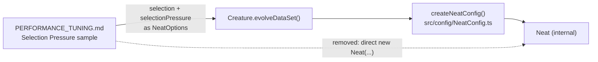

## Summary

The Selection Pressure sample in `docs/PERFORMANCE_TUNING.md` could not run: it
called `new Neat(input, output, fitness, options)`, but `Neat` is internal (not
re-exported from `mod.ts`, see `src/NEAT/Neat.ts:69`) and its real signature is
`(input, output, options, workers, fastWorkers?)` — there is no `fitness`
parameter. That breached `docs/DOC_STYLE.md` rule 4, which allows only symbols
re-exported from `mod.ts` in reader-facing examples.

The sample is now written around the public `Creature.evolveDataSet()` entry
point, which takes `NeatOptions` — where `selection` and `selectionPressure`
really live (`src/config/NeatArguments.ts:183`, `src/config/NeatOptions.ts:190`)
— and carries the import line so readers can copy-paste it. `Creature` and
`Selection` are both re-exported from `mod.ts` (`mod.ts:312` for `Selection`).
Documentation-only change; no source or API change was needed. Same defect class
as #3697 (PR #3730). Closes #3731.

## Evidence

Documentation-only change; no web surface to screenshot. Verified by tests:

- `test/docs/PerformanceTuningPublicApi.ts` "PERFORMANCE_TUNING.md constructs
  only classes mod.ts re-exports" fails against the old doc
  (`AssertionError: … symbols not re-exported from mod.ts: Neat`) and passes
  after the rewrite.
- Full gate: `./quality.sh` →
  `ok | 8308 passed (5 steps) | 0 failed | 4 ignored`.

## Test Plan

New `test/docs/PerformanceTuningPublicApi.ts`:

- `collectConstructedSymbols finds constructors only in TypeScript blocks` —
  unit test for the extractor (fenced `ts`/`typescript` blocks, blockquote
  markers stripped, non-TypeScript block ignored, no-match case).
- `collectRootImportedSymbols extracts named symbols and skips type-only ones` —
  unit test for the import extractor (happy path, type-only clause,
  other-package import).
- `PERFORMANCE_TUNING.md constructs only classes mod.ts re-exports` — regression
  test for this issue; checks every `new X(...)` in the guide's TypeScript
  examples against the real `mod.ts` namespace (a general check, not a grep for
  `Neat`), so any future non-exported symbol is caught too.
- `PERFORMANCE_TUNING.md imports only symbols mod.ts re-exports` — same guard
  for the guide's `@stsoftware/neat-ai` imports.
- `the documented selection-pressure options evolve through the public entry
  point`
  — runs the corrected sample through `Creature.evolveDataSet()` with
  `Selection.POWER` / `selectionPressure: { power: 8 }` and asserts it evolves
  to a finite error.
