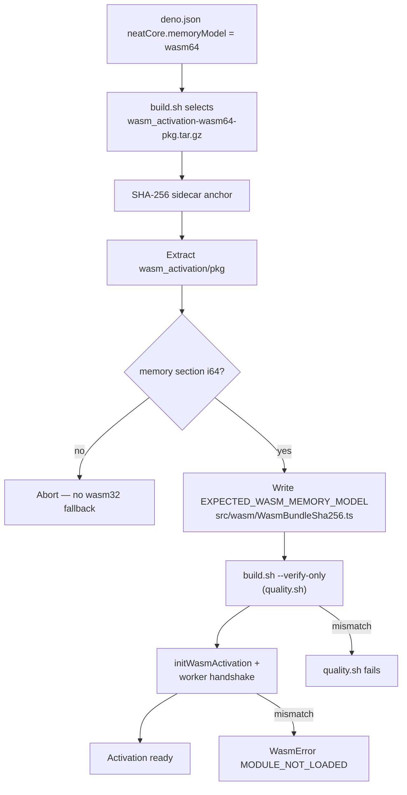

# Load and use the wasm64 Memory64 activation bundle

## Summary

NEAT-AI vendored the **wasm32** `wasm_activation` bundle, so WASM linear memory
was capped at 4 GiB no matter how much RAM the host had. NEAT-AI-core
[#541](https://github.com/stSoftwareAU/NEAT-AI-core/issues/541) now dual-ships a
Memory64 asset alongside the wasm32 one; this change makes NEAT-AI the consumer.
Closes #3743.

- **Pin advanced** to NEAT-AI-core `7c9f3de` and its
  `wasm_activation-wasm64-pkg.tar.gz` asset — a genuine `(memory i64 …)` module
  (limits flags `0x04`), anchored by the release sidecar.
- **`deno.json` gained `neatCore.memoryModel`** (`"wasm64"`). It selects the
  release asset _and_ is enforced against the bytes.
- **Three gates, no silent fallback.** The address size is verified after
  download, again by `./build.sh --verify-only` (so `./quality.sh` fails on a
  wasm32 copy), and a third time on the bytes actually instantiated — on the
  main thread and on the worker handshake. A mismatch raises
  `WasmError("MODULE_NOT_LOADED")`, which routes through the existing
  missing-bundle path so every WASM-only operation fails loud.
- **BigInt grow.** `growWasmMemory` takes a `bigint` page delta; a `Number` is
  rejected with an explicit error rather than truncated, and a wasm32 memory
  refuses a delta past its 65 536-page ceiling.
- **Docs** state the two ceilings explicitly: `--max-old-space-size` is the V8
  JS-heap lever, the wasm64 bundle is the WASM linear-memory lever, and neither
  moves the other.

Unchanged by design: the UUID-only wire format, semantic-version invariants, and
every handwritten activation / topological-backprop / scoring test. As with
`--next` and rust_scorer, the implementation swapped underneath and no test case
was rewritten.

### Deno regression avoided

The build-time address-size gate runs the repo's own TypeScript decoder via
`deno run scripts/check_wasm_memory_model.ts` rather than adding a Node/npm
WASM-inspection tool, so build time and runtime share one decoder.

## Evidence

Backend/CLI change — no web interface to screenshot.

**The vendored bundle is Memory64.** Limits flags byte of
`wasm_activation/pkg/wasm_activation_bg.wasm` is `0x04` (bit 2 = i64 index
type); the previous wasm32 bundle read `0x00`. Asserted by
`test/wasm/WasmMemoryModel.ts::"the vendored activation bundle is a Memory64
(wasm64) module"`.

**`./build.sh` output on the pin advance:**

```text
Memory model: wasm64 (asset wasm_activation-wasm64-pkg.tar.gz)
Tarball SHA-256 verified via sidecar wasm_activation-wasm64-pkg.tar.gz.sha256.
Pruning wasm_activation/pkg/package.json: the wasm_activation-wasm64-pkg.tar.gz bundle does not ship it.
wasm_activation/pkg/wasm_activation_bg.wasm: memory model wasm64 — verified.
```

**Where the gates sit:**



**Worker handshake** stays green: `test/wasm/WorkerActivation.ts` and
`test/wasm/WorkerMemoryIsolation.ts` pass against the wasm64 bundle, and
`initWasmActivationSync` now applies the same gate to the payload it receives.

### Note for reviewers — `package.json`

The wasm64 lane in NEAT-AI-core is built by the `wasm-bindgen` CLI (wasm-pack
0.15.0 still hard-codes `wasm32-unknown-unknown`), so it ships no
`package.json`; the wasm32 lane does. `build.sh` now hashes that file into the
content manifest when a bundle provides it and **prunes it with an
announcement** when one does not, rather than leaving wasm32-era npm metadata
beside a Memory64 module. Nothing in this Deno repo reads it. The required file
set (`wasm_activation.js`, `_bg.wasm`, and both `.d.ts` files) is unchanged and
still enforced.

## Test Plan

New:

- `test/wasm/WasmMemoryModel.ts` (17 tests) — memory-section decoding for
  wasm32/wasm64 including a shared bounded memory; malformed, truncated and
  memory-less modules rejected; the vendored bundle asserted to be wasm64 and to
  match `EXPECTED_WASM_MEMORY_MODEL`; mismatch in both directions fails loud
  with both model names and the offending path; `growWasmMemory` grows via
  BigInt, rejects a `Number` delta without resizing, rejects a negative delta,
  and refuses a wasm32 grow past the 4 GiB page ceiling.
- `test/scripts/BuildScriptMemoryModel.ts` (11 tests) — `deno.json` declares
  `wasm64`; `select_bundle_asset_name` maps each model onto its asset and prints
  nothing for an unknown one; `assert_wasm_memory_model` accepts the vendored
  bundle, rejects an i32 module under a wasm64 pin, and fails on a missing file;
  `prune_stale_optional_files` drops metadata the new bundle stopped shipping
  and keeps what it still ships; `write_runtime_bundle_pin` refuses to write
  without a model and records it when given one.

Modified (documented, none removed or disabled):

- `test/scripts/BuildScriptContentHash.ts` — the two tamper fixtures copied a
  hard-coded pkg file list including `package.json`; they now copy whatever the
  bundle actually ships, so neither lane breaks them. `write_runtime_bundle_pin`
  is invoked with `MEMORY_MODEL=wasm64` because that variable is now required.
- `test/scripts/BuildScriptRetry.ts` — the fake repo declares
  `memoryModel: "wasm64"`, carries the decoder module graph so the gate can run,
  and its `gh` shim writes the requested asset name instead of the hard-coded
  wasm32 one.

Full `./quality.sh --skip-discovery` passes.
