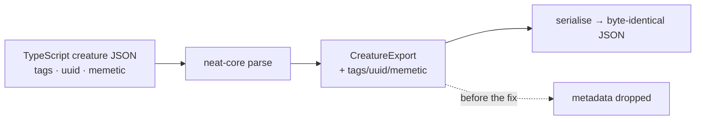

# neat-core keeps neuron tags, synapse tags, uuid and memetic (Issue #3747)

## Summary

`neat-core`'s creature export structs were lossy relative to this repository's
TypeScript wire format, so every Rust rewrite of a creature silently stripped
per-neuron `tags` (the `intelligentDesign` "Swish -> SOFTSIGN" pedigree),
per-synapse `tags`, and the top-level `uuid` / `tags` / `memetic` block.

The root cause lives in the internal dependency
[stSoftwareAU/NEAT-AI-core](https://github.com/stSoftwareAU/NEAT-AI-core)
(`neat-core/src/creature.rs`), not in this repository, so it was fixed there per
Issue #2942 (fix internal `stSoftwareAU/*` root causes cross-repo). This
repository needs no code change: NEAT-AI consumes `neat-core` through the pinned
wasm activation bundle, which does not serialise creature JSON. Closes #3747.

### What changed in NEAT-AI-core

Branch:
[`issue-3747-creature-export-tags-uuid-memetic`](https://github.com/stSoftwareAU/NEAT-AI-core/tree/issue-3747-creature-export-tags-uuid-memetic)
(commit `ed30e10`).

- New `CreatureTag { name, value }` matching the `@stsoftware/tags` wire shape.
- `NeuronExport::tags` and `SynapseExport::tags` — `Option<Vec<CreatureTag>>`.
- `CreatureExport::uuid`, `CreatureExport::tags`, `CreatureExport::memetic`.
- Every new field is optional with `skip_serializing_if = "Option::is_none"` and
  declared **after** the existing fields, so a creature carrying none of them
  serialises exactly as before — no new `null` keys, no key-order drift.
- `memetic` is held as `serde_json::value::RawValue` (wrapped in a
  `MemeticExport` struct) rather than `serde_json::Value`: `Value` is backed by
  a sorted map and would re-order every UUID key on rewrite, churning model-file
  diffs. Raw text preserves key order and number formatting byte-for-byte. This
  enabled the `raw_value` feature on the existing `serde_json` dependency — no
  new crate.

## Action required by a human

The `neat-core` fix is committed and **pushed**, but this run's write allowlist
covers only `stSoftwareAU/NEAT-AI`, so `gh pr create` against NEAT-AI-core was
refused. A human must:

1. Open the pull request from `issue-3747-creature-export-tags-uuid-memetic`
   into `Develop` on NEAT-AI-core
   ([compare link](https://github.com/stSoftwareAU/NEAT-AI-core/compare/Develop...issue-3747-creature-export-tags-uuid-memetic)).
2. Merge and release it. Per Issue #2944 the worker must not auto-merge,
   publish, or pin a consumer to a raw commit ref — releasing is a human
   decision.

Issue #3747 carries the `needs-human` label and a comment repeating these steps.
The sibling sub-issues (#3748 unknown-field preservation, #3749 Backpropagation,
#3750 Lamarck) are unaffected and stay open.

## Evidence

Backend-only crate change with no web interface to screenshot; evidence is the
NEAT-AI-core test suite and mutation runs.

`./quality.sh` in NEAT-AI-core — green (`cargo fmt --check`, `cargo clippy` with
`-D warnings`, `cargo test --workspace`, docs build, release build).

Mutation evidence (each applied alone, then reverted):

| Mutation                                                        | Result                                                                                                                                          |
| --------------------------------------------------------------- | ----------------------------------------------------------------------------------------------------------------------------------------------- |
| `MemeticExport` holds `serde_json::Value` instead of `RawValue` | `roundtrip_preserves_tags_uuid_memetic`, `memetic_object_key_order_is_preserved_verbatim`, `tagged_creature_survives_a_second_roundtrip` FAILED |
| `skip_serializing_if` dropped from `CreatureExport::uuid`       | `roundtrip_plain_creature_byte_identical` FAILED                                                                                                |
| `#[serde(skip_serializing)]` on `NeuronExport::tags`            | `roundtrip_preserves_tags_uuid_memetic`, `tagged_creature_survives_a_second_roundtrip` FAILED                                                   |

`./quality.sh` in this repository — not re-run: no file outside
`docs/archive/pr-summaries/` changed here.

## Test Plan

Added in NEAT-AI-core `neat-core/tests/creature/metadata_roundtrip.rs`:

- `roundtrip_preserves_tags_uuid_memetic` — fixture with per-neuron tags,
  per-synapse tags and top-level `uuid`/`tags`/`memetic` parses with every field
  readable and re-serialises **byte-identically**.
- `roundtrip_plain_creature_byte_identical` — fixture with none of the optional
  metadata re-serialises byte-identically and emits no `null`.
- `memetic_object_key_order_is_preserved_verbatim` — memetic keys stay in source
  order (`generation`, `score`, `biases`, `weights`), not sorted.
- `tagged_creature_survives_a_second_roundtrip` — repeated rewrites are a fixed
  point.

Modified in NEAT-AI-core:

- `neat-core/tests/creature/roundtrip.rs`, `neat-core/tests/creature_compile.rs`
  — struct literals gained `tags: None` / `uuid: None` / `memetic: None`.
- `test_parse_creature_json_ignores_extra_fields` — **documented business-logic
  change**: its fixture used a name-only tag (`{"name": "test"}`) from when
  `tags` was ignored entirely. `tags` is now parsed against the
  `@stsoftware/tags` contract (`name` and `value` both required), so the fixture
  carries the real wire shape. The test's intent — fields this crate does not
  model, such as `frozen`, are ignored — is unchanged.
