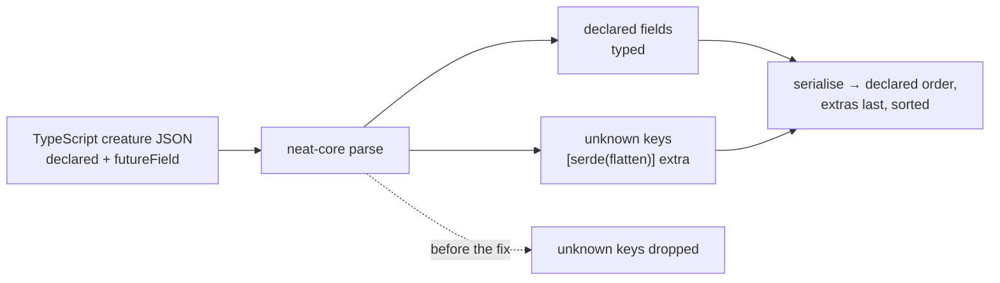

# neat-core preserves unknown creature JSON fields (Issue #3748)

## Summary

`neat-core`'s creature structs declared no catch-all, so any key the TypeScript
engine carries but the Rust structs do not declare was silently discarded on
parse and absent on re-serialise — while the module doc claimed round tripping
"preserves every field". Issue #3747 fixed the fields known to be missing today
(`tags` / `uuid` / `memetic`); this fixes the _class_ of bug, so the next field
TypeScript adds ahead of the Rust structs cannot vanish the same way.

The root cause lives in the internal dependency
[stSoftwareAU/NEAT-AI-core](https://github.com/stSoftwareAU/NEAT-AI-core)
(`neat-core/src/creature.rs`), not in this repository, so it was fixed there per
Issue #2942 (fix internal `stSoftwareAU/*` root causes cross-repo). This
repository needs no code change: NEAT-AI consumes `neat-core` through the pinned
wasm activation bundle, which does not serialise creature JSON, and the
TypeScript side already owns the full wire format. Closes #3748.

### What changed in NEAT-AI-core

Branch:
[`issue-3748-creature-unknown-field-passthrough`](https://github.com/stSoftwareAU/NEAT-AI-core/tree/issue-3748-creature-unknown-field-passthrough)
(commit `db097f6`), stacked on the Issue #3747 branch because both edit the same
three structs.

- `#[serde(flatten)] pub extra: serde_json::Map<String, serde_json::Value>` on
  `CreatureExport`, `NeuronExport` and `SynapseExport`.
- No `skip_serializing_if` is needed to keep no-extras creatures byte-identical:
  an empty flattened map contributes **no keys at all**, so the output is the
  same bytes as before the catch-all existed — no `"extra":{}`, no reordering,
  no new `null`.
- The module doc now states the guarantee the implementation actually delivers,
  rather than a broader claim:
  - declared fields are emitted in struct declaration order;
  - unknown keys are emitted **after** every declared field of their object
    (that is where the flattened map sits in declaration order);
  - unknown keys, and keys of objects nested inside them, are emitted in
    **sorted** order, because `serde_json::Map` is a sorted map here;
  - so `parse -> serialise` is byte-identical for unknown keys already in that
    canonical position, and lossless — but re-ordered — everywhere else.
- `CreatureExport::memetic` stays outside that normalisation: it is held as raw
  JSON text (Issue #3747) so its UUID key order and number formatting survive
  verbatim. The flatten catch-all and the `RawValue` field compose — proved by
  the byte-identical fixture that carries both.

## Action required by a human

The `neat-core` fix is committed and **pushed**, but this run's write allowlist
covers only `stSoftwareAU/NEAT-AI`, so `gh pr create` against NEAT-AI-core was
refused. A human must:

1. Open the PR from `issue-3748-creature-unknown-field-passthrough` into
   `issue-3747-creature-export-tags-uuid-memetic`
   ([compare link](https://github.com/stSoftwareAU/NEAT-AI-core/compare/issue-3747-creature-export-tags-uuid-memetic...issue-3748-creature-unknown-field-passthrough)),
   after the Issue #3747 PR it is stacked on.
2. Merge and release. Per Issue #2944 the worker must not auto-merge, publish,
   or pin this repository to a raw commit ref — releasing is a human decision,
   and the `deno.json` `neatCore.rev` bump rides the ordinary dependency-bump
   flow once a release exists.

This is the same outstanding human action already tracked on Issue #3747; no
separate follow-up issue was filed (Issue #2943 — one follow-up per root cause).

## Evidence

Backend-only crate change with no web interface to screenshot; the evidence is
the NEAT-AI-core test suite, its quality gate, and mutation runs.

`./quality.sh` in NEAT-AI-core — green: `cargo fmt --check`, shellcheck,
`cargo clippy --workspace --all-targets -- -D warnings`,
`cargo test --workspace` (46 test binaries, 0 failures), docs build, release
build.

Mutation evidence (each applied alone to `neat-core/src/creature.rs`, then
reverted):

| Mutation                                                                                            | Result                                                                                                                                                             |
| --------------------------------------------------------------------------------------------------- | ------------------------------------------------------------------------------------------------------------------------------------------------------------------ |
| `#[serde(flatten)]` → `#[serde(skip)]` on `NeuronExport`                                            | `unknown_fields_round_trip_byte_identical`, `typed_fields_not_duplicated_via_extra` FAILED                                                                         |
| `#[serde(flatten)]` → `#[serde(skip)]` on `SynapseExport`                                           | `unknown_fields_round_trip_byte_identical`, `typed_fields_not_duplicated_via_extra` FAILED                                                                         |
| `#[serde(flatten)]` → `#[serde(default)]` on `CreatureExport` (extras become a literal `extra` key) | all 5 `unknown_fields` tests plus the 3 Issue #3747 `metadata_roundtrip` tests FAILED — including `no_extras_serialisation_unchanged`, the `"extra":{}` regression |

`./quality.sh` in this repository — not re-run: no file outside
`docs/archive/pr-summaries/` changed here.

## Test Plan

Added in NEAT-AI-core `neat-core/tests/creature/unknown_fields.rs`:

- `unknown_fields_round_trip_byte_identical` — a fixture carrying
  `"futureField":{"a":1}` at all three levels (creature, neuron, synapse) parses
  with each unknown key readable, re-serialises **byte-identically**, and is a
  fixed point on a second pass. Untouched neurons/synapses keep an empty map
  rather than a sibling's leftovers.
- `no_extras_serialisation_unchanged` — golden fixture with no unknown keys
  serialises to the exact pre-change bytes, with no `extra` key and no `null`.
- `typed_fields_not_duplicated_via_extra` — a creature carrying the typed `tags`
  / `uuid` / `memetic` fields **and** an unknown key at each level: the
  catch-all holds only `futureField`, and each typed key is emitted exactly once
  (counted in the output), with the whole document byte-identical.
- `flattening_preserves_f64_precision_of_declared_fields` — flatten routes the
  struct through serde's buffering deserialiser, so this pins that declared
  `bias` / `weight` values keep full f64 precision in and out.
- `unknown_keys_are_re_emitted_in_canonical_order` — pins the documented
  normalisation: unknown keys arriving before/among the declared fields are
  preserved, moved after them, and sorted (nested objects too),
  deterministically.

Modified in NEAT-AI-core:

- `neat-core/tests/creature/roundtrip.rs`, `neat-core/tests/creature_compile.rs`
  — struct literals gained `extra: Default::default()`.
- `test_parse_creature_json_ignores_extra_fields` → renamed
  `test_parse_creature_json_keeps_extra_fields_out_of_compilation` —
  **documented business-logic change**: unmodelled fields such as `frozen` are
  no longer discarded, so the old name asserted the opposite of the new
  behaviour. What it pins is unchanged (extras do not disturb compilation) and
  it now also asserts `frozen` survives on both the neuron and the synapse.
