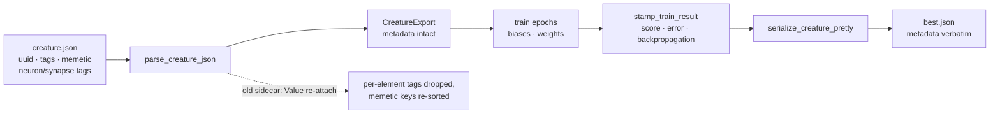

# NEAT-AI-Backpropagation stops dropping per-element tags and memetic (Issue #3749)

## Summary

`NEAT-AI-Backpropagation` worked around the lossy `neat_core::CreatureExport`
with a sidecar, `backpropagation/src/tags.rs`. The workaround was partial:
`CreatureMeta` mirrored only the top-level `uuid` + `tags` and re-attached them
through a `serde_json::Value` after `creature_to_json`, so per-neuron `tags`
(the `intelligentDesign` pedigree), per-synapse `tags` and the top-level
`memetic` block were dropped on every `train` rewrite — and the `Value` detour
re-sorted whatever did survive, because `serde_json::Map` is a sorted map.

The root cause was fixed in the internal dependency
[stSoftwareAU/NEAT-AI-core](https://github.com/stSoftwareAU/NEAT-AI-core) under
Issues #3747 / #3748 (per Issue #2942). This sub-issue retires the compensating
half in the consumer, which lives in
[stSoftwareAU/NEAT-AI-Backpropagation](https://github.com/stSoftwareAU/NEAT-AI-Backpropagation),
not in this repository — so this repository carries only the record. Closes
#3749.

### What changed in NEAT-AI-Backpropagation

Branch:
[`issue-3749-retire-tags-sidecar`](https://github.com/stSoftwareAU/NEAT-AI-Backpropagation/tree/issue-3749-retire-tags-sidecar)
(commit `135f66a`).

- **Removed** `tags::CreatureMeta` and `tags::serialize_creature_with_meta` —
  the extract-and-re-attach path neat-core now makes redundant.
- **Kept** the deliberate stamping behaviour, rewritten as free functions over
  the creature's own tag list: `tags::stamp_train_result` writes `score` /
  `error` / `backpropagation` for GRQ check-in (GRQ #3991 / #3952) and
  `tags::upsert_tag` replaces a tag in place, so `lamarck` and
  `intelligentDesign` are still never touched. The `%g` formatter and the `🌀`
  check-in blurb are unchanged.
- **Added** `creature_io::serialize_creature_pretty` — writes the parsed
  creature straight out, newline-terminated, with nothing re-attached. `train`
  now stamps `incumbent` and writes it through this helper.



## Action required by a human

The branch is **pushed but has no PR**: this run's write allowlist covers only
`stSoftwareAU/NEAT-AI`, so `gh pr create` against NEAT-AI-Backpropagation was
refused (`[WRITE_REPO_BLOCKED]`). It is also gated on the neat-core merge —
`backpropagation/Cargo.toml` consumes neat-core through an unpinned sibling
`path` dependency that tracks `Develop`, and against today's `Develop` the
branch does not compile:

```text
error[E0432]: unresolved import `neat_core::CreatureTag`
error[E0609]: no field `tags` on type `&mut CreatureExport`
```

Per Issue #2944 this run did not pin the consumer to a raw commit ref to pull
the fix in early — `.github/actions/setup-neat-core` still checks out `Develop`.

Issue #3757 is the single follow-up tracking the whole chain (merge the two
NEAT-AI-core branches, then open the Backpropagation PR); it carries
`needs-human` and a comment naming the next step. Issues #3747 and #3748 were
auto-closed by their own PRs, so #3757 is now the only open tracker for the
outstanding human action.

## Evidence

Backend-only crate change with no web interface to screenshot; the evidence is
the NEAT-AI-Backpropagation quality gate and mutation runs, both executed with
the fixed neat-core checked out as the sibling.

`./quality.sh` in NEAT-AI-Backpropagation — green across `cargo deny`, the
formatting check, clippy with `-D warnings` over all targets and features, the
78-test `cargo test --workspace --all-features` run, `cargo doc` with
`RUSTDOCFLAGS="-D warnings"`, plus the repo's shell / actionlint / spell gates.

Mutation evidence (each applied alone, then reverted):

- Keep the old `CreatureMeta` `Value` re-attach path →
  `full_metadata_survives_backprop_rewrite` and
  `stamped_tags_are_written_without_disturbing_the_rest` FAILED: the memetic
  keys came back sorted (`biases, generation, score, weights`).
- `serialize_creature_pretty` drops the trailing newline →
  `full_metadata_survives_backprop_rewrite` FAILED.
- `upsert_tag` always pushes instead of replacing →
  `stamped_tags_are_written_without_disturbing_the_rest` and
  `stamp_updates_score_and_backpropagation_without_touching_lamarck` FAILED.
- Strip per-neuron tags before writing `best.json` →
  `full_metadata_survives_backprop_rewrite` FAILED ("neuron 0 tags survive byte
  for byte").

The first entry is the pre-change state: the new tests were written first and
failed against the unmodified sidecar.

`./quality.sh` in this repository — not re-run: no file outside
`docs/archive/pr-summaries/` changed here.

## Test Plan

Added in NEAT-AI-Backpropagation `backpropagation/tests/tags_roundtrip.rs`:

- `full_metadata_survives_backprop_rewrite` — a fixture carrying per-neuron tags
  (including an `intelligentDesign` pedigree), per-synapse tags, top-level
  `uuid` / `tags` / `memetic` goes through a real `run_train` rewrite. Tag
  values and array order are compared verbatim; the memetic block is compared as
  raw text with whitespace stripped, so a re-ordered key or a re-formatted
  number (`1e-7`, `0.30000000000000004`) fails. The test also asserts a trained
  gene actually moved, so it cannot pass on a no-op.
- `stamped_tags_are_written_without_disturbing_the_rest` — with a stub
  `rust_scorer`, `score` / `error` / `backpropagation` are stamped, the
  pre-existing `score` is replaced in place rather than appended, and `lamarck`,
  `intelligentDesign` and `memetic` come out untouched.

Modified in NEAT-AI-Backpropagation:

- `backpropagation/src/tags.rs` unit tests — **documented business-logic
  change**: `CreatureMeta` no longer exists, so
  `extract_preserves_uuid_and_tags` became `parse_keeps_uuid_and_tags` (it now
  pins the neat-core parse contract this module leans on) and the stamping test
  drives the free function. The two progress-message tests are unchanged. A new
  case, `stamp_gives_an_untagged_creature_its_first_tags`, covers a creature
  with no `tags` key.
- `backpropagation/src/creature_io.rs` — new
  `serialize_round_trips_a_creature_and_terminates_the_line`.
