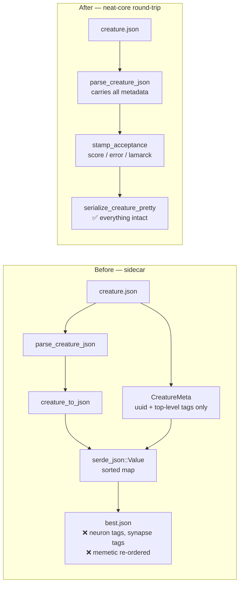

# NEAT-AI-Lamarck stops dropping per-element tags and memetic (Issue #3750)

## Summary

`NEAT-AI-Lamarck` carried `lamarck/src/tags.rs`, a near-copy of the
Backpropagation sidecar that worked around the lossy
`neat_core::CreatureExport`. The workaround was partial in the same way:
`CreatureMeta` mirrored only the top-level `uuid` + `tags` and re-attached them
through a `serde_json::Value` after `creature_to_json`, so per-neuron `tags`
(the `intelligentDesign` pedigree), per-synapse `tags` and the top-level
`memetic` block were dropped on every rewrite — and the `Value` detour
re-sorted whatever did survive, because `serde_json::Map` is a sorted map.

The root cause was fixed in the internal dependency
[stSoftwareAU/NEAT-AI-core](https://github.com/stSoftwareAU/NEAT-AI-core) under
Issues #3747 / #3748 (per Issue #2942). This sub-issue retires the compensating
half in the consumer, which lives in
[stSoftwareAU/NEAT-AI-Lamarck](https://github.com/stSoftwareAU/NEAT-AI-Lamarck),
not in this repository — so this repository carries only the record. Closes
#3750.

### What changed in NEAT-AI-Lamarck

Branch:
[`issue-3750-retire-tags-sidecar`](https://github.com/stSoftwareAU/NEAT-AI-Lamarck/tree/issue-3750-retire-tags-sidecar)
(commit `b1ab035`).

- **Removed** `tags::CreatureMeta`, `tags::CreatureTag`,
  `tags::serialize_creature_with_meta` and
  `tags::serialize_creature_with_meta_compact` — the extract-and-re-attach path
  neat-core now makes redundant, including the `serde_json::Value` detour that
  re-ordered the `memetic` block.
- **Kept** the deliberate stamping behaviour, rewritten as free functions over
  the creature's own tag list: `tags::stamp_acceptance` writes `score` /
  `error` at full numeric precision and the run-level `lamarck` summary tag,
  with the wording and precision `worker/Lamarck/run.sh` reads unchanged.
  `tags::upsert_tag` replaces by name in place, so the existing tag order is
  never disturbed; `tags::tag_value` reads one back for the run log and the
  error fallback.
- **Write paths** now serialise the parsed creature directly:
  `tags::serialize_creature_pretty` (newline-terminated) for `best.json` and
  `winners/`, and `neat_core::creature_to_json` compact for the scorer batch in
  `candidates::write_candidate_batch`, whose `meta` parameter is gone. The
  candidate files must carry the metadata: an accepted candidate file is
  re-parsed as the next incumbent, so a candidate written without it would lose
  the pedigree the moment it won.
- **Fixed a second loss site**: `combos::merge_candidate_deltas` rebuilt merged
  neurons and synapses field by field, which silently dropped their tags. Both
  are now cloned whole.
- **Untouched**: tags owned by other programs (`backpropagation`,
  `intelligentDesign`) are never written or invented — the two GRQ #3952 tests
  still pin that, now against the creature rather than the sidecar.

Mechanical follow-on: `NeuronExport` / `SynapseExport` / `CreatureExport`
literals across `structural.rs`, `grafts.rs`, `combos.rs` and the bench example
gained the new `tags` / `extra` (and `uuid` / `memetic`) fields, since these are
genuinely new elements with no metadata of their own.

### Write path, before and after



## Evidence

Backend/CLI change — no web interface to screenshot. The evidence is the test
suite in the consumer repository, run against a sibling `NEAT-AI-core` checked
out at `issue-3748-creature-unknown-field-passthrough`:

```text
$ cargo test --test tags_roundtrip
running 3 tests
test full_metadata_survives_a_lamarck_accept ... ok
test the_check_in_stamp_keeps_its_exact_strings_and_precision ... ok
test the_winner_snapshot_carries_the_same_metadata ... ok

test result: ok. 3 passed; 0 failed

$ ./quality.sh < /dev/null
...
All quality checks passed!   # 416 tests, cargo clippy -D warnings, cargo fmt
```

Red-then-green was real: with the sidecar still in place (and neat-core already
fixed) `full_metadata_survives_a_lamarck_accept` failed on the memetic block —

```text
assertion `left == right` failed: memetic block survives verbatim, key order and all
  left:  {"biases":{...},"generation":7,"score":...,"weights":{...}}
  right: {"generation":7,"score":...,"biases":{...},"weights":{...}}
```

— which is precisely the `serde_json::Value` re-sort the sidecar introduced.

### Blocked on a human

The branch has **no PR**: this run's write allowlist covers only
`stSoftwareAU/NEAT-AI`, so `gh pr create` against the sibling repository is
refused. It also cannot compile in CI until the NEAT-AI-core branches from
#3747 / #3748 merge to `Develop`, because Lamarck consumes neat-core through an
unpinned sibling `path` dependency that tracks head. Per Issue #2944 the worker
must not merge, publish, or pin a consumer to a raw commit ref to pull the fix
in early.

This is tracked in the existing follow-up **#3757** (`needs-human`), which lists
the merge order; that issue already names this sub-issue as step 3 and has been
updated with the branch link. No new follow-up was filed (Issue #2943 — one
follow-up per root cause).

## Test Plan

New in `NEAT-AI-Lamarck`:

- `lamarck/tests/tags_roundtrip.rs::full_metadata_survives_a_lamarck_accept` —
  a fully tagged creature (per-neuron tags including an `intelligentDesign`
  pedigree, per-synapse tags, top-level `tags` / `uuid` / `memetic`) goes
  through a real `run_optimisation` accept-and-write cycle; every field is
  asserted byte for byte, with the memetic block compared as raw text so a
  re-ordered key or re-formatted number fails.
- `lamarck/tests/tags_roundtrip.rs::the_check_in_stamp_keeps_its_exact_strings_and_precision`
  — `score` / `error` are the exact full-precision strings, the `lamarck` tag
  keeps its exact prefix and score clause, tag order is unchanged, and another
  program's tags are untouched.
- `lamarck/tests/tags_roundtrip.rs::the_winner_snapshot_carries_the_same_metadata`
  — `winners/` is a check-in artefact too.
- `tags.rs::score_and_error_are_stamped_at_full_precision` and
  `tags.rs::stamp_gives_an_untagged_creature_its_first_tags` — unit-level
  stamping contract.

Modified (documented business-logic change — the sidecar they exercised no
longer exists):

- `tags.rs::extract_preserves_uuid_and_tags` → `parse_keeps_uuid_and_tags`,
  which asserts the neat-core contract this module now leans on.
- `tags.rs::serialize_round_trips_original_tags_plus_lamarck` and
  `compact_round_trips_to_the_same_creature_and_tags_as_pretty` now stamp the
  creature and serialise it directly.
- The two GRQ #3952 `intelligentDesign` tests operate on the creature's tag
  list instead of `CreatureMeta`.
- `candidates.rs::compact_baseline_keeps_uuid_and_tags` drops the `meta`
  argument; the assertions on the written file are unchanged.
