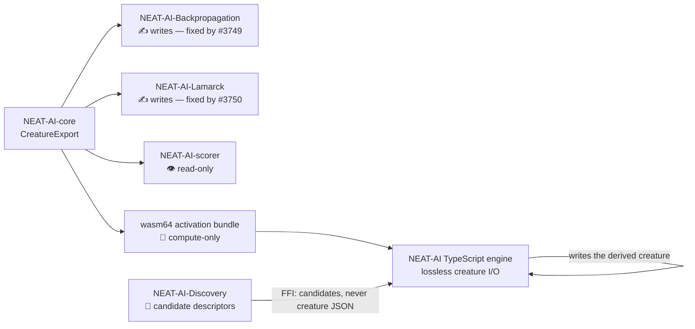

## Summary

Verified the parent milestone's unproven assumption that every Rust extension
other than Backpropagation and Lamarck is read-only, and recorded the result as
evidence rather than belief. Closes #3751.

The audit found **no writer beyond the two already fixed**, so no follow-up
issues were filed. Two deliverables land instead of a code fix:

- `docs/RUST_EXTENSION_WRITE_PATH_AUDIT.md` — a per-extension verdict (writes
  creature JSON / does not) with the `file:line` each verdict rests on, pinned
  to the commit SHA a reviewer can re-grep. Membership was enumerated, not
  assumed: every `stSoftwareAU/*` repository carrying Rust was checked,
  including the one outside the NEAT-AI family.
- `test/discovery/DiscoveryCandidatePedigree.ts` — the regression guard the
  issue asks for on the one candidate-_generating_ extension. Discovery's Rust
  side never emits a creature; it returns candidate descriptors over FFI and the
  derived creature is built in TypeScript, so this repo's CI is where the guard
  belongs.

### Findings

| Extension                           | Verdict                          | Key evidence                                                                                                                                                                                                                                |
| ----------------------------------- | -------------------------------- | ------------------------------------------------------------------------------------------------------------------------------------------------------------------------------------------------------------------------------------------- |
| NEAT-AI-Discovery                   | does **not** write creature JSON | no `neat-core` dependency at all; its `CreatureJson` (`src/ffi_types/mod.rs:89`) is an input type. Sole creature-touching write is the Explore debug snapshot (`src/export/snapshot.rs:374,394`), a derived artefact NEAT-AI never invokes. |
| NEAT-AI-scorer                      | does **not** write (read-only)   | zero `creature_to_json` calls anywhere; every `File::create`/`fs::write` in `rust_scorer/src/` is inside a `#[cfg(test)]` module. Non-test serialisations emit scores (`cli.rs:666-668`) and a host report (`host_report.rs:188`).          |
| wasm64 activation bundle            | compute-only                     | whole API in `wasm_activation/pkg/wasm_activation.d.ts` is typed arrays and numbers; `to_topology_json` returns an index-keyed topology string with no `uuid`/`tags`, never a creature file.                                                |
| NEAT-AI-core                        | library only                     | `creature_to_json` returns a `String`; no `[[bin]]`, no non-test file write.                                                                                                                                                                |
| GRQ trainer `rust/train-extensions` | does **not** write               | zero-dependency crate, cannot consume `CreatureExport`; all writes past the `#[cfg(test)]` gate.                                                                                                                                            |

**`tags.rs` sidecar count: exactly two** — Backpropagation and Lamarck, the two
already known. No third copy exists, so the duplication does not yet justify a
shared crate.

**Discovery pedigree question answered.** A derived candidate _does_ inherit its
parent's creature, neuron and synapse tags, via the lossless TypeScript path.
`memetic` is the one field that does not survive a topology-changing candidate —
`memeticUpdate` (`src/blackbox/MemeticUpdate.ts:17`) returns `undefined` when
the child's structure diverges, so the fine-tuning record is reset by design.
That is a designed reset bound to topology, not the silent strip #3746 fixes;
the new test pins the contract so a change of intent stays visible.

## Evidence

Backend/CLI audit — no web interface to screenshot. The evidence is the new test
suite plus the greps recorded in the audit document.

```
$ deno test --allow-all test/discovery/DiscoveryCandidatePedigree.ts
Discovery add-synapse candidate inherits the parent's tags ... ok (3ms)
Discovery change-squash candidate inherits the parent's tags ... ok (383µs)
Discovery candidate generation leaves the parent creature untouched ... ok (218µs)
Discovery add-synapse candidate resets memetic by contract ... ok (177µs)

ok | 4 passed | 0 failed (6ms)
```

```
$ ./quality.sh < /dev/null
ok | 8371 passed (5 steps) | 0 failed | 6 ignored (4m11s)
```

Where the creature actually gets written, and why Discovery is not on that list:



### Test-suite note

`test/ErrorGuidedStructuralEvolution/DiscoveryTimeout.ts` ("Batch size 128 saves
more batches than 512 on timeout") failed intermittently during this run and
then passed on re-run, both with and without these changes. It is a pre-existing
timing-sensitive test; the failure asserts that no timeout fired, which added
load cannot cause. Nothing here touches it.

## Test Plan

Added `test/discovery/DiscoveryCandidatePedigree.ts` — four tests exercising the
real candidate builders in `src/discovery/CandidateCreation.ts` against a parent
creature carrying creature tags, per-neuron tags, per-synapse tags and
`memetic`:

- `Discovery add-synapse candidate inherits the parent's tags` — happy path for
  `buildSingleSynapseCandidates`; asserts each tag surface survives on the
  derived candidate.
- `Discovery change-squash candidate inherits the parent's tags` — same for
  `buildSingleSquashCandidates`, tolerating the extra `discovered` tag the
  builder stamps.
- `Discovery candidate generation leaves the parent creature untouched` — edge
  case: the parent export must be byte-identical after generation.
- `Discovery add-synapse candidate resets memetic by contract` — pins the
  documented `memeticUpdate` divergence reset so the deliberate drop is never
  mistaken for the accidental one.

Docs: `docs/RUST_EXTENSION_WRITE_PATH_AUDIT.md` added and indexed from
`docs/README.md`.
